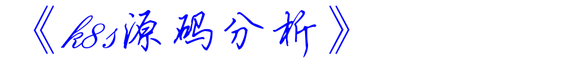

# 1、关于本书

本书将系统讲解kubernetes的核心组件源码，附带介绍相关的周边项目，比如client-go等。

建议通过公众号`CloudGeek`（微信上直接搜索可以找到）接收更新消息，通过[<u>github pages</u>](https://farmer-hutao.github.io/k8s-source-code-analysis/)阅读本书。

寻找组织可以加我微信（ITNT01），一句话证明自己是源码学习者，然后我会拉你进群。

# 2、内容更新

本项目会不定期更新，一般会在每周五更新一节；更新内容将同步发到公众号`CloudGeek`、博客园`CloudGeek`等。细微的更新，比如错别字修改等不会同步到其他所有平台。

每次新章节会选择性提前发到微信群内，比如本周五要发出来的新内容周一可能就内部发到群里了，然后接受读者反馈，定稿后上传到github，然后同步到微信公众号等平台。

# 3、本教程适合谁读

任何对k8s源码感兴趣的人都可以看本教程，但是我建议你至少有golang项目开发经验，简单的golang开源项目的源码分析经验，k8s应用经验，对golang的基础特性和k8s的基础特性有一定的了解；不然直接上手看k8s源码会郁闷的。

# 4、章节规划与负责人

- [Scheduler](core/scheduler/README.md) - [farmer-hutao](https://github.com/farmer-hutao)
- [Controller-manager](core/controller-manager/README.md)  - [farmer-hutao](https://github.com/farmer-hutao)
- [Kube-proxy](core/kube-proxy/README.md) - [XiaoYang](https://github.com/gotoolkits)
- [Apiserver](core/apiserver/README.md)
- [Kubelet](core/kubelet/README.md)

# 5、版本说明

本书基于：v1.13版本源码讲解。

# 6、协议

本书使用Apache License 2.0协议，但是保留出版图书的权利。

# 7、贡献

欢迎参与本书编写！如果你对开源项目源码分析感兴趣，可以和我联系，如果你擅长某个项目，可以主导一个章节的编写。

如果想要提交pull request，建议先开一个issue，说明你要做什么修改，一般1天内我会回复issue，告诉你是否接受修改。但是得提前告诉你我是一个有洁癖的人，包括代码洁癖，文字洁癖等，所以请不要提交太随意的风格的内容哦～

另外注意：一定先更新你的仓库到最新状态，然后编辑新内容，不然冲突很尴尬～

# 8、FAQ

暂时我没有考虑增加评论功能，因为不可避免要增加三方插件，三方插件意味着用户需要注册登录等，体验不会太好。万一哪天这个插件倒闭了，就白忙活了。所以在每章开头我增加了一个FAQ部分，会把这一章中各个小节收到的部分问题汇总在开头的FAQ里。

大家在微信里问我的问题一般我都会耐心解答，但是和go语言本身语法相关的初级问题还是不希望经常遇到，因为我认为语言本身问题是很容易通过网络资料学习掌握的。另外有问题尽量抛到群里，私信多的话有时候我要1个问题很好几个人讲，工作量比较大。

# 9、支持本书

微信扫一扫，鼓励作者快快更新，写出更多优质的文章～

