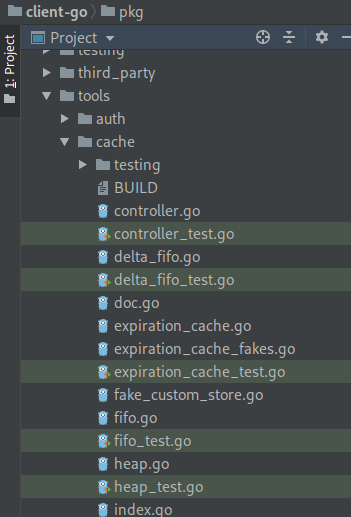
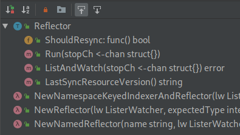
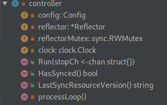
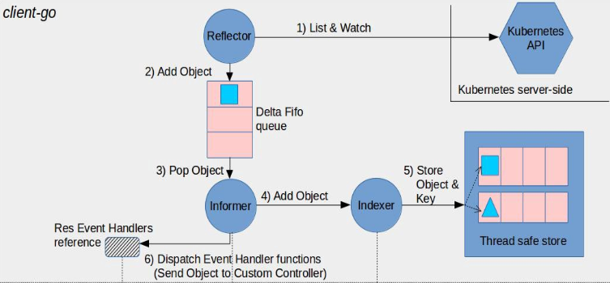

# Custom Controller 之 Informer (一)

<!-- toc -->

## 概述

本节标题写的是 Informer，不过我们的内容不局限于狭义的 Informer 部分，只是 Informer 最有代表性，其他的 Reflector 等也不好独立开来讲。

Informer 在很多组件的源码中可以看到，尤其是 kube-controller-manager (写这篇文章时我已经基本写完 kube-scheduler 的源码分析，着手写 kube-controller-manager 了，鉴于 controlelr 和 client-go 关联比较大，跳过来先讲讲典型的控制器工作流程中涉及到的 client-go 部分).

Informer 是 client-go 中一个比较核心的工具，通过 Informer(实际我们用到的都不是单纯的 informer，而是组合了各种工具的 sharedInformerFactory) 我们可以轻松 List/Get 某个资源对象，可以监听资源对象的各种事件(比如创建和删除)然后触发回调函数，让我们能够在各种事件发生的时候能够作出相应的逻辑处理。举个例字，当 pod 数量变化的时候 deployment 是不是需要判断自己名下的 pod 数量是否还和预期的一样？如果少了是不是要考虑创建？

## 架构概览

自定义控制器的工作流程基本如下图所示，我们今天要分析图中上半部分的逻辑。


我们开发自定义控制器的时候用到的“机制”主要定义在 client-go 的 tool/cache下：



我们根据图中的9个步骤来跟源码

## reflector - List & Watch API Server

Reflector 会监视特定的资源，将变化写入给定的存储中，也就是 Delta FIFO queue.

### Reflector 对象

Reflector 的中文含义是反射器，我们先看一下类型定义：

!FILENAME tools/cache/reflector.go:47

```go
type Reflector struct {
   name string
   metrics *reflectorMetrics
   expectedType reflect.Type
    
   store Store
   listerWatcher ListerWatcher
    
   period       time.Duration
   resyncPeriod time.Duration
   ShouldResync func() bool
   clock clock.Clock
   lastSyncResourceVersion string
   lastSyncResourceVersionMutex sync.RWMutex
}
```

`reflector.go`中主要就 Reflector 这个 struct 和相关的一些函数：



### ListAndWatch

ListAndWatch 首先 list 所有 items，获取当前的资源版本信息，然后使用这个版本信息来 watch(也就是从这个版本开始的所有资源变化会被关注)。我们看一下这里的 ListAndWatch 方法主要逻辑：

!FILENAME tools/cache/reflector.go:168

```go
func (r *Reflector) ListAndWatch(stopCh <-chan struct{}) error {
   // list 资源
   list, err := r.listerWatcher.List(options)
   // 提取 items
   items, err := meta.ExtractList(list)
    // 更新存储(Delta FIFO)中的 items
   if err := r.syncWith(items, resourceVersion); err != nil {
      return fmt.Errorf("%s: Unable to sync list result: %v", r.name, err)
   }
   r.setLastSyncResourceVersion(resourceVersion)

   // ……

   for {
      select {
      case <-stopCh:
         return nil
      default:
      }

      timeoutSeconds := int64(minWatchTimeout.Seconds() * (rand.Float64() + 1.0))
      options = metav1.ListOptions{
         ResourceVersion: resourceVersion,
         TimeoutSeconds: &timeoutSeconds,
      }

      r.metrics.numberOfWatches.Inc()
       // 开始 watch
      w, err := r.listerWatcher.Watch(options)
       // ……
       // w 交给 watchHandler 处理
      if err := r.watchHandler(w, &resourceVersion, resyncerrc, stopCh); err != nil {
         if err != errorStopRequested {
            klog.Warningf("%s: watch of %v ended with: %v", r.name, r.expectedType, err)
         }
         return nil
      }
   }
}
```

## watchHandler - add obj to delta fifo

前面讲到 ListAndWatch 函数的最后一步逻辑是 watchHandler，在 ListAndWatch 中先是更新了 Delta FIFO 中的 item，然后 watch 资源对象，最后交给 watchHandler 处理，所以 watchHandler 基本可以猜到是将有变化的资源添加到 Delta FIFO 中了。

!FILENAME tools/cache/reflector.go:287

```go
func (r *Reflector) watchHandler(w watch.Interface, resourceVersion *string, errc chan error, stopCh <-chan struct{}) error {
   // ……
loop:
    // 这里进入一个无限循环
   for {
      select {
      case <-stopCh:
         return errorStopRequested
      case err := <-errc:
         return err
          // watch 返回值中的一个 channel
      case event, ok := <-w.ResultChan():
         // ……
         newResourceVersion := meta.GetResourceVersion()
          // 根据事件类型处理，有 Added Modified Deleted 3种
          // 3 种事件分别对应 store 中的增改删操作
         switch event.Type {
         case watch.Added:
            err := r.store.Add(event.Object)
            
         case watch.Modified:
            err := r.store.Update(event.Object)
            
         case watch.Deleted:
            err := r.store.Delete(event.Object)
            
         default:
            utilruntime.HandleError(fmt.Errorf("%s: unable to understand watch event %#v", r.name, event))
         }
         *resourceVersion = newResourceVersion
         r.setLastSyncResourceVersion(newResourceVersion)
         eventCount++
      }
   }

   // ……
    
   return nil
}
```

## Informer (controller) - pop obj from delta fifo

### Controller

一个 Informer 需要实现 Controller 接口：

!FILENAME tools/cache/controller.go:82

```go
type Controller interface {
   Run(stopCh <-chan struct{})
   HasSynced() bool
   LastSyncResourceVersion() string
}
```

一个基础的 Controller 实现如下：

!FILENAME tools/cache/controller.go:75

```go
type controller struct {
   config         Config
   reflector      *Reflector
   reflectorMutex sync.RWMutex
   clock          clock.Clock
}
```

controller 类型结构如下：



可以看到主要对外暴露的逻辑是 Run() 方法，我们看一下 Run() 中的逻辑：

!FILENAME tools/cache/controller.go:100

```go
func (c *controller) Run(stopCh <-chan struct{}) {
   defer utilruntime.HandleCrash()
   go func() {
      <-stopCh
      c.config.Queue.Close()
   }()
    // 内部 Reflector 创建
   r := NewReflector(
      c.config.ListerWatcher,
      c.config.ObjectType,
      c.config.Queue,
      c.config.FullResyncPeriod,
   )
   r.ShouldResync = c.config.ShouldResync
   r.clock = c.clock

   c.reflectorMutex.Lock()
   c.reflector = r
   c.reflectorMutex.Unlock()

   var wg wait.Group
   defer wg.Wait()

   wg.StartWithChannel(stopCh, r.Run)
	// 循环调用 processLoop
   wait.Until(c.processLoop, time.Second, stopCh)
}
```

### processLoop

!FILENAME tools/cache/controller.go:148

```go
func (c *controller) processLoop() {
   for {
       // 主要逻辑
      obj, err := c.config.Queue.Pop(PopProcessFunc(c.config.Process))
       // 异常处理
   }
}
```

这里的 Queue 就是 Delta FIFO，Pop 是个阻塞方法，内部实现时会逐个 pop 队列中的数据，交给 PopProcessFunc 处理。我们先不看 Pop 的实现，关注一下 PopProcessFunc 是如何处理 Pop 中从队列拿出来的 item 的。

PopProcessFunc 是一个类型：

`type PopProcessFunc func(interface{}) error`

所以这里只是一个类型转换，我们关注`c.config.Process`就行：

!FILENAME tools/cache/controller.go:367

```go
Process: func(obj interface{}) error {
	for _, d := range obj.(Deltas) {
		switch d.Type {
            // 更新、添加、同步、删除等操作
		case Sync, Added, Updated:
			if old, exists, err := clientState.Get(d.Object); err == nil && exists {
				if err := clientState.Update(d.Object); err != nil {
					return err
				}
				h.OnUpdate(old, d.Object)
			} else {
				if err := clientState.Add(d.Object); err != nil {
					return err
				}
				h.OnAdd(d.Object)
			}
		case Deleted:
			if err := clientState.Delete(d.Object); err != nil {
				return err
			}
			h.OnDelete(d.Object)
		}
	}
	return nil
},
```

这里涉及到2个点：

- clientState
- ResourceEventHandler (h)

我们一一来看

## Add obj to Indexer (Thread safe store)

前面说到 clientState，这个变量的初始化是`clientState := NewIndexer(DeletionHandlingMetaNamespaceKeyFunc, indexers)`

NewIndexer 代码如下：

!FILENAME tools/cache/store.go:239

```go
func NewIndexer(keyFunc KeyFunc, indexers Indexers) Indexer {
   return &cache{
      cacheStorage: NewThreadSafeStore(indexers, Indices{}),
      keyFunc:      keyFunc,
   }
}
```

!FILENAME tools/cache/index.go:27

```go
type Indexer interface {
   Store
   Index(indexName string, obj interface{}) ([]interface{}, error)
   IndexKeys(indexName, indexKey string) ([]string, error)
   ListIndexFuncValues(indexName string) []string
   ByIndex(indexName, indexKey string) ([]interface{}, error)
   GetIndexers() Indexers
   AddIndexers(newIndexers Indexers) error
}
```

顺带看一下 NewThreadSafeStore()

!FILENAME tools/cache/thread_safe_store.go:298

```go
func NewThreadSafeStore(indexers Indexers, indices Indices) ThreadSafeStore {
   return &threadSafeMap{
      items:    map[string]interface{}{},
      indexers: indexers,
      indices:  indices,
   }
}
```

然后关注一下 Process 中的`err := clientState.Add(d.Object)`的 Add() 方法：

!FILENAME tools/cache/store.go:123

```go
func (c *cache) Add(obj interface{}) error {
    // 计算key；一般是namespace/name
   key, err := c.keyFunc(obj)
   if err != nil {
      return KeyError{obj, err}
   }
    // Add
   c.cacheStorage.Add(key, obj)
   return nil
}
```

cacheStorage 是一个 ThreadSafeStore 实例，这个 Add() 代码如下：

!FILENAME tools/cache/thread_safe_store.go:68

```go
func (c *threadSafeMap) Add(key string, obj interface{}) {
   c.lock.Lock()
   defer c.lock.Unlock()
    // 拿出 old obj
   oldObject := c.items[key]
    // 写入 new obj
   c.items[key] = obj
    // 更新索引，有一堆逻辑
   c.updateIndices(oldObject, obj, key)
}
```

第四步和第五步的内容先分析到这里，后面关注 threadSafeMap 实现的时候再继续深入。

## sharedIndexInformer

第六步是 Dispatch Event Handler functions(Send Object to Custom Controller)

我们先看一个接口 SharedInformer：

!FILENAME tools/cache/shared_informer.go:43

```go
type SharedInformer interface {
   AddEventHandler(handler ResourceEventHandler)
   AddEventHandlerWithResyncPeriod(handler ResourceEventHandler, resyncPeriod time.Duration)
   GetStore() Store
   GetController() Controller
   Run(stopCh <-chan struct{})
   HasSynced() bool
   LastSyncResourceVersion() string
}
```

SharedInformer 有一个共享的 data cache，能够分发 changes 通知到缓存，到通过 AddEventHandler 注册了的 listerners. 当你接收到一个通知，缓存的内容能够保证至少和通知中的一样新。

再看一下 SharedIndexInformer 接口：

!FILENAME tools/cache/shared_informer.go:66

```go
type SharedIndexInformer interface {
   SharedInformer
   // AddIndexers add indexers to the informer before it starts.
   AddIndexers(indexers Indexers) error
   GetIndexer() Indexer
}
```

相比 SharedInformer 增加了一个 Indexer. 然后看具体的实现 sharedIndexInformer 吧：

!FILENAME tools/cache/shared_informer.go:127

```go
type sharedIndexInformer struct {
   indexer    Indexer
   controller Controller
   processor             *sharedProcessor
   cacheMutationDetector CacheMutationDetector
   listerWatcher ListerWatcher
    
   objectType    runtime.Object
   resyncCheckPeriod time.Duration
   defaultEventHandlerResyncPeriod time.Duration
   clock clock.Clock
   started, stopped bool
   startedLock      sync.Mutex
   blockDeltas sync.Mutex
}
```

这个类型内包了很多我们前面看到过的对象，indexer、controller、listeratcher 都不陌生，我们看这里的 processor 是做什么的：

### sharedProcessor

类型定义如下：

!FILENAME tools/cache/shared_informer.go:375

```go
type sharedProcessor struct {
   listenersStarted bool
   listenersLock    sync.RWMutex
   listeners        []*processorListener
   syncingListeners []*processorListener
   clock            clock.Clock
   wg               wait.Group
}
```

这里的重点明显是 listeners 属性了，我们继续看 listeners 的类型中的 processorListener：

#### processorListener

!FILENAME tools/cache/shared_informer.go:466

```go
type processorListener struct {
   nextCh chan interface{}
   addCh  chan interface{}

   handler ResourceEventHandler
   // 一个 ring buffer，保存未分发的通知
   pendingNotifications buffer.RingGrowing
   // ……
}
```

processorListener 主要有2个方法：

- run()
- pop()

#### processorListener.run()

先看一下这个 run 做了什么：

!FILENAME tools/cache/shared_informer.go:540

```go
func (p *processorListener) run() {
   stopCh := make(chan struct{})
    wait.Until(func() { // 一分钟执行一次这个 func()
        // 一分钟内的又有几次重试
      err := wait.ExponentialBackoff(retry.DefaultRetry, func() (bool, error) {
          // 等待信号 nextCh
         for next := range p.nextCh {
             // notification 是 next 的实际类型
            switch notification := next.(type) {
                // update
            case updateNotification:
               p.handler.OnUpdate(notification.oldObj, notification.newObj)
                // add
            case addNotification:
               p.handler.OnAdd(notification.newObj)
                // delete
            case deleteNotification:
               p.handler.OnDelete(notification.oldObj)
            default:
               utilruntime.HandleError(fmt.Errorf("unrecognized notification: %#v", next))
            }
         }
         return true, nil
      })

      if err == nil {
         close(stopCh)
      }
   }, 1*time.Minute, stopCh)
}
```

这个 run 过程不复杂，等待信号然后调用 handler 的增删改方法做对应的处理逻辑。case 里的 Notification 再看一眼：

!FILENAME tools/cache/shared_informer.go:176

```go
type updateNotification struct {
   oldObj interface{}
   newObj interface{}
}

type addNotification struct {
   newObj interface{}
}

type deleteNotification struct {
   oldObj interface{}
}
```

另外注意到`for next := range p.nextCh`是下面的 case 执行的前提，也就是说触发点是 p.nextCh，我们接着看 pop 过程(这里的逻辑不简单，可能得多花点精力)

#### processorListener.pop()

!FILENAME tools/cache/shared_informer.go:510

```go
func (p *processorListener) pop() {
   defer utilruntime.HandleCrash()
   defer close(p.nextCh) // Tell .run() to stop
    // 这个 chan 是没有初始化的
   var nextCh chan<- interface{}
    // 可以接收任意类型，其实是对应前面提到的 addNotification 等
   var notification interface{}
    // for 循环套 select 是比较常规的写法
   for {
      select {
          //第一遍执行到这里的时候由于 nexth 没有初始化，所以这里会阻塞(和notification有没有值没有关系，notification哪怕是nil也可以写入 chan interface{} 类型的 channel)
      case nextCh <- notification:
         var ok bool
          // 第二次循环，下面一个case运行过之后才有这里的逻辑
         notification, ok = p.pendingNotifications.ReadOne()
         if !ok { 
             // 将 channel 指向 nil 相当于初始化的逆操作，会使得这个 case 条件阻塞
            nextCh = nil 
         }
          // 这里是 for 首次执行逻辑的入口
      case notificationToAdd, ok := <-p.addCh:
         if !ok {
            return
         }
          // 如果是 nil，也就是第一个通知过来的时候，这时不需要用到缓存(和下面else相对)
         if notification == nil { 
             // 赋值给 notification，这样上面一个 case 在接下来的一轮循化中就可以读到了
            notification = notificationToAdd
             // 相当于复制引用，nextCh 就指向了 p.nextCh，使得上面 case 写 channel 的时候本质上操作了 p.nextCh，从而 run 能够读到 p.nextCh 中的信号
            nextCh = p.nextCh
         } else { 
             // 处理到这里的时候，其实第一个 case 已经有了首个 notification，这里的逻辑是一下子来了太多 notification 就往 pendingNotifications 缓存，在第一个 case 中 有对应的 ReadOne()操作
            p.pendingNotifications.WriteOne(notificationToAdd)
         }
      }
   }
}
```

这里的 pop 逻辑的入口是`<-p.addCh`，我们继续向上找一下这个 addCh 的来源：

#### processorListener.add()

!FILENAME tools/cache/shared_informer.go:506

```go
func (p *processorListener) add(notification interface{}) {
   p.addCh <- notification
}
```

这个 add() 方法又在哪里被调用呢？

#### sharedProcessor.distribute()

!FILENAME tools/cache/shared_informer.go:400

```go
func (p *sharedProcessor) distribute(obj interface{}, sync bool) {
   p.listenersLock.RLock()
   defer p.listenersLock.RUnlock()

   if sync {
      for _, listener := range p.syncingListeners {
         listener.add(obj)
      }
   } else {
      for _, listener := range p.listeners {
         listener.add(obj)
      }
   }
}
```

这个方法逻辑比较简洁，分发对象。我们继续看哪里进入的 distribute：

### sharedIndexInformer.HandleDeltas()

!FILENAME tools/cache/shared_informer.go:344

```go
func (s *sharedIndexInformer) HandleDeltas(obj interface{}) error {
   s.blockDeltas.Lock()
   defer s.blockDeltas.Unlock()

   // from oldest to newest
   for _, d := range obj.(Deltas) {
      switch d.Type { // 根据 DeltaType 选择 case
      case Sync, Added, Updated:
         isSync := d.Type == Sync
         s.cacheMutationDetector.AddObject(d.Object)
         if old, exists, err := s.indexer.Get(d.Object); err == nil && exists {
             // indexer 更新的是本地 store
            if err := s.indexer.Update(d.Object); err != nil {
               return err
            }
             // 前面分析的 distribute；update
            s.processor.distribute(updateNotification{oldObj: old, newObj: d.Object}, isSync)
         } else {
            if err := s.indexer.Add(d.Object); err != nil {
               return err
            }
             // 前面分析的 distribute；add
            s.processor.distribute(addNotification{newObj: d.Object}, isSync)
         }
      case Deleted:
         if err := s.indexer.Delete(d.Object); err != nil {
            return err
         }
          // 前面分析的 distribute；delete
         s.processor.distribute(deleteNotification{oldObj: d.Object}, false)
      }
   }
   return nil
}
```

继续往前看代码逻辑。

### sharedIndexInformer.Run()

!FILENAME tools/cache/shared_informer.go:189

```go
func (s *sharedIndexInformer) Run(stopCh <-chan struct{}) {
   defer utilruntime.HandleCrash()
	// new DeltaFIFO
   fifo := NewDeltaFIFO(MetaNamespaceKeyFunc, s.indexer)

   cfg := &Config{
       // DeltaFIFO
      Queue:            fifo,
      ListerWatcher:    s.listerWatcher,
      ObjectType:       s.objectType,
      FullResyncPeriod: s.resyncCheckPeriod,
      RetryOnError:     false,
      ShouldResync:     s.processor.shouldResync,
       // 前面分析的 HandleDeltas()
      Process: s.HandleDeltas,
   }

   func() {
      s.startedLock.Lock()
      defer s.startedLock.Unlock()
		// 创建 Informer
      s.controller = New(cfg)
      s.controller.(*controller).clock = s.clock
      s.started = true
   }()

   processorStopCh := make(chan struct{})
   var wg wait.Group
   defer wg.Wait()              // Wait for Processor to stop
   defer close(processorStopCh) // Tell Processor to stop
   wg.StartWithChannel(processorStopCh, s.cacheMutationDetector.Run)
    // 关注一下 s.processor.run
   wg.StartWithChannel(processorStopCh, s.processor.run)

   defer func() {
      s.startedLock.Lock()
      defer s.startedLock.Unlock()
      s.stopped = true
   }()
    // Run informer
   s.controller.Run(stopCh)
}
```

看到这里已经挺和谐了，在 sharedIndexInformer 的 Run() 方法中先是创建一个 DeltaFIFO，然后和 lw 一起初始化 cfg，利用 cfg 创建 controller，最后 Run 这个 controller，也就是最基础的 informer.

在这段代码里我们还注意到有一步是`s.processor.run`，我们看一下这个 run 的逻辑。

#### sharedProcessor.run()

!FILENAME tools/cache/shared_informer.go:415

```go
func (p *sharedProcessor) run(stopCh <-chan struct{}) {
   func() {
      p.listenersLock.RLock()
      defer p.listenersLock.RUnlock()
      for _, listener := range p.listeners {
          // 前面详细讲过 listener.run
         p.wg.Start(listener.run)
          // 前面详细讲过 listener.pop
         p.wg.Start(listener.pop)
      }
      p.listenersStarted = true
   }()
   <-stopCh
  // ……
}
```

撇开细节，可以看到这里调用了内部所有 listener 的 run() 和 pop() 方法，和前面的分析呼应上了。

到这里，我们基本讲完了自定义 controller 的时候 client-go 里相关的逻辑，也就是图中的上半部分：



