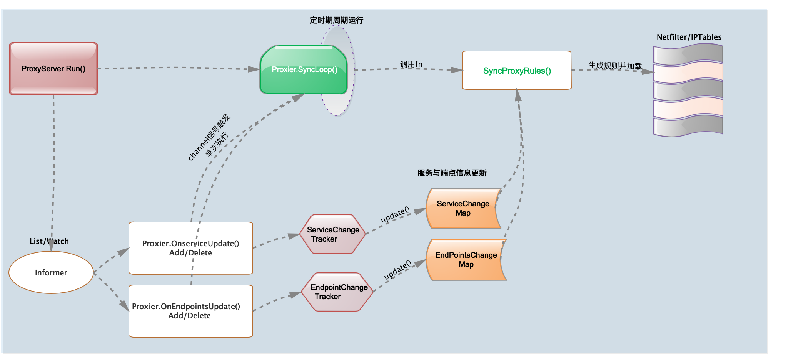

# IPtables-Mode Proxier

<!-- toc -->

## 概述

kube-Proxy提供三种模式(userspace/iptables/ipvs)的proxier实现,userspace是早期的proxy模式，ipvs模式处于实验性阶段proxy模式，本文先从默认的内核级iptables proxier代码实现与逻辑分析开始，其它模式将用专文解析源码。

Iptables-mode Proxier的service配置和代码内都包含一些基础概念如clusterIP、nodeport、loadbalancer、Ingress、ClusterCIDR、onlyLocal、ExternalIP等，请在了解源码之前先熟悉其概念用途场景与类型区别，再看源码将对你理解proxy事半功倍。当然也需要对netfilter、iptables、connTrack等proxy基础依赖的工具熟悉。基础概念部分在本文将不深入介绍，有需求可自行查阅相关资料。

从kube-proxy组件整体框架层的代码来看，在ProxyServer.Run()最后走到了**s.Proxier.SyncLoop()**执行空间一直无限loop下去。而默认的ProxyServer配置的Proxier对象就是Iptables(*if proxyMode == proxyModeIPTables*)，将调用iptabls-mode的Proxier.SyncLoop()，SyncLoop()时间定时循环执行syncProxyRules()完成services、endpoints与iptables规则的同步操作。

Iptables-mode proxier的负载均衡机制是通过底层netfliter/iptables规则来实现的，通过Informer机制watch服务与端点信息的变更事件触发对iptables的规则的同步更新，如下代码逻辑示意图：



下面proxier源码分析,我们先从proxier的接口、实现类、实现类方法列表一窥究竟，从结构上看整体Proxier的框架。然后我们再详细分析proxier对象的产生时所定义的属性值、值类型和用途。有了前面的两项的了解后我们再来分析proxier类方法的实现，也就是proxier代理逻辑部分(关键逻辑部分在**syncProxyRules()**方法分析部分)。最后我们分析proxier底层内核iptables的runner实现，也就是proxy上层逻辑层最终会调用iptables命令去执行规则的操作部分。

## Proxier 数据结构与类定义

**ProxyProvider** 代理提供者接口定义，需要实现两个proxy的关键方法Sync()和SyncLoop()

!FILENAME  pkg/proxy/types.go:27

```go
type ProxyProvider interface {
  // Sync 即时同步Proxy提供者的当前状态至proxy规则
	Sync()
	// SyncLoop 周期性运行
  // 作为一个线程或应用主loop运行，无返回.
	SyncLoop()
}
```

**Iptables-mode Proxier** 为 ProxyProvider 接口实现类，proxier 类属性项比较多，我们先看一下注释用途与结构定义，在实例化proxier对象时我们再详看。

!FILENAME pkg/proxy/iptables/proxier.go:205

```go
type Proxier struct {
	endpointsChanges *proxy.EndpointChangeTracker // 端点更新信息跟踪器
	serviceChanges   *proxy.ServiceChangeTracker  // 服务更新信息跟踪器

	mu           sync.Mutex                       // 保护同步锁
	serviceMap   proxy.ServiceMap                 // 存放服务列表信息                ①
	endpointsMap proxy.EndpointsMap               // 存放端点列表信息                ②
	portsMap     map[utilproxy.LocalPort]utilproxy.Closeable //端口关闭接口map

	endpointsSynced bool                          // ep同步状态
	servicesSynced  bool                          // svc同步状态
	initialized     int32                         // 初始化状态
	syncRunner      *async.BoundedFrequencyRunner // 指定频率运行器，此处用于管理对 
                                                // syncProxyRules的调用

	iptables       utiliptables.Interface         // iptables命令执行接口
	masqueradeAll  bool                          
	masqueradeMark string                         // SNAT地址伪装Mark
	exec           utilexec.Interface             // exec命令执行工具接口
	clusterCIDR    string                         // 集群CIDR
	hostname       string                         // 主机名
	nodeIP         net.IP                         // 节点IP地址
	portMapper     utilproxy.PortOpener           // TCP/UTP端口打开与监听
	recorder       record.EventRecorder           // 事件记录器
	healthChecker  healthcheck.Server             // healthcheck服务器对象
	healthzServer  healthcheck.HealthzUpdater     // Healthz更新器

	precomputedProbabilities []string             //预计算可能性

  //iptables规则与链数据(Filter/NAT)
	iptablesData             *bytes.Buffer        
	existingFilterChainsData *bytes.Buffer        
	filterChains             *bytes.Buffer         
	filterRules              *bytes.Buffer           
	natChains                *bytes.Buffer        
	natRules                 *bytes.Buffer      

	endpointChainsNumber int                       

	// Node节点IP与端口信息
	nodePortAddresses []string                    

	networkInterfacer utilproxy.NetworkInterfacer  //网络接口
}
```

① ServiceMap和ServicePort定义

!FILENAME pkg/proxy/service.go:229

```go
type ServiceMap map[ServicePortName]ServicePort

//String() =>  "NS/SvcName:PortName"
ServicePortName{NamespacedName: svcName, Port: servicePort.Name}
```

*ServiceSpec service.spec定义，在用户前端可定义service的spec配置项。*

!FILENAME vendor/k8s.io/api/core/v1/types.go:3606

```go
type ServiceSpec struct {
	Ports []ServicePort                   //服务端口列表
	Selector map[string]string            //选择器
	ClusterIP string                      //VIP 、 portal
	Type ServiceType                      //服务类型   
	ExternalIPs []string                  //外部IP列表，如外部负载均衡
	SessionAffinity ServiceAffinity       //会话保持
	LoadBalancerIP string                 //service类型为"LoadBalancer"时配置LB ip
	LoadBalancerSourceRanges []string     //cloud-provider的限制client ip区间
	ExternalName string 
	ExternalTrafficPolicy ServiceExternalTrafficPolicyType 
	HealthCheckNodePort int32              
	PublishNotReadyAddresses bool 
	SessionAffinityConfig *SessionAffinityConfig  //会话保持配置信息
}
```

*ServicePort类定义和ServicePort接口*

!FILENAME vendor/k8s.io/api/core/v1/types.go:3563

```go
type ServicePort struct {
	Name string 
	Protocol Protocol 
	Port int32 
	TargetPort intstr.IntOrString 
	NodePort int32 
}

//ServicePort接口
type ServicePort interface {
	// 返回服务字串，格式如: `IP:Port/Protocol`.
	String() string
	// 返回集群IP字串
	ClusterIPString() string
	// 返回协议
	GetProtocol() v1.Protocol
	// 返回健康检测端口
	GetHealthCheckNodePort() int
}
```

② EndpointsMap定义与Endpoint接口

!FILENAME pkg/proxy/endpoints.go:181

```go
type EndpointsMap map[ServicePortName][]Endpoint

type Endpoint interface {
	// 返回endpoint字串，格式 `IP:Port`.
	String() string
  // 是否本地
	GetIsLocal() bool
	// 返回IP
	IP() string
	// 返回端口
	Port() (int, error)
	// 检测两上endpoint是否相等
	Equal(Endpoint) bool
}
```

*Endpoints结构与相关定义*

!FILENAME vendor/k8s.io/api/core/v1/types.go:3710

```go
type Endpoints struct {
	metav1.TypeMeta 
	metav1.ObjectMeta 
	Subsets []EndpointSubset  
}

type EndpointSubset struct {
	Addresses []EndpointAddress            // EndpointAddress地址列表
	NotReadyAddresses []EndpointAddress    
	Ports []EndpointPort                   // EndpointPort端口列表
}

type EndpointAddress struct {           
	IP string 
	Hostname string 
	NodeName *string
	TargetRef *ObjectReference 
}

type EndpointPort struct {
	Name string 
	Port int32 
	Protocol Protocol 
}
```

**Iptables-mode Proxier**提供的方法列表，先大概从名称上来了解一下方法用途，后面我在逻辑部分对主要使用的方法再深入分析。

```go
func (proxier *Proxier) precomputeProbabilities(numberOfPrecomputed int) {/*...*/}
func (proxier *Proxier) probability(n int) string{/*...*/}
func (proxier *Proxier) Sync(){/*...*/}
func (proxier *Proxier) SyncLoop(){/*...*/}
func (proxier *Proxier) setInitialized(value bool){/*...*/}
func (proxier *Proxier) isInitialized() bool{/*...*/}
func (proxier *Proxier) OnServiceAdd(service *v1.Service){/*...*/}
func (proxier *Proxier) OnServiceUpdate(oldService, service *v1.Service){/*...*/}
func (proxier *Proxier) OnServiceDelete(service *v1.Service){/*...*/}
func (proxier *Proxier) OnServiceSynced(){/*...*/}
func (proxier *Proxier) OnEndpointsAdd(endpoints *v1.Endpoints){/*...*/}
func (proxier *Proxier) OnEndpointsUpdate(oldEndpoints, endpoints *v1.Endpoints){/*...*/}
func (proxier *Proxier) OnEndpointsDelete(endpoints *v1.Endpoints) {/*...*/}
func (proxier *Proxier) OnEndpointsSynced() {/*...*/}
func (proxier *Proxier) deleteEndpointConnections(connectionMap []proxy.ServiceEndpoint){/*...*/}
func (proxier *Proxier) appendServiceCommentLocked(args []string, svcName string){/*...*/}
func (proxier *Proxier) syncProxyRules(){/*...*/}
```

## Proxier对象生成与运行

iptables **Proxier** **构建**`New`方法，下面省略部分校验的代码，关注关键构造部分。

!FILENAME pkg/proxy/iptables/proxier.go:281

```go
func NewProxier(ipt utiliptables.Interface,
	sysctl utilsysctl.Interface,
	exec utilexec.Interface,
	syncPeriod time.Duration,
	minSyncPeriod time.Duration,
	masqueradeAll bool,
	masqueradeBit int,
	clusterCIDR string,
	hostname string,
	nodeIP net.IP,
	recorder record.EventRecorder,
	healthzServer healthcheck.HealthzUpdater,
	nodePortAddresses []string,
) (*Proxier, error) {
  
	// ...以下为省略部分解析...
  // sysctl对"net/ipv4/conf/all/route_localnet"设置 ，内核iptables支持   
	// sysctl对"net/bridge/bridge-nf-call-iptables"设置，内核iptables支持
  
  // 生产SNAT的IP伪装mark
  // 如果节点IP为空，则kube-proxy的nodeIP的初始IP为127.0.0.1
  // 集群CIDR检验是否为空，IPv6验证
  // ...
  
  //healthcheck服务器对象
	healthChecker := healthcheck.NewServer(hostname, recorder, nil, nil) 

  //proxier对象
	proxier := &Proxier{
		portsMap:                 make(map[utilproxy.LocalPort]utilproxy.Closeable),
		serviceMap:               make(proxy.ServiceMap),   //svc存放map
		serviceChanges:           proxy.NewServiceChangeTracker(newServiceInfo, &isIPv6, recorder),                                              //svc变化跟踪器
		endpointsMap:             make(proxy.EndpointsMap), //ep存放map
		endpointsChanges:         proxy.NewEndpointChangeTracker(hostname, newEndpointInfo, &isIPv6, recorder),                                     //ep变化跟踪器
		iptables:                 ipt,
		masqueradeAll:            masqueradeAll,
		masqueradeMark:           masqueradeMark,
		exec:                     exec,
		clusterCIDR:              clusterCIDR,
		hostname:                 hostname,
		nodeIP:                   nodeIP,
		portMapper:               &listenPortOpener{},       //服务端口监听器
		recorder:                 recorder,
		healthChecker:            healthChecker,
		healthzServer:            healthzServer,
		precomputedProbabilities: make([]string, 0, 1001),
		iptablesData:             bytes.NewBuffer(nil),      //iptables配置规则数据
		existingFilterChainsData: bytes.NewBuffer(nil),
		filterChains:             bytes.NewBuffer(nil),
		filterRules:              bytes.NewBuffer(nil),
		natChains:                bytes.NewBuffer(nil),
		natRules:                 bytes.NewBuffer(nil),
		nodePortAddresses:        nodePortAddresses,
		networkInterfacer:        utilproxy.RealNetwork{},   //网络接口
	}
	burstSyncs := 2
	klog.V(3).Infof("minSyncPeriod: %v, syncPeriod: %v, burstSyncs: %d", minSyncPeriod, syncPeriod, burstSyncs)
  //运行器执行指定频率对syncProxyRules调用来同步规则,关键的逻辑则在syncProxyRules()方法内，后面有详述方法                               
	proxier.syncRunner = async.NewBoundedFrequencyRunner("sync-runner", proxier.syncProxyRules, minSyncPeriod, syncPeriod, burstSyncs)  
	return proxier, nil
}
```

proxier.**SyncLoop()** 我们知道proxy server的运行时最后的调用就是"s.Proxier.SyncLoop()",此处我们来详细了解一下SyncLoop的`proxier运行`实现。

!FILENAME pkg/proxy/iptables/proxier.go:487

```go
func (proxier *Proxier) SyncLoop() {
	if proxier.healthzServer != nil {
		proxier.healthzServer.UpdateTimestamp()
	}
  // proxier.syncRunner在proxier对象创建时指定为async.NewBoundedFrequencyRunner(...)     ① 
	proxier.syncRunner.Loop(wait.NeverStop) 
}
```

 ①  **async.BoundedFrequencyRunner**时间器循环func执行器。

proxier类结构内定义的proxier.**syncRunner** 类型为async.BoundedFrequencyRunner 

!FILENAME pkg/util/async/bounded_frequency_runner.go:31

```go
type BoundedFrequencyRunner struct {
	name        string        
	minInterval time.Duration // 两次运行的最小间隔时间
	maxInterval time.Duration // 两次运行的最大间隔时间

	run chan struct{}         // 执行一次run

	mu      sync.Mutex  
	fn      func()            // 需要运行的func
	lastRun time.Time         // 最近一次运行时间
	timer   timer             // 定时器
	limiter rateLimiter       // 按需限制运行的QPS
}
```

BoundedFrequencyRunner实例化构建，通过传参按需来控制对func的调用。

!FILENAME pkg/util/async/bounded_frequency_runner.go:134

```go
func NewBoundedFrequencyRunner(name string, fn func(), minInterval, maxInterval time.Duration, burstRuns int) *BoundedFrequencyRunner {
	timer := realTimer{Timer: time.NewTimer(0)}       // 立即tick
	<-timer.C()                                       // 消费第一次tick,完成一执行run
	return construct(name, fn, minInterval, maxInterval, burstRuns, timer)  // ->
}

//实例构建
func construct(name string, fn func(), minInterval, maxInterval time.Duration, burstRuns int, timer timer) *BoundedFrequencyRunner {
	if maxInterval < minInterval {
		panic(fmt.Sprintf("%s: maxInterval (%v) must be >= minInterval (%v)", name, minInterval, maxInterval))
	}
	if timer == nil {
		panic(fmt.Sprintf("%s: timer must be non-nil", name))
	}

	bfr := &BoundedFrequencyRunner{
		name:        name,
		fn:          fn,                               //被调用处理的func
		minInterval: minInterval,
		maxInterval: maxInterval,
		run:         make(chan struct{}, 1),
		timer:       timer,
	}
	if minInterval == 0 {                            //最小间隔时间如果不指定，将不受限制
		bfr.limiter = nullLimiter{}
	} else {
		// TokenBucketRateLimiter的实现流控机制，有兴趣可以再深入了解机制，此处不展开
		qps := float32(time.Second) / float32(minInterval)
		bfr.limiter = flowcontrol.NewTokenBucketRateLimiterWithClock(qps, burstRuns, timer)
	}
	return bfr
}
```

proxier.syncRunner.`Loop()`  时间器循环运行的实现

```go
func (bfr *BoundedFrequencyRunner) Loop(stop <-chan struct{}) {
	klog.V(3).Infof("%s Loop running", bfr.name)
	bfr.timer.Reset(bfr.maxInterval)
	for {
		select {
		case <-stop:             // 停止channel实现关闭loop
			bfr.stop()
			klog.V(3).Infof("%s Loop stopping", bfr.name)
			return
		case <-bfr.timer.C():    //定时器tick运行
			bfr.tryRun()           
		case <-bfr.run:          // 执行一次运行
			bfr.tryRun()
		}
	}
}
```

BoundedFrequencyRunner.*tryRun()*  按指定频率对func的运行

!FILENAME:pkg/util/async/bounded_frequency_runner.go:211

```go
func (bfr *BoundedFrequencyRunner) tryRun() {
	bfr.mu.Lock()
	defer bfr.mu.Unlock()

  //限制条件允许运行func
	if bfr.limiter.TryAccept() {
		bfr.fn()                                  // 调用func
		bfr.lastRun = bfr.timer.Now()             // 记录运行时间
		bfr.timer.Stop()                          
		bfr.timer.Reset(bfr.maxInterval)          // 重设下次运行时间
		klog.V(3).Infof("%s: ran, next possible in %v, periodic in %v", bfr.name, bfr.minInterval, bfr.maxInterval)
		return
	}

  //限制条件不允许运行，计算下次运行时间
  elapsed := bfr.timer.Since(bfr.lastRun)    // elapsed:上次运行时间到现在已过多久
  nextPossible := bfr.minInterval - elapsed  // nextPossible:下次运行至少差多久（最小周期）
  nextScheduled := bfr.maxInterval - elapsed // nextScheduled:下次运行最迟差多久(最大周期)
	klog.V(4).Infof("%s: %v since last run, possible in %v, scheduled in %v", bfr.name, elapsed, nextPossible, nextScheduled)

	if nextPossible < nextScheduled {
		// Set the timer for ASAP, but don't drain here.  Assuming Loop is running,
		// it might get a delivery in the mean time, but that is OK.
		bfr.timer.Stop()
		bfr.timer.Reset(nextPossible)
		klog.V(3).Infof("%s: throttled, scheduling run in %v", bfr.name, nextPossible)
	}
}
```

## Proxier 服务与端点更新 Tracker

kube-proxy需要及时同步services和endpoints的变化信息,前面我们看到proxier类对象有两个属性：**serviceChanges**和**endpointsChanges**是就是用来跟踪Service和Endpoint的更新信息，我们先来分析与之相关这两个类ServiceChangeTracker和EndpointChangeTracker。

**ServiceChangeTracker**  服务信息变更Tracker

!FILENAME pkg/proxy/service.go:143

```go
type ServiceChangeTracker struct {
	// 同步锁保护items
	lock sync.Mutex
	// items为service变化记录map
  items map[types.NamespacedName]*serviceChange
	// makeServiceInfo允许proxier在处理服务时定制信息
	makeServiceInfo makeServicePortFunc    
	isIPv6Mode *bool                           //IPv6
	recorder   record.EventRecorder            //事件记录器 
}

//serviceChange类型定义， <previous, current> 新旧服务对.
type serviceChange struct {
	previous ServiceMap
	current  ServiceMap
}
//ServiceMap类型定义
type ServiceMap map[ServicePortName]ServicePort

//ServicePortName类型定义
type ServicePortName struct {
	types.NamespacedName
	Port string
}
//NamespacedName类型定义
type NamespacedName struct {
	Namespace string
	Name      string
}

//实例化ServiceChangeTracker对象
func NewServiceChangeTracker(makeServiceInfo makeServicePortFunc, isIPv6Mode *bool, recorder record.EventRecorder) *ServiceChangeTracker {
	return &ServiceChangeTracker{
		items:           make(map[types.NamespacedName]*serviceChange),
		makeServiceInfo: makeServiceInfo,
		isIPv6Mode:      isIPv6Mode,
		recorder:        recorder,
	}
}
```

EndpointChangeTracker.**Update()**

!FILENAME pkg/proxy/service.go:173

```go
func (ect *EndpointChangeTracker) Update(previous, current *v1.Endpoints) bool {
	endpoints := current
	if endpoints == nil {
		endpoints = previous
	}
	// previous == nil && current == nil is unexpected, we should return false directly.
	if endpoints == nil {
		return false
	}
	namespacedName := types.NamespacedName{Namespace: endpoints.Namespace, Name: endpoints.Name}

	ect.lock.Lock()
	defer ect.lock.Unlock()

	change, exists := ect.items[namespacedName]
	if !exists {
		change = &endpointsChange{}
		change.previous = ect.endpointsToEndpointsMap(previous)
		ect.items[namespacedName] = change
	}
	change.current = ect.endpointsToEndpointsMap(current)
	// if change.previous equal to change.current, it means no change
	if reflect.DeepEqual(change.previous, change.current) {
		delete(ect.items, namespacedName)
	}
	return len(ect.items) > 0
}
```

**EndpointChangeTracker** 端点信息变更Tracker

!FILENAME pkg/proxy/endpoints.go:83

```go
type EndpointChangeTracker struct {
	lock sync.Mutex
	// kube-proxy运行的主机名.
	hostname string
	// items为"endpoints"变化记录map
	items map[types.NamespacedName]*endpointsChange
	makeEndpointInfo makeEndpointFunc
	isIPv6Mode *bool
	recorder   record.EventRecorder
}
//endpointsChange类型定义，<previous, current> 新旧端点对
type endpointsChange struct {
	previous EndpointsMap
	current  EndpointsMap
}
//EndpointsMap类型定义
type EndpointsMap map[ServicePortName][]Endpoint

//Endpoint接口
type Endpoint interface {
	// 返回endpoint字串 如格式: `IP:Port`.
	String() string
	// 是否本地主机
	GetIsLocal() bool
	// 返回endpoint的IP部分
	IP() string
	// 返回endpoint的Port部分
	Port() (int, error)
	// 计算两个endpoint是否相等
	Equal(Endpoint) bool
}

//实例化NewEndpointChangeTracker对象
func NewEndpointChangeTracker(hostname string, makeEndpointInfo makeEndpointFunc, isIPv6Mode *bool, recorder record.EventRecorder) *EndpointChangeTracker {
	return &EndpointChangeTracker{
		hostname:         hostname,
		items:            make(map[types.NamespacedName]*endpointsChange),
		makeEndpointInfo: makeEndpointInfo,
		isIPv6Mode:       isIPv6Mode,
		recorder:         recorder,
	}
}
```

EndpointChangeTracker.**Update()**

!FILENAME pkg/proxy/endpoints.go:116

```go
func (ect *EndpointChangeTracker) Update(previous, current *v1.Endpoints) bool {
	endpoints := current
	if endpoints == nil {
		endpoints = previous
	}
	// previous == nil && current == nil is unexpected, we should return false directly.
	if endpoints == nil {
		return false
	}
	namespacedName := types.NamespacedName{Namespace: endpoints.Namespace, Name: endpoints.Name}

	ect.lock.Lock()
	defer ect.lock.Unlock()

	change, exists := ect.items[namespacedName]
	if !exists {
		change = &endpointsChange{}
		change.previous = ect.endpointsToEndpointsMap(previous)
		ect.items[namespacedName] = change
	}
	change.current = ect.endpointsToEndpointsMap(current)
	// if change.previous equal to change.current, it means no change
	if reflect.DeepEqual(change.previous, change.current) {
		delete(ect.items, namespacedName)
	}
	return len(ect.items) > 0
}
```

Proxier服务与端点同步（Add / delete /update）都将调用ChangeTracker的update()来执行syncProxyRules

**Proxier.OnServiceSynced()**服务信息同步

!FILENAME pkg/proxy/iptables/proxier.go:528

```go
func (proxier *Proxier) OnServiceSynced() {
	proxier.mu.Lock()
	proxier.servicesSynced = true
	proxier.setInitialized(proxier.servicesSynced && proxier.endpointsSynced)
	proxier.mu.Unlock()

	// 非周期同步，单次执行同步
	proxier.syncProxyRules()
}
```

service服务更新(add/delete/update),都调用Proxier.OnServiceUpdate()方法

!FILENAME pkg/proxy/iptables/proxier.go:513

```go
func (proxier *Proxier) OnServiceAdd(service *v1.Service) {
  proxier.OnServiceUpdate(nil, service)    //传参一:oldService为nil
}

// update Service 包含Add / Delete
func (proxier *Proxier) OnServiceUpdate(oldService, service *v1.Service) {
	if proxier.serviceChanges.Update(oldService, service) && proxier.isInitialized() {
		proxier.syncRunner.Run()     //单次执行
	}
}

func (proxier *Proxier) OnServiceDelete(service *v1.Service) {
  proxier.OnServiceUpdate(service, nil)   //传参二:newService为nil
}
```

**Proxier.OnEndpointsSynced()**端点信息同步

!FILENAME pkg/proxy/iptables/proxier.go:552

```go
func (proxier *Proxier) OnEndpointsSynced() {
	proxier.mu.Lock()
	proxier.endpointsSynced = true
	proxier.setInitialized(proxier.servicesSynced && proxier.endpointsSynced)
	proxier.mu.Unlock()

	// Sync unconditionally - this is called once per lifetime.
	proxier.syncProxyRules()
}
```

同service服务一样endpoint更新(add/delete/update),都调用Proxier.OnEndpointsUpdate()方法

!FILENAME pkg/proxy/iptables/proxier.go:538

```go
func (proxier *Proxier) OnEndpointsAdd(endpoints *v1.Endpoints) {
  proxier.OnEndpointsUpdate(nil, endpoints)       //传参一:oldEndpoints为nil
}

// update endpoints，包含 Add / Delete
func (proxier *Proxier) OnEndpointsUpdate(oldEndpoints, endpoints *v1.Endpoints) {
	if proxier.endpointsChanges.Update(oldEndpoints, endpoints) && proxier.isInitialized() {
		proxier.syncRunner.Run()
	}
}

func (proxier *Proxier) OnEndpointsDelete(endpoints *v1.Endpoints) {
  proxier.OnEndpointsUpdate(endpoints, nil)    //传参二:endpoints为nil
}
```


## syncProxyRule 同步配置与规则

**proxier.syncProxyRules()**  实现监听svc或ep更新配置到iptables规则的一致性同步机制功能，这也是iptables proxer最核心的逻辑代码。作者实现是利用了iptables-save/iptables-restore机制将现存的iptables配置和服务与端点同步的信息来生成相对应的iptables链与规则数据，每次同步执行写入可restore标准格式的规则数据后通过iptables-restore命令进行重设iptables规则。

这个同步规则处理代码比较长，我们后面将分解成小块来讲解。下面为syncProxyRules(部分已解析注释替代)代码框架说明，内注释的每块内容在后面都将有单独代码分析说明。

!FILENAME pkg/proxy/iptables/proxier.go:634

```go
func (proxier *Proxier) syncProxyRules() {
  proxier.mu.Lock()
	defer proxier.mu.Unlock()

	start := time.Now()
	defer func() {
		metrics.SyncProxyRulesLatency.Observe(metrics.SinceInMicroseconds(start))
		klog.V(4).Infof("syncProxyRules took %v", time.Since(start))
	}()
	// don't sync rules till we've received services and endpoints
	if !proxier.endpointsSynced || !proxier.servicesSynced {
		klog.V(2).Info("Not syncing iptables until Services and Endpoints have been received from master")
		return
	}

  // 检测与更新变化(service/endpoints)
  //...

  // 创建与联接kube链
  //...

	// 获取现存在的Filter/Nat表链数据
  //...


  // 创建iptables-save/restore格式数据（表头、链）
  //...

  // 写kubernets特有的SNAT地址伪装规则
  //...

	// Accumulate NAT chains to keep.
	activeNATChains := map[utiliptables.Chain]bool{} 
	// Accumulate the set of local ports that we will be holding open once this update is complete
	replacementPortsMap := map[utilproxy.LocalPort]utilproxy.Closeable{}

	endpoints := make([]*endpointsInfo, 0)
	endpointChains := make([]utiliptables.Chain, 0)

	args := make([]string, 64)

	// Compute total number of endpoint chains across all services.
	proxier.endpointChainsNumber = 0
	for svcName := range proxier.serviceMap {
		proxier.endpointChainsNumber += len(proxier.endpointsMap[svcName])
	}

  // 为个"服务"创建rules（service portal规则的创建）
	for svcName, svc := range proxier.serviceMap {
     //...
	}

	// 删除不再使用的链
  //...

	// nodeports链
  //...
  
  // FORWARD策略
  //...

	// 配置clusterCIDR规则
  //...

	// 写结整标签
  //...

	//汇集与iptables-restore加载数据
  //...

  // 关闭过旧的本地端口，更新portmap数据
	for k, v := range proxier.portsMap {
		if replacementPortsMap[k] == nil {
			v.Close()
		}
	}
	proxier.portsMap = replacementPortsMap

	// 更新healthz timestamp.
	if proxier.healthzServer != nil {
		proxier.healthzServer.UpdateTimestamp()
	}

	// 更新healthchecks.
	if err := proxier.healthChecker.SyncServices(serviceUpdateResult.HCServiceNodePorts); err != nil {
		klog.Errorf("Error syncing healthcheck services: %v", err)
	}
	if err := proxier.healthChecker.SyncEndpoints(endpointUpdateResult.HCEndpointsLocalIPSize); err != nil {
		klog.Errorf("Error syncing healthcheck endpoints: %v", err)
	}

	// 完成清理工作
	for _, svcIP := range staleServices.UnsortedList() {
		if err := conntrack.ClearEntriesForIP(proxier.exec, svcIP, v1.ProtocolUDP); err != nil {
			klog.Errorf("Failed to delete stale service IP %s connections, error: %v", svcIP, err)
		}
	}
	proxier.deleteEndpointConnections(endpointUpdateResult.StaleEndpoints)
}
```

下面将分解详述每块代码逻辑:

### 更新 service 和 endpoints ;返回更新结果 

!FILENAME pkg/proxy/iptables/proxier.go:652

```go
	//更新SVC/EP
  serviceUpdateResult := proxy.UpdateServiceMap(proxier.serviceMap, proxier.serviceChanges)
	endpointUpdateResult := proxy.UpdateEndpointsMap(proxier.endpointsMap, proxier.endpointsChanges)
  
	staleServices := serviceUpdateResult.UDPStaleClusterIP
  // 从EndpointsMap更新结果返回中合并UDP协议废弃服务信息
	for _, svcPortName := range endpointUpdateResult.StaleServiceNames {
		if svcInfo, ok := proxier.serviceMap[svcPortName]; ok && svcInfo != nil && svcInfo.GetProtocol() == v1.ProtocolUDP {
			klog.V(2).Infof("Stale udp service %v -> %s", svcPortName, svcInfo.ClusterIPString())
			staleServices.Insert(svcInfo.ClusterIPString())
		}
	}
```

#### UpdateServiceMap() SVC 服务的更新实现

!FILENAME pkg/proxy/service.go:212

```go
func UpdateServiceMap(serviceMap ServiceMap, changes *ServiceChangeTracker) (result UpdateServiceMapResult) {
	result.UDPStaleClusterIP = sets.NewString()   // 已废弃的UDP端口
	serviceMap.apply(changes, result.UDPStaleClusterIP)  // 应用更新map->

	result.HCServiceNodePorts = make(map[types.NamespacedName]uint16)
	for svcPortName, info := range serviceMap {
		if info.GetHealthCheckNodePort() != 0 {
			result.HCServiceNodePorts[svcPortName.NamespacedName] = uint16(info.GetHealthCheckNodePort())    //健康检测的node Port
		}
	}

	return result
}
```

**serviceMap.apply() **应用更新变化事件的服务项(merge->filter->unmerge)

!FILENAME pkg/proxy/service.go:268

```go
func (serviceMap *ServiceMap) apply(changes *ServiceChangeTracker, UDPStaleClusterIP sets.String) {
	changes.lock.Lock()
	defer changes.lock.Unlock()
	for _, change := range changes.items {
		serviceMap.merge(change.current)         //合并变更增加项到serviceMap              ①
		change.previous.filter(change.current)   //过滤掉已处理更新变化的项，跳过unmerge处理  ②
		serviceMap.unmerge(change.previous, UDPStaleClusterIP)  //删除废弃的项            ③
	}
	// clear changes after applying them to ServiceMap.
	changes.items = make(map[types.NamespacedName]*serviceChange)
	return
}
```

①  serviceMap.merge() 合并增加"other“内容到当前的serviceMap内。"**即将变化的服务列表进行合并**”。

!FILENAME pkg/proxy/service.go:301

```go
func (sm *ServiceMap) merge(other ServiceMap) sets.String {
	existingPorts := sets.NewString()
	for svcPortName, info := range other {
		existingPorts.Insert(svcPortName.String())
		_, exists := (*sm)[svcPortName]
     //...
		(*sm)[svcPortName] = info
	}
	return existingPorts
}
```

② serviceMap.unmerge()  从当前map移除"other"存在的内容项。"**即删除废弃的项**"

!FILENAME pkg/proxy/service.go:330

```go
func (sm *ServiceMap) unmerge(other ServiceMap, UDPStaleClusterIP sets.String) {
	for svcPortName := range other {
		info, exists := (*sm)[svcPortName]
		if exists {
			if info.GetProtocol() == v1.ProtocolUDP {
				UDPStaleClusterIP.Insert(info.ClusterIPString())  //存储已废丢UDP服务的集群IP列表 
			}
			delete(*sm, svcPortName)
		} //...
	}
}
```

③ serviceMap.filter()  基于"other"给定的服务端口名(key值)，**过滤掉存在于serviceMap的项**

!FILENAME pkg/proxy/service.go:319

```go
func (sm *ServiceMap) filter(other ServiceMap) {
	for svcPortName := range *sm {
		if _, ok := other[svcPortName]; ok {
			delete(*sm, svcPortName)
		}
	}
}
```

#### UpdateEndpointsMap() 端点更新的实现

!FILENAME pkg/proxy/endpoints.go:163

```go
func UpdateEndpointsMap(endpointsMap EndpointsMap, changes *EndpointChangeTracker) (result UpdateEndpointMapResult) {
	result.StaleEndpoints = make([]ServiceEndpoint, 0)
	result.StaleServiceNames = make([]ServicePortName, 0)

	endpointsMap.apply(changes, &result.StaleEndpoints, &result.StaleServiceNames)

	// TODO: If this will appear to be computationally expensive, consider
	// computing this incrementally similarly to endpointsMap.
	result.HCEndpointsLocalIPSize = make(map[types.NamespacedName]int)
	localIPs := GetLocalEndpointIPs(endpointsMap)
	for nsn, ips := range localIPs {
		result.HCEndpointsLocalIPSize[nsn] = len(ips)
	}

	return result
}
```

**EndpointsMap.apply()** 应用更新变化事件的端点项(merge->unmerge)

!FILENAME pkg/proxy/endpoints.go:242

```go
func (endpointsMap EndpointsMap) apply(changes *EndpointChangeTracker, staleEndpoints *[]ServiceEndpoint, staleServiceNames *[]ServicePortName) {
	if changes == nil {
		return
	}
	changes.lock.Lock()
	defer changes.lock.Unlock()
	for _, change := range changes.items {
		endpointsMap.Unmerge(change.previous)                  // 删除                ①
		endpointsMap.Merge(change.current)                     // 更新                ②
		detectStaleConnections(change.previous, change.current, staleEndpoints, staleServiceNames)                                           //废弃查找              ③      
	}
	changes.items = make(map[types.NamespacedName]*endpointsChange)
}
```

① EndpointsMap.Merge()   将"other"内指定项的值(端点列表)更新至EndpointMap

!FILENAME pkg/proxy/endpoints.go:259

```go
func (em EndpointsMap) Merge(other EndpointsMap) {
	for svcPortName := range other {
		em[svcPortName] = other[svcPortName]
	}
}
```

② EndpointsMap.Unmerge()  删除"other"内指定项

!FILENAME pkg/proxy/endpoints.go:266

```go
func (em EndpointsMap) Unmerge(other EndpointsMap) {
	for svcPortName := range other {
		delete(em, svcPortName)
	}
}
```

③ EndpointsMap.detectStaleConnections() 查找废弃后端连接信息项

!FILENAME pkg/proxy/endpoints.go:291

```go
func detectStaleConnections(oldEndpointsMap, newEndpointsMap EndpointsMap, staleEndpoints *[]ServiceEndpoint, staleServiceNames *[]ServicePortName) {
	for svcPortName, epList := range oldEndpointsMap {
		for _, ep := range epList {
			stale := true
			for i := range newEndpointsMap[svcPortName] {
				if newEndpointsMap[svcPortName][i].Equal(ep) {     //存在则stale为否
					stale = false
					break
				}
			}
			if stale {  
				klog.V(4).Infof("Stale endpoint %v -> %v", svcPortName, ep.String())
				*staleEndpoints = append(*staleEndpoints, ServiceEndpoint{Endpoint: ep.String(), ServicePortName: svcPortName})   //存储废弃的endpoint列表
			}
		}
	}

	for svcPortName, epList := range newEndpointsMap {
    //对于UDP服务，如果后端变化从0至非0，可能存在conntrack项将服务的流量黑洞
		if len(epList) > 0 && len(oldEndpointsMap[svcPortName]) == 0 {
			*staleServiceNames = append(*staleServiceNames, svcPortName)
      //存储废弃的服务名列表
		}
	}
}
```

### 创建与联接 kube 链

- filter表中INPUT链头部插入自定义链调转到KUBE-EXTERNAL-SERVICES链
  *iptables  -I "INPUT" -t "filter" -m "conntrack" --ctstate  "NEW"  -m comment --comment  "kubernetes externally-visible service portals" -j "KUBE-EXTERNAL-SERVICES"*  

- filter表中OUTPUT链头部插入自定义链调转到KUBE-SERVICE链
  *iptables  -I "OUTPUT" -t "filter" -m "conntrack" --ctstate  "NEW"  -m comment --comment  "kubernetes service portals" -j "KUBE-SERVICES"*

- nat表中OUTPUT链头部插入自定义链调转到KUBE-SERVICES链
  *iptables  -I "OUTPUT" -t "nat" -m comment --comment  "kubernetes service portals" -j "KUBE-SERVICES"*

- nat表中PREROUTING链头部插入自定义链调转到KUBE-SERVICES链
  *iptables  -I "PREROUTING" -t "nat" -m comment --comment  "kubernetes service portals" -j "KUBE-SERVICES"*

- nat表中POSTROUTING链头部插入自定义链调转到KUBE-POSTROUTING链
  *iptables  -I "POSTROUTING" -t "nat" -m comment --comment "kubernetes postrouting rules" -j  "KUBE-POSTROUTING"*

- filter表中FORWARD链头部插入自定义链调转到KUBE-FORWARD链
  *iptables  -I "FORWARD" -t "filter" -m comment --comment "kubernetes forwarding rules" -j "KUBE-FORWARD"*

!FILENAME pkg/proxy/iptables/proxier.go:667

```go
//循环iptablesJumpChains定义
for _, chain := range iptablesJumpChains {
    //底层命令iptables -t $tableName -N $chainName
		if _, err := proxier.iptables.EnsureChain(chain.table, chain.chain); err != nil {
			klog.Errorf("Failed to ensure that %s chain %s exists: %v", chain.table, kubeServicesChain, err)
			return
		}
		args := append(chain.extraArgs,
			"-m", "comment", "--comment", chain.comment,
			"-j", string(chain.chain),
		)
    //底层命令iptables  -I $chainName -t $tableName -m comment --comment $comment -j $chain
		if _, err := proxier.iptables.EnsureRule(utiliptables.Prepend, chain.table, chain.sourceChain, args...); err != nil {
			klog.Errorf("Failed to ensure that %s chain %s jumps to %s: %v", chain.table, chain.sourceChain, chain.chain, err)
			return
		}
	}
```

### 创建 Iptables 基础数据

- 获取现存在的Filter/Nat表链数据
- 创建iptables-save/restore格式数据（表头、链）
- 创建SNAT地址伪装规则

!FILENAME pkg/proxy/iptables/proxier.go:688

```go
	//现存在的filter表链获取
	existingFilterChains := make(map[utiliptables.Chain][]byte)
	proxier.existingFilterChainsData.Reset()
	err := proxier.iptables.SaveInto(utiliptables.TableFilter, proxier.existingFilterChainsData)  //通过iptables-save方式来获取
	if err != nil { 
		klog.Errorf("Failed to execute iptables-save, syncing all rules: %v", err)
	} else { 
		existingFilterChains = utiliptables.GetChainLines(utiliptables.TableFilter, proxier.existingFilterChainsData.Bytes()) //输出结果
	}

	//同上，现存在的nat表链获取
	existingNATChains := make(map[utiliptables.Chain][]byte)
	proxier.iptablesData.Reset()
	err = proxier.iptables.SaveInto(utiliptables.TableNAT, proxier.iptablesData)
	if err != nil { 
		klog.Errorf("Failed to execute iptables-save, syncing all rules: %v", err)
	} else { 
		existingNATChains = utiliptables.GetChainLines(utiliptables.TableNAT, proxier.iptablesData.Bytes())
	}

	// Reset all buffers used later.
	// This is to avoid memory reallocations and thus improve performance.
	proxier.filterChains.Reset()
	proxier.filterRules.Reset()
	proxier.natChains.Reset()
	proxier.natRules.Reset()

	// 写表头
	writeLine(proxier.filterChains, "*filter")
	writeLine(proxier.natChains, "*nat")
```

写链数据

  *fileter:  "KUBE-SERVICES" / "KUBE-EXTERNAL-SERVICES"/ "KUBE-FORWARD"*
  *nat: "KUBE-SERVICES" / "KUBE-NODEPORTS" / "KUBE-POSTROUTING" / "KUBE-MARK-MASQ"*

!FILENAME pkg/proxy/iptables/proxier.go:720

```go
	// 写chain链数据,将filter和Nat相关链格式化存放buffer
	for _, chainName := range []utiliptables.Chain{kubeServicesChain, kubeExternalServicesChain, kubeForwardChain} {
		if chain, ok := existingFilterChains[chainName]; ok {
			writeBytesLine(proxier.filterChains, chain)
		} else {
      // iptables-save/restore格式的链行":$chainName - [0:0]"
			writeLine(proxier.filterChains, utiliptables.MakeChainLine(chainName))
		}
	}
	for _, chainName := range []utiliptables.Chain{kubeServicesChain, kubeNodePortsChain, kubePostroutingChain, KubeMarkMasqChain} {
		if chain, ok := existingNATChains[chainName]; ok {
			writeBytesLine(proxier.natChains, chain)
		} else {
			writeLine(proxier.natChains, utiliptables.MakeChainLine(chainName))
		}
	}
```

写地址伪装规则，在POSTROUTING阶段对地址进行MASQUERADE（基于接口动态IP的SNAT）处理，原始请求源IP将被丢失，被请求POD的应用看到为NodeIP或CNI设备IP(bridge/vxlan设备)

!FILENAME pkg/proxy/iptables/proxier.go:738

```go
  // 写kubernets特有的SNAT地址伪装规则
  // -A KUBE-POSTROUTING -m comment --comment "kubernetes service traffic requiring SNAT" -m mark --mark 0x4000/0x4000 -j MASQUERADE
	writeLine(proxier.natRules, []string{
		"-A", string(kubePostroutingChain),
		"-m", "comment", "--comment", `"kubernetes service traffic requiring SNAT"`,
		"-m", "mark", "--mark", proxier.masqueradeMark,
		"-j", "MASQUERADE",
	}...)

  //-A KUBE-MARK-MASQ -j MARK --set-xmark 0x4000/0x4000
	writeLine(proxier.natRules, []string{
		"-A", string(KubeMarkMasqChain),
		"-j", "MARK", "--set-xmark", proxier.masqueradeMark,
	}...)
```

### 为每个 service 创建 rules

先了解serviceInfo的完整定义说明

!FILENAME pkg/proxy/iptables/proxier.go:141

```go
type serviceInfo struct {
	*proxy.BaseServiceInfo
	// The following fields are computed and stored for performance reasons.
	serviceNameString        string
  servicePortChainName     utiliptables.Chain  // KUBE-SVC-XXXX16BitXXXX  服务链
	serviceFirewallChainName utiliptables.Chain  // KUBE-FW-XXXX16BitXXXX   Firewall链
	serviceLBChainName       utiliptables.Chain  // KUBE-XLB-XXXX16BitXXXX  SLB链
}

type BaseServiceInfo struct {
  ClusterIP                net.IP                   //PortalIP(VIP)
	Port                     int                      //portal端口
	Protocol                 v1.Protocol              //协议
	NodePort                 int                      //node节点端口     
	LoadBalancerStatus       v1.LoadBalancerStatus    //LB Ingress
	SessionAffinityType      v1.ServiceAffinity       //会话保持
	StickyMaxAgeSeconds      int                      //保持最大时长
	ExternalIPs              []string                 //ExternalIPs（指定的node上监听端口）
	LoadBalancerSourceRanges []string                 //过滤源地址流量
	HealthCheckNodePort      int                      //HealthCheck检测端口
	OnlyNodeLocalEndpoints   bool
}
```

为每个服务创建服务"KUBE-SVC-XXX…"和外部负载均衡"KUBE-XLB-XXX…"链

!FILENAME pkg/proxy/iptables/proxier.go:791

```go
		svcChain := svcInfo.servicePortChainName  //"KUBE-SVC-XXX..."
		if hasEndpoints {
			// Create the per-service chain, retaining counters if possible.
			if chain, ok := existingNATChains[svcChain]; ok {
				writeBytesLine(proxier.natChains, chain)
			} else {
				writeLine(proxier.natChains, utiliptables.MakeChainLine(svcChain))
			}
			activeNATChains[svcChain] = true
		}

		svcXlbChain := svcInfo.serviceLBChainName  // "KUBE-XLB-XXX…" 
		if svcInfo.OnlyNodeLocalEndpoints {
			// Only for services request OnlyLocal traffic
			// create the per-service LB chain, retaining counters if possible.
			if lbChain, ok := existingNATChains[svcXlbChain]; ok {
				writeBytesLine(proxier.natChains, lbChain)
			} else {
				writeLine(proxier.natChains, utiliptables.MakeChainLine(svcXlbChain))
			}
			activeNATChains[svcXlbChain] = true
		}
```

clusterIP流量的匹配，clusterIP为默认方式，仅资源集群内可访问。

!FILENAME pkg/proxy/iptables/proxier.go:815

```go
    //存在端点，写规则
		if hasEndpoints {
			args = append(args[:0],
				"-A", string(kubeServicesChain),
				"-m", "comment", "--comment", fmt.Sprintf(`"%s cluster IP"`, svcNameString),
				"-m", protocol, "-p", protocol,
				"-d", utilproxy.ToCIDR(svcInfo.ClusterIP),
				"--dport", strconv.Itoa(svcInfo.Port),
			)
     // proxier配置masqueradeAll
     //  -A KUBE-SERVICES -m comment --comment "..." -m $prot -p $prot -d $clusterIP \
     //     --dport $port -j KUBE-MARK-MASQ
			if proxier.masqueradeAll {
				writeLine(proxier.natRules, append(args, "-j", string(KubeMarkMasqChain))...)
			} else if len(proxier.clusterCIDR) > 0 {
       // proxier配置clusterCIDR情况：
       // -A KUBE-SERVICES ! -s $clusterCIDR -m comment --comment "..." -m $prot \
       //    -p $prot -d $clusterIP --dport $port -j  KUBE-MARK-MASQ
				writeLine(proxier.natRules, append(args, "! -s", proxier.clusterCIDR, "-j", string(KubeMarkMasqChain))...)
			}
      //  -A KUBE-SERVICES -m comment --comment "..." -m $prot -p $prot -d $clusterIP \
      //     --dport $port -j KUBE-SVC-XXXX16bitXXXX
			writeLine(proxier.natRules, append(args, "-j", string(svcChain))...)
		} else {
      // 无Endpoints的情况，则创建REJECT规则
      // -A KUBE-SERVICES -m comment --comment $svcName -m $prot -p $prot -d $clusterIP \
      // --dport $port -j REJECT
			writeLine(proxier.filterRules,
				"-A", string(kubeServicesChain),
				"-m", "comment", "--comment", fmt.Sprintf(`"%s has no endpoints"`, svcNameString),
				"-m", protocol, "-p", protocol,
				"-d", utilproxy.ToCIDR(svcInfo.ClusterIP),
				"--dport", strconv.Itoa(svcInfo.Port),
				"-j", "REJECT",
			)
		}
```

服务是否启用ExternalIPs(指定的node上开启监听端口)

!FILENAME pkg/proxy/iptables/proxier.go:846

```go
	for _, externalIP := range svcInfo.ExternalIPs {
      // 判断externalIP是否为本node的IP以及协议为SCTP，且端口是否已开启
      // 如果未开启则在本地打开监听端口
			if local, err := utilproxy.IsLocalIP(externalIP); err != nil {
				klog.Errorf("can't determine if IP is local, assuming not: %v", err)
			} else if local && (svcInfo.GetProtocol() != v1.ProtocolSCTP) {
				lp := utilproxy.LocalPort{
					Description: "externalIP for " + svcNameString,
					IP:          externalIP,
					Port:        svcInfo.Port,
					Protocol:    protocol,
				}
				if proxier.portsMap[lp] != nil {
					klog.V(4).Infof("Port %s was open before and is still needed", lp.String())
					replacementPortsMap[lp] = proxier.portsMap[lp]
				} else {
          //打开与监听本地端口
					socket, err := proxier.portMapper.OpenLocalPort(&lp)
					if err != nil {
						msg := fmt.Sprintf("can't open %s, skipping this externalIP: %v", lp.String(), err)

						proxier.recorder.Eventf(
							&v1.ObjectReference{
								Kind:      "Node",
								Name:      proxier.hostname,
								UID:       types.UID(proxier.hostname),
								Namespace: "",
							}, v1.EventTypeWarning, err.Error(), msg)
						klog.Error(msg)
						continue
					}
					replacementPortsMap[lp] = socket
				}
			}
      
      //存在端点，写规则
			if hasEndpoints {
				args = append(args[:0],
					"-A", string(kubeServicesChain),        
					"-m", "comment", "--comment", fmt.Sprintf(`"%s external IP"`, svcNameString),
					"-m", protocol, "-p", protocol,
					"-d", utilproxy.ToCIDR(net.ParseIP(externalIP)),
					"--dport", strconv.Itoa(svcInfo.Port),
				)

         // -A KUBE-EXTERNAL-SERVICES -m comment --comment "..." -m $prot -p $prot -d \
        //    $externalIP --dport $port -j KUBE-MARK-MASQ 
				writeLine(proxier.natRules, append(args, "-j", string(KubeMarkMasqChain))...)
       
        //  -A KUBE-EXTERNAL-SERVICES -m comment --comment "..." -m $prot -p $prot -d \
        //     $externalIP --dport $port -m physdev ! --physdev-is-in \ 
        //     -m addrtype ! --src-type Local -j KUBE-SVC-XXXX16bitXXXXX
				externalTrafficOnlyArgs := append(args,
					"-m", "physdev", "!", "--physdev-is-in",
					"-m", "addrtype", "!", "--src-type", "LOCAL")
				writeLine(proxier.natRules, append(externalTrafficOnlyArgs, "-j", string(svcChain))...)
				dstLocalOnlyArgs := append(args, "-m", "addrtype", "--dst-type", "LOCAL")
		
        //  -A KUBE-EXTERNAL-SERVICES -m comment --comment "..." -m $prot -p $prot -d \
        //     $externalIP --dport $port -m addrtype --dst-type Local 
        //     -j KUBE-SVC-XXXX16bitXXXXX
				writeLine(proxier.natRules, append(dstLocalOnlyArgs, "-j", string(svcChain))...)
			} else {
        // 不存在端点信息则reject
        // -A KUBE-EXTERNAL-SERVICES -m comment --comment "..." -m $prot -p $prot -d \
        //    $externalIP --dport $port -j REJECT 
				writeLine(proxier.filterRules,
					"-A", string(kubeExternalServicesChain),
					"-m", "comment", "--comment", fmt.Sprintf(`"%s has no endpoints"`, svcNameString),
					"-m", protocol, "-p", protocol,
					"-d", utilproxy.ToCIDR(net.ParseIP(externalIP)),
					"--dport", strconv.Itoa(svcInfo.Port),
					"-j", "REJECT",
				)
			}
		}
```

服务是否启用了外部负载均衡服务load-balancer **ingress**

!FILENAME pkg/proxy/iptables/proxier.go:917

```go
    //存在端点，写规则
		if hasEndpoints {
			fwChain := svcInfo.serviceFirewallChainName     //"KUBE-FW-XXXX16bitXXXXX"
			for _, ingress := range svcInfo.LoadBalancerStatus.Ingress {
				if ingress.IP != "" {
					// 创建服务KUBE-FW-X链
					if chain, ok := existingNATChains[fwChain]; ok {
						writeBytesLine(proxier.natChains, chain)
					} else {  //原来不存在则新建
						writeLine(proxier.natChains, utiliptables.MakeChainLine(fwChain))
					}
					activeNATChains[fwChain] = true
					// The service firewall rules are created based on ServiceSpec.loadBalancerSourceRanges field.
					// This currently works for loadbalancers that preserves source ips.
					// For loadbalancers which direct traffic to service NodePort, the firewall rules will not apply.

					args = append(args[:0],
						"-A", string(kubeServicesChain),
						"-m", "comment", "--comment", fmt.Sprintf(`"%s loadbalancer IP"`, svcNameString),
						"-m", protocol, "-p", protocol,
						"-d", utilproxy.ToCIDR(net.ParseIP(ingress.IP)),
						"--dport", strconv.Itoa(svcInfo.Port),
					)          
          // -A KUBE-SERVICES -m comment --comment "..." -m $prot -p $prot -d \
          //    $ingresIP --dport $port -j KUBE-FW-XXXX16bitXXXXX 
					writeLine(proxier.natRules, append(args, "-j", string(fwChain))...)

					args = append(args[:0],
						"-A", string(fwChain),
						"-m", "comment", "--comment", fmt.Sprintf(`"%s loadbalancer IP"`, svcNameString),
					)

	       // 在KUBE-FW链，每个源匹配规则可能跳转至一个SVC或XLB链
					chosenChain := svcXlbChain
					// If we are proxying globally, we need to masquerade in case we cross nodes.
					// If we are proxying only locally, we can retain the source IP.
					if !svcInfo.OnlyNodeLocalEndpoints {
            // -j "KUBE-MARK-MASQ" 地址伪装实现跨主机访问 
						writeLine(proxier.natRules, append(args, "-j", string(KubeMarkMasqChain))...)
						chosenChain = svcChain   // 选择为SVC链
					}

					if len(svcInfo.LoadBalancerSourceRanges) == 0 {
            // 允许所有源，直接跳转 
						writeLine(proxier.natRules, append(args, "-j", string(chosenChain))...)
					} else {
						// 基于source range配置过滤 "-s $srcRanges"
            allowFromNode := false
						for _, src := range svcInfo.LoadBalancerSourceRanges {
							writeLine(proxier.natRules, append(args, "-s", src, "-j", string(chosenChain))...)
							_, cidr, _ := net.ParseCIDR(src)
							if cidr.Contains(proxier.nodeIP) {
								allowFromNode = true    //配置CIDR包含节点IP，则允许来自节点请求
							}
						}
            
            // 添加 "-s $ingresIP" 来允许LB后端主机请求
						if allowFromNode {
							writeLine(proxier.natRules, append(args, "-s", utilproxy.ToCIDR(net.ParseIP(ingress.IP)), "-j", string(chosenChain))...)
						}
					}
          
          // 条件ingress.IP为空"-j KUBE-MARK-DROP"
					writeLine(proxier.natRules, append(args, "-j", string(KubeMarkDropChain))...)
				}
			}
		}
```

服务是否启用了nodeport(在每个节点上都将开启一个nodeport端口)

!FILENAME pkg/proxy/iptables/proxier.go:989

```go
		if svcInfo.NodePort != 0 {
      // 获取node addresses
			addresses, err := utilproxy.GetNodeAddresses(proxier.nodePortAddresses, proxier.networkInterfacer)
			if err != nil {
				klog.Errorf("Failed to get node ip address matching nodeport cidr: %v", err)
				continue
			}

			lps := make([]utilproxy.LocalPort, 0)
			for address := range addresses {
				lp := utilproxy.LocalPort{
					Description: "nodePort for " + svcNameString,
					IP:          address,
					Port:        svcInfo.NodePort,
					Protocol:    protocol,
				}
				if utilproxy.IsZeroCIDR(address) {
					// Empty IP address means all
					lp.IP = ""
					lps = append(lps, lp)
					// If we encounter a zero CIDR, then there is no point in processing the rest of the addresses.
					break
				}
				lps = append(lps, lp)     //IP列表
			}

      // 为node节点的ips打开端口并保存持有socket句柄
			for _, lp := range lps {
				if proxier.portsMap[lp] != nil {
					klog.V(4).Infof("Port %s was open before and is still needed", lp.String())
					replacementPortsMap[lp] = proxier.portsMap[lp]
				} else if svcInfo.GetProtocol() != v1.ProtocolSCTP {
          // 打开和监听端口
					socket, err := proxier.portMapper.OpenLocalPort(&lp)
					if err != nil {
						klog.Errorf("can't open %s, skipping this nodePort: %v", lp.String(), err)
						continue
					}
					if lp.Protocol == "udp" {
		        //清理udp conntrack记录
						err := conntrack.ClearEntriesForPort(proxier.exec, lp.Port, isIPv6, v1.ProtocolUDP)
						if err != nil {
							klog.Errorf("Failed to clear udp conntrack for port %d, error: %v", lp.Port, err)
						}
					}
					replacementPortsMap[lp] = socket //socket保存
				}
			}
      
      //存在端点，写规则
			if hasEndpoints {
        // -A KUBE-NODEPORTS -m comment --comment "..." -m $prot -p $prot --dport $nodePort
				args = append(args[:0],
					"-A", string(kubeNodePortsChain),
					"-m", "comment", "--comment", svcNameString,
					"-m", protocol, "-p", protocol,
					"--dport", strconv.Itoa(svcInfo.NodePort),
				)
				if !svcInfo.OnlyNodeLocalEndpoints {
          //非本地nodeports则需SNAT规则添加,
          // -j KUBE-MARK-MASQ -j KUBE-XLB-XXXX16bitXXXX
					writeLine(proxier.natRules, append(args, "-j", string(KubeMarkMasqChain))...)
					// Jump to the service chain.
					writeLine(proxier.natRules, append(args, "-j", string(svcChain))...)
				} else {
					loopback := "127.0.0.0/8"
					if isIPv6 {
						loopback = "::1/128"
					}
           // 本地nodeports则规则添加,
          // -s $loopback -j KUBE-MARK-MASQ -j KUBE-XLB-XXXX16bitXXXX
					writeLine(proxier.natRules, append(args, "-s", loopback, "-j", string(KubeMarkMasqChain))...)
					writeLine(proxier.natRules, append(args, "-j", string(svcXlbChain))...)
				}
			} else {
        // 无hasEndpoints，添加-j reject规则 
        // -A KUBE-EXTERNAL-SERVICES -m comment --comment "..." -m addrtype \
        //     --dst-type LOCAL -m $prot -p $prot --dport $nodePort -j REJECT
				writeLine(proxier.filterRules,
					"-A", string(kubeExternalServicesChain),
					"-m", "comment", "--comment", fmt.Sprintf(`"%s has no endpoints"`, svcNameString),
					"-m", "addrtype", "--dst-type", "LOCAL",
					"-m", protocol, "-p", protocol,
					"--dport", strconv.Itoa(svcInfo.NodePort),
					"-j", "REJECT",
				)
			}
		}
```

基于服务名和协议，生成每个端点链

!FILENAME pkg/proxy/iptables/proxier.go:1087

```go
  for _, ep := range proxier.endpointsMap[svcName] {
			epInfo, ok := ep.(*endpointsInfo)
			if !ok {
				klog.Errorf("Failed to cast endpointsInfo %q", ep.String())
				continue
			}
			endpoints = append(endpoints, epInfo)
      //基于服务名和协议生成端点链名称 "KUBE-SEP-XXXX16bitXXXX"
			endpointChain = epInfo.endpointChain(svcNameString, protocol)
			endpointChains = append(endpointChains, endpointChain)

      // 创建端点链
			if chain, ok := existingNATChains[utiliptables.Chain(endpointChain)]; ok {
				writeBytesLine(proxier.natChains, chain) 
			} else {
				writeLine(proxier.natChains, utiliptables.MakeChainLine(endpointChain))
			}
			activeNATChains[endpointChain] = true
		}
```

写SessionAffinity会话保持规则，实现在一段时间内保持session affinity，保持时间为180秒，通过添加“-m recent –rcheck –seconds 180 –reap”的iptables规则实现了会话保持。

!FILENAME pkg/proxy/iptables/proxier.go:1107

```go
    //SessionAffinityType设置为"ClientIP"，则写session保持规则
    // -A KUBE-SVC-XXXX16bitXXXX -m recent -m comment –comment "..." \
    //    --name KUBE-SEP-XXXX16bitXXXX --rcheck --seconds 180 --reap \
    //    -j KUBE-SEP-XXXX16bitXXXX
		if svcInfo.SessionAffinityType == v1.ServiceAffinityClientIP {
			for _, endpointChain := range endpointChains {
				args = append(args[:0],
					"-A", string(svcChain),
				)
				proxier.appendServiceCommentLocked(args, svcNameString)
				args = append(args,
					"-m", "recent", "--name", string(endpointChain),
					"--rcheck", "--seconds", strconv.Itoa(svcInfo.StickyMaxAgeSeconds), "--reap",
					"-j", string(endpointChain),
				)
				writeLine(proxier.natRules, args...)
			}
		}
```

写负载均衡和DNAT规则，使用“-m statistic –-mode random -–probability ” iptables规则将后端POD组成一个基于概率访问的组合,实现服务访问的负载均衡功能效果。

- 针对服务的每个端点在nat表内该service对应的自定义链“KUBE-SVC-XXXX16bitXXXX”中加入iptables规则。如果该服务对应的endpoints大于等于2，则添加负载均衡规则。
- 针对选择非本地Node上的POD，需进行DNAT，将请求的目标地址设置成后选的POD的IP后进行路由。KUBE-MARK-MASQ将重设(伪装)源地址

 *-A KUBE-SVC-XXXX16bitXXXX -m comment –comment "..." -m statistic --mode random --probability $prob  -j KUBE-SEP-XXXX16bitXXXX*

*-A KUBE-SEP-XXXX16bitXXXX -m comment –comment "..."  -s $epIp -j "KUBE-MARK-MASQ"*

*-A KUBE-SVC-XXXX16bitXXXX -m comment –comment "…" -m prot  -p $prot -j DNAT --to-destination X.X.X.X:xxx*

!FILENAME pkg/proxy/iptables/proxier.go:1123

```go
    // 写负载均衡和DNAT规则
		n := len(endpointChains)
		for i, endpointChain := range endpointChains {
			epIP := endpoints[i].IP()
			if epIP == "" {
				// Error parsing this endpoint has been logged. Skip to next endpoint.
				continue
			}
			// 每个服务生成的负载均衡规则，后端POD组成一个基于概率访问的组合
      //  // -A KUBE-SVC-XXXX16bitXXXX -m comment –comment "..." 
      //    -m statistic --mode random --probability $prob 
      //    -j KUBE-SEP-XXXX16bitXXXX
			args = append(args[:0], "-A", string(svcChain))
			proxier.appendServiceCommentLocked(args, svcNameString)
			if i < (n - 1) {   // 当端点大于或等于2 
				args = append(args,
					"-m", "statistic",
					"--mode", "random",
					"--probability", proxier.probability(n-i))
			}
			// The final (or only if n == 1) rule is a guaranteed match.
			args = append(args, "-j", string(endpointChain))
			writeLine(proxier.natRules, args...)

      // 每个端点链规则
      // -A KUBE-SEP-XXXX16bitXXXX -m comment –comment "..."  -s $epIp -j "KUBE-MARK-MASQ"
			args = append(args[:0], "-A", string(endpointChain))
			proxier.appendServiceCommentLocked(args, svcNameString)
			// Handle traffic that loops back to the originator with SNAT.
			writeLine(proxier.natRules, append(args,
				"-s", utilproxy.ToCIDR(net.ParseIP(epIP)),
				"-j", string(KubeMarkMasqChain))...)

      // 如配置session保持"ClientIP"
      // -m recent --name KUBE-SEP-XXXX16bitXXXX --set 
			if svcInfo.SessionAffinityType == v1.ServiceAffinityClientIP {
				args = append(args, "-m", "recent", "--name", string(endpointChain), "--set")
			}
			// DNAT至最终的端点服务上
      // -A KUBE-SVC-XXXX16bitXXXX -m comment –comment "..." 
      //    -m $prot -p $prot -j DNAT --to-destination X.X.X.X:xxx
			args = append(args, "-m", protocol, "-p", protocol, "-j", "DNAT", "--to-destination", endpoints[i].Endpoint)
			writeLine(proxier.natRules, args...)
		}

    // 服务请求仅本地流量
		localEndpoints := make([]*endpointsInfo, 0)
		localEndpointChains := make([]utiliptables.Chain, 0)
		for i := range endpointChains {
			if endpoints[i].IsLocal {
				// These slices parallel each other; must be kept in sync
				localEndpoints = append(localEndpoints, endpoints[i])
				localEndpointChains = append(localEndpointChains, endpointChains[i])
			}
		}
```

启用clusterCIDR (Kube-proxy中的`--cluster-dir`指定的是集群中pod使用的网段，而pod使用的网段和apiserver中指定的service的cluster ip或vip网段不是同一个网段)

!FILENAME pkg/proxy/iptables/proxier.go:1179

```go
     // pod -> external VIP流量导向服务VIP(服务链)
    // -A KUBE-XLB-XXXX16bitXXXX -m comment --comment "..." -s $clusterCIDR 
    //    -j  KUBE-SVC-XXXX16bitXXXXX
		if len(proxier.clusterCIDR) > 0 {
			args = append(args[:0],
				"-A", string(svcXlbChain),
				"-m", "comment", "--comment",
				`"Redirect pods trying to reach external loadbalancer VIP to clusterIP"`,
				"-s", proxier.clusterCIDR,
				"-j", string(svcChain),
			)
			writeLine(proxier.natRules, args...)
		}
```

生成本地端点链规则，**本地源IP保持**(当只在本地选择POD服务请求时，则不存在SNAT规则，可保持源地址IP信息。在nodePort或XLB时，可定义`"externalTrafficPolicy": "Local"`控制向属于这个service的本地的POD转发请求，如果本地没有POD能服务这个请求，请求将被DROP掉，客户端会发现请求超时没有响应。

!FILENAME pkg/proxy/iptables/proxier.go:1190

```go
    numLocalEndpoints := len(localEndpointChains)
		if numLocalEndpoints == 0 {
      // 无本地端点，将流量Drop(流量黑洞处理)
      // -A KUBE-XLB-XXXX16bitXXXX -m comment --comment "..." -j KUBE-MARK-DROP
			args = append(args[:0],
				"-A", string(svcXlbChain),
				"-m", "comment", "--comment",
				fmt.Sprintf(`"%s has no local endpoints"`, svcNameString),
				"-j",
				string(KubeMarkDropChain),
			)
			writeLine(proxier.natRules, args...)
		} else {
			// 本地端点会话保持开启
      // -A KUBE-XLB-XXXX16bitXXXX -m comment --comment "..." -m recent \ 
      //    --name KUBE-SEP-XXXX16bitXXXX \
      //    --rcheck --seconds $StickyMaxAge --reap -j KUBE-SEP-XXXX16bitXXXX
			if svcInfo.SessionAffinityType == v1.ServiceAffinityClientIP {
				for _, endpointChain := range localEndpointChains {
					writeLine(proxier.natRules,
						"-A", string(svcXlbChain),
						"-m", "comment", "--comment", svcNameString,
						"-m", "recent", "--name", string(endpointChain),
						"--rcheck", "--seconds", strconv.Itoa(svcInfo.StickyMaxAgeSeconds), "--reap",
						"-j", string(endpointChain))
				}
			}

      // 本地端点负载均衡处理"-m statistic --mode random --probability"
      // 后端POD组成一个基于概率访问的组合
			for i, endpointChain := range localEndpointChains {
				// Balancing rules in the per-service chain.
				args = append(args[:0],
					"-A", string(svcXlbChain),
					"-m", "comment", "--comment",
					fmt.Sprintf(`"Balancing rule %d for %s"`, i, svcNameString),
				)
				if i < (numLocalEndpoints - 1) {
					// Each rule is a probabilistic match.
					args = append(args,
						"-m", "statistic",
						"--mode", "random",
						"--probability", proxier.probability(numLocalEndpoints-i))
				}
        
				args = append(args, "-j", string(endpointChain))
      // -A KUBE-XLB-XXXX16bitXXXX -m comment --comment "..." -m recent \ 
      //    --name KUBE-SEP-XXXX16bitXXXX -m statistic --mode random \
      //    --probability 0.50000000000  -j KUBE-SEP-XXXX16bitXXXX
				writeLine(proxier.natRules, args...)
			}
		}
```

### 配置收尾规则数据

删除不再使用的服务自定义kube链"KUBE-SVC-\*"/"KUBE-SEP-\*"/"KUBE-FW-\*"/"KUBE-XLB-\*"。

!FILENAME pkg/proxy/iptables/proxier.go:1237

```go
	for chain := range existingNATChains {
		if !activeNATChains[chain] {
			chainString := string(chain)
			if !strings.HasPrefix(chainString, "KUBE-SVC-") && !strings.HasPrefix(chainString, "KUBE-SEP-") && !strings.HasPrefix(chainString, "KUBE-FW-") && !strings.HasPrefix(chainString, "KUBE-XLB-") {
				// Ignore chains that aren't ours.
				continue
			}
			// We must (as per iptables) write a chain-line for it, which has
			// the nice effect of flushing the chain.  Then we can remove the
			// chain.
			writeBytesLine(proxier.natChains, existingNATChains[chain])
			writeLine(proxier.natRules, "-X", chainString)
		}
	}
```

添加服务的nodeports规则(nat表-"KUBE-SERVICES"链)

!FILENAME pkg/proxy/iptables/proxier.go:1254

```go
// -A KUBE-SERVICES -m comment --comment "..." -m addrtype --dst-type LOCAL \
//    -j KUBE-NODEPORTS
//
// -A KUBE-SERVICES -m comment --comment "..." -d $NODEIP -j KUBE-NODEPORTS
//
addresses, err := utilproxy.GetNodeAddresses(proxier.nodePortAddresses, proxier.networkInterfacer)
	if err != nil {
		klog.Errorf("Failed to get node ip address matching nodeport cidr")
	} else {
		isIPv6 := proxier.iptables.IsIpv6()
		for address := range addresses {
			// TODO(thockin, m1093782566): If/when we have dual-stack support we will want to distinguish v4 from v6 zero-CIDRs.
			if utilproxy.IsZeroCIDR(address) {
				args = append(args[:0],
					"-A", string(kubeServicesChain),
					"-m", "comment", "--comment", `"kubernetes service nodeports; NOTE: this must be the last rule in this chain"`,
					"-m", "addrtype", "--dst-type", "LOCAL",
					"-j", string(kubeNodePortsChain))
				writeLine(proxier.natRules, args...)
				// Nothing else matters after the zero CIDR.
				break
			}
			// Ignore IP addresses with incorrect version
			if isIPv6 && !utilnet.IsIPv6String(address) || !isIPv6 && utilnet.IsIPv6String(address) {
				klog.Errorf("IP address %s has incorrect IP version", address)
				continue
			}
			// create nodeport rules for each IP one by one
			args = append(args[:0],
				"-A", string(kubeServicesChain),
				"-m", "comment", "--comment", `"kubernetes service nodeports; NOTE: this must be the last rule in this chain"`,
				"-d", address,
				"-j", string(kubeNodePortsChain))
			writeLine(proxier.natRules, args...)
		}
	}
```

添加forward规则(filter表-"KUBE-FORWARD"链)

!FILENAME pkg/proxy/iptables/proxier.go:1289

```go
//-A KUBE-FORWARD -m comment --comment "..." -m mark --mark 0xFFFF/0xFFFF -j ACCEPT
writeLine(proxier.filterRules,
		"-A", string(kubeForwardChain),
		"-m", "comment", "--comment", `"kubernetes forwarding rules"`,
		"-m", "mark", "--mark", proxier.masqueradeMark,
		"-j", "ACCEPT",
	)
```

添加带clusterCIDR配置(源/目标)规则(filter表-"KUBE-FORWARD"链)

!FILENAME pkg/proxy/iptables/proxier.go:1297

```go
//Kube-proxy中的cluster-dir指定的是集群中pod使用的网段
//pod使用的网段和service的cluster ip网段不是同一个网段
//
// -A KUBE-FORWARD -s $clusterCIDR -m comment --comment "..." -m conntrack --ctstate \ 
//    RELATED,ESTABLISHED -j ACCEPT
// -A KUBE-FORWARD -m comment --comment "..." -d $clusterCIDR -m conntrack --ctstate \ 
//    RELATED,ESTABLISHED -j ACCEPT
//
if len(proxier.clusterCIDR) != 0 {
		writeLine(proxier.filterRules,
			"-A", string(kubeForwardChain),
			"-s", proxier.clusterCIDR,           //指定源
			"-m", "comment", "--comment", `"kubernetes forwarding conntrack pod source rule"`,
			"-m", "conntrack",
			"--ctstate", "RELATED,ESTABLISHED",
			"-j", "ACCEPT",
		)
		writeLine(proxier.filterRules,
			"-A", string(kubeForwardChain),
			"-m", "comment", "--comment", `"kubernetes forwarding conntrack pod destination rule"`,
			"-d", proxier.clusterCIDR,            //指定目标
			"-m", "conntrack",
			"--ctstate", "RELATED,ESTABLISHED",
			"-j", "ACCEPT",
		)
	}
```

结尾标志写入

```go
	writeLine(proxier.filterRules, "COMMIT")
	writeLine(proxier.natRules, "COMMIT")
```

### 汇集与加载 iptables 配置规则数据

!FILENAME pkg/proxy/iptables/proxier.go:1326

```go  
  //汇集前面所处理的filter和nat表数据至iptablesData
  proxier.iptablesData.Reset()
	proxier.iptablesData.Write(proxier.filterChains.Bytes())
	proxier.iptablesData.Write(proxier.filterRules.Bytes())
	proxier.iptablesData.Write(proxier.natChains.Bytes())
	proxier.iptablesData.Write(proxier.natRules.Bytes())

	klog.V(5).Infof("Restoring iptables rules: %s", proxier.iptablesData.Bytes())
// iptables-restore加载新配置(iptablesData)
	err = proxier.iptables.RestoreAll(proxier.iptablesData.Bytes(), utiliptables.NoFlushTables, utiliptables.RestoreCounters)
	if err != nil {
		klog.Errorf("Failed to execute iptables-restore: %v", err)
		// Revert new local ports.
		klog.V(2).Infof("Closing local ports after iptables-restore failure")
		utilproxy.RevertPorts(replacementPortsMap, proxier.portsMap)
		return
	}
```


## IPtables 底层的 runner 实现

前面基本已看完整个proxy的执行流程，最后iptables proxier是如何使用系统层iptables命令进行底层的iptables规则CRUD操作（通俗的理解：iptables proxier实现都是在操作iptables命令生成相应的规则），下面我来看一下kuber-proxy组件底层iptables操作器的封装。

### iptables 执行器

Interface**接口为运行iptables命令定义

!FILENAME pkg/util/iptables/iptables.go:45

```go
//接口与接口方法定义
type Interface interface {
	GetVersion() (string, error)
	EnsureChain(table Table, chain Chain) (bool, error)
	FlushChain(table Table, chain Chain) error
	DeleteChain(table Table, chain Chain) error
	EnsureRule(position RulePosition, table Table, chain Chain, args ...string) (bool, error)
	DeleteRule(table Table, chain Chain, args ...string) error
	IsIpv6() bool
	SaveInto(table Table, buffer *bytes.Buffer) error
	Restore(table Table, data []byte, flush FlushFlag, counters RestoreCountersFlag) error
	RestoreAll(data []byte, flush FlushFlag, counters RestoreCountersFlag) error
	AddReloadFunc(reloadFunc func())
	Destroy()
}
```

iptables Interface接实现类runner,完成对iptables命令执行器的定义

!FILENAME pkg/util/iptables/iptables.go:135

```go
// 类结构定义
type runner struct {
	mu              sync.Mutex              //同步锁 
	exec            utilexec.Interface      //osExec命令执行
	dbus            utildbus.Interface      //D-Bus操作API接口 
	protocol        Protocol                //协议IPv4/IPv6
	hasCheck        bool                    //"-C"检测命令flag
  hasListener     bool                    //D-Bus信号监听是否开启(FirewallD start/restart)
	waitFlag        []string                //iptables命令"wait"flag,等待xtables锁
	restoreWaitFlag []string                //iptables-restore命令"wait"flag
	lockfilePath    string                  //xtables锁文件位置

	reloadFuncs []func()                    //定义reload处理func
	signal      chan *godbus.Signal         //dbus信号
}

// Runner实现Iterface方法列表，后面将详细分析关键的方法实现代码逻辑
func (runner *runner) GetVersion() (string, error)
func (runner *runner) EnsureChain(table Table, chain Chain) (bool, error) 
func (runner *runner) FlushChain(table Table, chain Chain) error 
func (runner *runner) DeleteChain(table Table, chain Chain) error
func (runner *runner) EnsureRule(position RulePosition, table Table, chain Chain, args ...string) (bool, error) 
func (runner *runner) DeleteRule(table Table, chain Chain, args ...string) error
func (runner *runner) IsIpv6() bool 
func (runner *runner) SaveInto(table Table, buffer *bytes.Buffer) error
func (runner *runner) Restore(table Table, data []byte, flush FlushFlag, counters RestoreCountersFlag) error 
func (runner *runner) RestoreAll(data []byte, flush FlushFlag, counters RestoreCountersFlag) error
func (runner *runner) AddReloadFunc(reloadFunc func()) 
func (runner *runner) Destroy() 

// Runner内部方法列表
func (runner *runner) connectToFirewallD()
func (runner *runner) restoreInternal(args []string, data []byte, flush FlushFlag, counters RestoreCountersFlag) error
func (runner *runner) run(op operation, args []string) ([]byte, error)
func (runner *runner) runContext(ctx context.Context, op operation, args []string) ([]byte, error)
func (runner *runner) checkRule(table Table, chain Chain, args ...string) (bool, error)
func (runner *runner) checkRuleWithoutCheck(table Table, chain Chain, args ...string) (bool, error) 
func (runner *runner) checkRuleUsingCheck(args []string) (bool, error)
func (runner *runner) dbusSignalHandler(bus utildbus.Connection)
func (runner *runner) reload()
```

iptables **runner对象**的构造New() -> newInternal(),返回runner{…}实例化对象(Interface接口类型) ，完成了创建一个iptables的命令执行器生成工作。

!FILENAME pkg/util/iptables/iptables.go:152

```go
func newInternal(exec utilexec.Interface, dbus utildbus.Interface, protocol Protocol, lockfilePath string) Interface {
	vstring, err := getIPTablesVersionString(exec, protocol)   //iptables版本获取
	if err != nil {
		klog.Warningf("Error checking iptables version, assuming version at least %s: %v", MinCheckVersion, err)
		vstring = MinCheckVersion
	}

	if lockfilePath == "" {
		lockfilePath = LockfilePath16x                      //默认锁文件位置"/run/xtables.lock"
	}

	runner := &runner{
		exec:            exec,                                         //utilexec = osExec封装
		dbus:            dbus,                                         //utildbus
		protocol:        protocol,                                     //IPv4 or IPv6
		hasCheck:        getIPTablesHasCheckCommand(vstring),          //"-C" flag是否指定
		hasListener:     false,
		waitFlag:        getIPTablesWaitFlag(vstring),                 //iptables -wait
		restoreWaitFlag: getIPTablesRestoreWaitFlag(exec, protocol),   //iptables-restore -wait
		lockfilePath:    lockfilePath,                                 //xtables锁文件位置
	}
	return runner
}

// 返回iptables exec命令执行器对象runner
func New(exec utilexec.Interface, dbus utildbus.Interface, protocol Protocol) Interface {
	return newInternal(exec, dbus, protocol, "")     
}
```

### iptables 执行器方法

**runner.run()**  这个是方法是runner最基础和公共调用的内部方法，也就是iptables命令执行os exec调用代码。run()有两个传参：1. 指定iptables操作command，2.参数列表。通过传参将组成一个完整的iptables命令进行exec调用执行。runContext()此方法内含有带context上下文和不带context两种执行方式。

!FILENAME pkg/util/iptables/iptables.go:218

```go
func (runner *runner) run(op operation, args []string) ([]byte, error) {
	return runner.runContext(nil, op, args)
}

func (runner *runner) runContext(ctx context.Context, op operation, args []string) ([]byte, error) {
	iptablesCmd := iptablesCommand(runner.protocol)  // "iptabels or ip6tables"
	fullArgs := append(runner.waitFlag, string(op))
	fullArgs = append(fullArgs, args...)
	klog.V(5).Infof("running iptables %s %v", string(op), args)
  // 根据是否传有Context上下文，调用不同的执行command/commandContext
	if ctx == nil {
		return runner.exec.Command(iptablesCmd, fullArgs...).CombinedOutput()
	}
	return runner.exec.CommandContext(ctx, iptablesCmd, fullArgs...).CombinedOutput()
}

//支持的iptables操作commands
type operation string

//runner.exec实现是osexec命令的执行
func New() Interface {
	return &executor{}
}

// Command is part of the Interface interface.
func (executor *executor) Command(cmd string, args ...string) Cmd {
	return (*cmdWrapper)(osexec.Command(cmd, args...))
}

// CommandContext is part of the Interface interface.
func (executor *executor) CommandContext(ctx context.Context, cmd string, args ...string) Cmd {
	return (*cmdWrapper)(osexec.CommandContext(ctx, cmd, args...))
}
```

**runner.GetVersion()**  获取系统安装的iptables版本信息，格式为 "X.Y.Z"

!FILENAME pkg/util/iptables/iptables.go:218

```go
func (runner *runner) GetVersion() (string, error) {
	return getIPTablesVersionString(runner.exec, runner.protocol)
}

func getIPTablesVersionString(exec utilexec.Interface, protocol Protocol) (string, error) {
	// 执行命令"iptables or ip6tables --version"
	iptablesCmd := iptablesCommand(protocol)   
	bytes, err := exec.Command(iptablesCmd, "--version").CombinedOutput()
	if err != nil {
		return "", err
	}
  // 正则匹配，查找版本字符串，格式为 "X.Y.Z"
	versionMatcher := regexp.MustCompile("v([0-9]+(\\.[0-9]+)+)")
	match := versionMatcher.FindStringSubmatch(string(bytes))
	if match == nil {
		return "", fmt.Errorf("no iptables version found in string: %s", bytes)
	}
	return match[1], nil
}
```

**runner.EnsureChain()** "-N"  检测指定的规则链是否存在，如果不存则创建此链，存在则返回true 

!FILENAME pkg/util/iptables/iptables.go:223

```go
func (runner *runner) EnsureChain(table Table, chain Chain) (bool, error) {
	fullArgs := makeFullArgs(table, chain)

	runner.mu.Lock()
	defer runner.mu.Unlock()

  //执行"iptables -t $tableName -N $chainName"
	out, err := runner.run(opCreateChain, fullArgs)
	if err != nil {
		if ee, ok := err.(utilexec.ExitError); ok {
			if ee.Exited() && ee.ExitStatus() == 1 {
				return true, nil
			}
		}
		return false, fmt.Errorf("error creating chain %q: %v: %s", chain, err, out)
	}
	return false, nil
}
```

**runner.FlushChain()**  "-F" 清空指定链

!FILENAME pkg/util/iptables/iptables.go:242

```go
func (runner *runner) FlushChain(table Table, chain Chain) error {
	fullArgs := makeFullArgs(table, chain)
  //...
  //执行"iptables -t $tableName -F $chainName"
	out, err := runner.run(opFlushChain, fullArgs)
  //...
}
```

**runner.DeleteChain()**  "-X" 删除指定的链

!FILENAME pkg/util/iptables/iptables.go:256

```go
func (runner *runner) DeleteChain(table Table, chain Chain) error {
	fullArgs := makeFullArgs(table, chain)
  //...
  //执行"iptables -t $tableName -X $chainName"
	out, err := runner.run(opDeleteChain, fullArgs)
  //...
}
```

**runner.EnsureRule()** 检测规则是否存在，不存在则指定的"表内链上", 指定position添加规则

!FILENAME pkg/util/iptables/iptables.go:271

```go
func (runner *runner) EnsureRule(position RulePosition, table Table, chain Chain, args ...string) (bool, error) {
	fullArgs := makeFullArgs(table, chain, args...)

	runner.mu.Lock()
	defer runner.mu.Unlock()
  // 检测规则是否存在
	exists, err := runner.checkRule(table, chain, args...)
	if err != nil {
		return false, err
	}
	if exists {
		return true, nil
	}
  // RulePosition "-I" "-A"
  // 指定链序插入规则,执行"iptables  -I $chainName -t $tableName ... "
  // 链末添加规则,执行"iptables  -A $chainName -t $tableName ... "    
	out, err := runner.run(operation(position), fullArgs)  
	if err != nil {
		return false, fmt.Errorf("error appending rule: %v: %s", err, out)
	}
	return false, nil
}

//checkRule()先判断iptables是否支持"-C"flag,调用不同版本的检测rule的方法
func (runner *runner) checkRule(table Table, chain Chain, args ...string) (bool, error) {
	if runner.hasCheck {
		return runner.checkRuleUsingCheck(makeFullArgs(table, chain, args...))
	}
	return runner.checkRuleWithoutCheck(table, chain, args...)
}

//支持"-C"flag
func (runner *runner) checkRuleUsingCheck(args []string) (bool, error) {
	ctx, cancel := context.WithTimeout(context.Background(), 5*time.Minute)
	defer cancel()
  //...
  //执行"iptables -wait -C $chainName -t $tableName ... "
	out, err := runner.runContext(ctx, opCheckRule, args)
  //...
}

 //不支持"-C"flag，为了兼容iptables版本<1.4.11 
func (runner *runner) checkRuleWithoutCheck(table Table, chain Chain, args ...string) (bool, error) {
  // 'iptables-save -t $tableName'
	iptablesSaveCmd := iptablesSaveCommand(runner.protocol)
	klog.V(1).Infof("running %s -t %s", iptablesSaveCmd, string(table))
	out, err := runner.exec.Command(iptablesSaveCmd, "-t", string(table)).CombinedOutput()
	if err != nil {
		return false, fmt.Errorf("error checking rule: %v", err)
	}

	//移除引号
	var argsCopy []string
	for i := range args {
		tmpField := strings.Trim(args[i], "\"")
		tmpField = trimhex(tmpField)
		argsCopy = append(argsCopy, strings.Fields(tmpField)...)
	}
	argset := sets.NewString(argsCopy...)

	for _, line := range strings.Split(string(out), "\n") {
		var fields = strings.Fields(line)

		//检测rule的链是否一致
		if !strings.HasPrefix(line, fmt.Sprintf("-A %s", string(chain))) || len(fields) != len(argsCopy)+2 {
			continue
		}

    // 移除所有引号
		for i := range fields {
			fields[i] = strings.Trim(fields[i], "\"")
			fields[i] = trimhex(fields[i])
		}

		//字符集匹配查找是否存在
		if sets.NewString(fields...).IsSuperset(argset) {
			return true, nil
		}
		klog.V(5).Infof("DBG: fields is not a superset of args: fields=%v  args=%v", fields, args)
	}

	return false, nil
}
```

**runner.DeleteRule()**  "-D" 指定的"表中链上"删除规则

!FILENAME pkg/util/iptables/iptables.go:292

```go
func (runner *runner) DeleteRule(table Table, chain Chain, args ...string) error {
	fullArgs := makeFullArgs(table, chain, args...)
  //...
  //检测规则是否存在
	exists, err := runner.checkRule(table, chain, args...)
  //...
  //执行"iptables -D $chainName -t $tableName ..."
	out, err := runner.run(opDeleteRule, fullArgs)
  //...
}
```

**runner.SaveInto()** 保存指定表的iptables规则集（buffer内）

!FILENAME pkg/util/iptables/iptables.go:317

```go
func (runner *runner) SaveInto(table Table, buffer *bytes.Buffer) error {
  //...
  // 执行 "iptables-save -t $tableName"
	iptablesSaveCmd := iptablesSaveCommand(runner.protocol)
	args := []string{"-t", string(table)}

	cmd := runner.exec.Command(iptablesSaveCmd, args...)

	cmd.SetStdout(buffer)
	cmd.SetStderr(buffer)
	return cmd.Run()
}
```

**runner.Restore()** 装载指定表由**iptables-save**保存的规则集(从标准输入接收输入)

!FILENAME pkg/util/iptables/iptables.go:340

```go
func (runner *runner) Restore(table Table, data []byte, flush FlushFlag, counters RestoreCountersFlag) error {
	// "iptables-restore -T $tableName"
	args := []string{"-T", string(table)}
	return runner.restoreInternal(args, data, flush, counters) //call and return
}

// restoreInternal()参数组装和iptables-restore命令恢复规则集data
func (runner *runner) restoreInternal(args []string, data []byte, flush FlushFlag, counters RestoreCountersFlag) error {
	runner.mu.Lock()
	defer runner.mu.Unlock()

	trace := utiltrace.New("iptables restore")
	defer trace.LogIfLong(2 * time.Second)
   
  //参数的组装 "--noflush" "--counters" "--wait"
	if !flush {
		args = append(args, "--noflush")
	}
	if counters {
		args = append(args, "--counters")
	}
	if len(runner.restoreWaitFlag) == 0 {
		locker, err := grabIptablesLocks(runner.lockfilePath)
		if err != nil {
			return err
		}
		trace.Step("Locks grabbed")
		defer func(locker iptablesLocker) {
			if err := locker.Close(); err != nil {
				klog.Errorf("Failed to close iptables locks: %v", err)
			}
		}(locker)
	}


	fullArgs := append(runner.restoreWaitFlag, args...)
	iptablesRestoreCmd := iptablesRestoreCommand(runner.protocol)
	klog.V(4).Infof("running %s %v", iptablesRestoreCmd, fullArgs)
  
  // "iptables-restore -T $tableName --wait --noflush --counters < data"
	cmd := runner.exec.Command(iptablesRestoreCmd, fullArgs...)
  //从标准输入接受输入规则集data
	cmd.SetStdin(bytes.NewBuffer(data))
  //command对象执行与输出反馈
	b, err := cmd.CombinedOutput()
	if err != nil {
		return fmt.Errorf("%v (%s)", err, b)
	}
	return nil
}
```

**runner.RestoreAll() ** 如同上Restore()，调用命令iptables-restore装载所有备份规则集

!FILENAME pkg/util/iptables/iptables.go:347

```go
func (runner *runner) RestoreAll(data []byte, flush FlushFlag, counters RestoreCountersFlag) error {
	args := make([]string, 0)
  //同上，无参数限制
	return runner.restoreInternal(args, data, flush, counters) 
}
```

**runner.AddReloadFunc()  **注册reload回调函数，实现iptables reload重新加载规则

!FILENAME pkg/util/iptables/iptables.go:679

```go
func (runner *runner) AddReloadFunc(reloadFunc func()) {
	runner.mu.Lock()
	defer runner.mu.Unlock()

	//是否已启动监听
	if !runner.hasListener {
		runner.connectToFirewallD()  //启动D-bus监听
	}
	runner.reloadFuncs = append(runner.reloadFuncs, reloadFunc) //注册信号触发回调func
}

//通过Linux内核D-bus机制实现对FirewallD进程的信号监听与处理（实现reload iptables规则）
func (runner *runner) connectToFirewallD() {
	bus, err := runner.dbus.SystemBus()
	if err != nil {
		klog.V(1).Infof("Could not connect to D-Bus system bus: %s", err)
		return
	}
	runner.hasListener = true

  //SystemBus对象添加匹配规则定义（firewalld）
	rule := fmt.Sprintf("type='signal',sender='%s',path='%s',interface='%s',member='Reloaded'", firewalldName, firewalldPath, firewalldInterface)
	bus.BusObject().Call("org.freedesktop.DBus.AddMatch", 0, rule)

	rule = fmt.Sprintf("type='signal',interface='org.freedesktop.DBus',member='NameOwnerChanged',path='/org/freedesktop/DBus',sender='org.freedesktop.DBus',arg0='%s'", firewalldName)
	bus.BusObject().Call("org.freedesktop.DBus.AddMatch", 0, rule)

	runner.signal = make(chan *godbus.Signal, 10)
	bus.Signal(runner.signal)

	go runner.dbusSignalHandler(bus)  //D-Bus信号监听处理Handler
}

//goroutine监听D-Bus信号，监听FirewallD发生变化和reload信号则reload规则集
func (runner *runner) dbusSignalHandler(bus utildbus.Connection) {
	firewalld := bus.Object(firewalldName, firewalldPath)

	for s := range runner.signal {
		if s == nil {
			// 反注册dbus
			bus.Signal(runner.signal)
			return
		}

		switch s.Name {
		case "org.freedesktop.DBus.NameOwnerChanged":  //信号：指定名称的拥有者发生了变化
			name := s.Body[0].(string)
			new_owner := s.Body[2].(string)

      // 信号名称为"org.fedoraproject.FirewallD1"
			if name != firewalldName || len(new_owner) == 0 {
				continue
			}

			firewalld.Call(firewalldInterface+".getDefaultZone", 0)

      runner.reload()  //重新加载与同步规则(遍历调用runner.reloadFuncs())
		case firewalldInterface + ".Reloaded":
			runner.reload()
		}
	}
}
```

**runner.Destroy()**  D-bus监听注消

!FILENAME pkg/util/iptables/iptables.go:218

```go
func (runner *runner) Destroy() {
	if runner.signal != nil {
		runner.signal <- nil            //D-Bug信号channel置为空实现反注册
	}
}
```

上面为kube-proxy第三层的iptables Proxier代码分析所有内容，对于另外两种模式ipvs、userspace模式的proxier实现代码分析可查询userspace-mode proxier和ipvs-mode proxier文章内容。 

**~本文 END~**