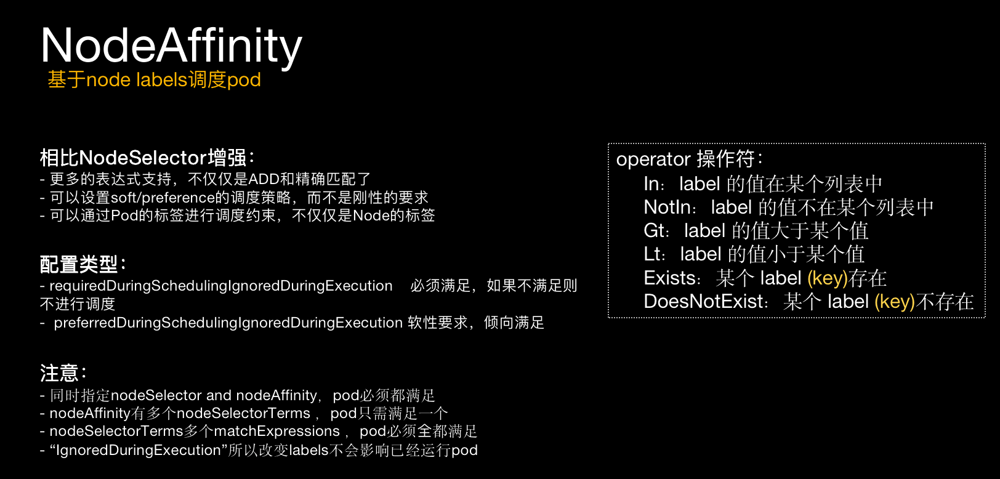
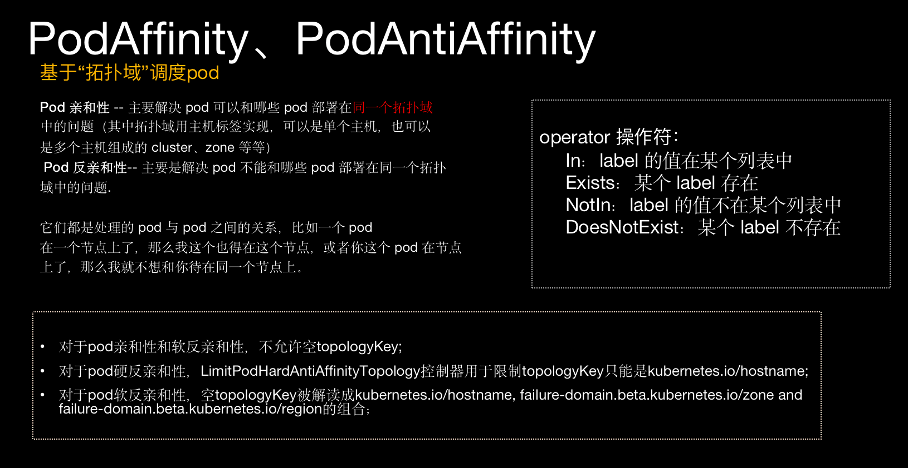

# 专题-亲和性调度(Author - XiaoYang)

<!-- toc -->

## 简介

在未分析和深入理解scheduler源码逻辑之前，本人在操作配置亲和性上，由于官方和第三方文档者说明不清楚等原因，在亲和性理解上有遇到过一些困惑，如： 

1. 亲和性的operator的 “*In*”底层是什么匹配操作？正则匹配吗？“*Gt/Lt*”底层又是什么操作实现的？ 

2. 所有能查到的文档描述pod亲和性的topoloykey有三个： 
   *kubernetes.io/hostname* 
   *failure-domain.beta.kubernetes.io/zone* 
   *failure-domain.beta.kubernetes.io/region* 
   为什么？真的只支持这三个key？不能自定义？ 

3. Pod与Node亲和性两种类型的差异是什么？而Pod亲和性正真要去匹配的是什么，其内在逻辑是？ 
   不知道你们是否有同样类似的问题或困惑呢？当你清晰的理解了代码逻辑实现后，那么你会觉得一切是那么的 
   清楚明确了，不再有“隐性知识”问题存在。所以我希望本文所述内容能给大家在kubernetes亲和性的解惑上有所帮助。 

### 约束调度

  在展开源码分析之前为更好的理解亲和性代码逻辑，补充一些kubernetes调度相关的基础知识： 

1. 亲和性目的是为了实现用户可以按需将pod调度到`指定Node`上，我称之为`“约束调度”`。 
2. 约束调度操作上常用以下三类： 

- **NodeSelector / NodeName**     *node标签选择器 和 "nodeName"匹配*
- **Affinity (Node/Pod/Service）**  *亲和性*
- **Taint / Toleration**                       *污点和容忍* 

3. 本文所述主题是亲和性，亲和性分为三种类型Node、Pod、Service亲和，以下是亲和性预选和优选阶段代码实现的策略对应表（*后面有详细分析*）： 

|       预选阶段策略        |                         Pod.Spec配置                         |  类别   | 次序 |
| :-----------------------: | :----------------------------------------------------------: | :-----: | :--: |
|  MatchNodeSelecotorPred   | *NodeAffinity.RequiredDuringScheduling<br />IgnoredDuringExecution* |  Node   |  6   |
| MatchInterPodAffinityPred | *PodAffinity.RequiredDuringScheduling<br />IgnoredDuringExecution<br />**PodAntiAffinity.RequiredDuringScheduling<br />IgnoredDuringExecution* |   Pod   |  22  |
| CheckServiceAffinityPred  |                                                              | Service |  12  |

|       优选阶段策略       |                         Pod.Spec配置                         | 默认权重 |
| :----------------------: | :----------------------------------------------------------: | :------: |
| InterPodAffinityPriority | PodAffinity.PreferredDuringScheduling<br />IgnoredDuringExecution |    1     |
|   NodeAffinityPriority   | NodeAffinity.PreferredDuringScheduling<br />IgnoredDuringExecution |    1     |

### Labels.selector标签选择器

labels selector是亲和性代码底层使用最基础的代码工具，不论是nodeAffinity还是podAffinity都是需要用到它。在使用yml类型deployment定义一个pod，配置其亲和性时须指定匹配表达式，其根本的匹配都是要对Node或pod的labels标签进行条件匹配。而这些labels标签匹配计算就必须要用到labels.selector工具(公共使用部分)。 所以在将此块最底层的匹配计算分析部分放在最前面，以便于后面源码分析部分更容易理解。 

> labels.selector接口定义，关键的方法是Matchs()

!FILENAME vendor/k8s.io/apimachinery/pkg/labels/selector.go:36

```go
type Selector interface {
	Matches(Labels) bool  
	Empty() bool
	String() string
	Add(r ...Requirement) Selector
	Requirements() (requirements Requirements, selectable bool)
	DeepCopySelector() Selector
}
```

> 看一下调用端，如下面的几个实例的func，调用labels.NewSelector()实例化一个labels.selector对象返回.

```go
func LabelSelectorAsSelector(ps *LabelSelector) (labels.Selector, error) {
  ...
	selector := labels.NewSelector()   
  ...
}

func NodeSelectorRequirementsAsSelector(nsm []v1.NodeSelectorRequirement) (labels.Selector, error) {
	...
	selector := labels.NewSelector() 
	...
	}

func TopologySelectorRequirementsAsSelector(tsm []v1.TopologySelectorLabelRequirement) (labels.Selector, error) {
  ...
	selector := labels.NewSelector()  
  ...
}

```

> NewSelector返回的是一个InternelSelector类型，而InternelSelector类型是一个Requirement（必要条件） 
>
> 类型的列表。 

!FILENAME vendor/k8s.io/apimachinery/pkg/labels/selector.go:79

```go
func NewSelector() Selector {
	return internalSelector(nil)
}

type internalSelector []Requirement
```

> InternelSelector类的Matches()底层实现是遍历调用requirement.Matches()

!FILENAME   vendor/k8s.io/apimachinery/pkg/labels/selector.go:340

```go
func (lsel internalSelector) Matches(l Labels) bool {
	for ix := range lsel {
	  // internalSelector[ix]为Requirement
		if matches := lsel[ix].Matches(l); !matches {
			return false
		}
	}
	return true
}
```

> 再来看下requirment结构定义(key、操作符、值 )       *"这就是配置的亲和匹配条件表达式"*

!FILENAME   vendor/k8s.io/apimachinery/pkg/labels/selector.go:114

```go
type Requirement struct {
	key      string
	operator selection.Operator
	// In huge majority of cases we have at most one value here.
	// It is generally faster to operate on a single-element slice
	// than on a single-element map, so we have a slice here.
	strValues []string
}
```

> requirment.matchs() 真正的条件表达式操作实现,基于表达式`operator`,计算`key/value`,返回匹配`与否`

!FILENAME  vendor/k8s.io/apimachinery/pkg/labels/selector.go:192

```go
func (r *Requirement) Matches(ls Labels) bool {
	switch r.operator {
	case selection.In, selection.Equals, selection.DoubleEquals:
		if !ls.Has(r.key) {                       //IN
			return false
		}
		return r.hasValue(ls.Get(r.key))
	case selection.NotIn, selection.NotEquals:   //NotIn
		if !ls.Has(r.key) {
			return true
		}
		return !r.hasValue(ls.Get(r.key))        
	case selection.Exists:                       //Exists
		return ls.Has(r.key)
	case selection.DoesNotExist:                 //NotExists
		return !ls.Has(r.key)
	case selection.GreaterThan, selection.LessThan: // GT、LT
		if !ls.Has(r.key) {
			return false
		}
		lsValue, err := strconv.ParseInt(ls.Get(r.key), 10, 64)   //能转化为数值的”字符数值“
		if err != nil {
			klog.V(10).Infof("ParseInt failed for value %+v in label %+v, %+v", ls.Get(r.key), ls, err)
			return false
		}

		// There should be only one strValue in r.strValues, and can be converted to a integer.
		if len(r.strValues) != 1 {
			klog.V(10).Infof("Invalid values count %+v of requirement %#v, for 'Gt', 'Lt' operators, exactly one value is required", len(r.strValues), r)
			return false
		}

		var rValue int64
		for i := range r.strValues {
			rValue, err = strconv.ParseInt(r.strValues[i], 10, 64)
			if err != nil {
				klog.V(10).Infof("ParseInt failed for value %+v in requirement %#v, for 'Gt', 'Lt' operators, the value must be an integer", r.strValues[i], r)
				return false
			}
		}
		return (r.operator == selection.GreaterThan && lsValue > rValue) || (r.operator == selection.LessThan && lsValue < rValue)
	default:
		return false
	}
}
```

*注：*
*除了LabelsSelector外还有NodeSelector 、FieldsSelector、PropertySelector等，但基本都是类似的Selector接口实现，逻辑上都基本一致，后在源码分析过程有相应的说明。*


## Node亲和性

Node亲和性基础描述:



yml配置实例sample：

```yaml
---
apiVersion:v1
kind: Pod
metadata:
  name: with-node-affinity
spec:
  affinity:
    nodeAffinity:    #pod实例部署在prd-zone-A 或 prd-zone-B
      requiredDuringSchedulingIgnoredDuringExecution:
        nodeSelectorTerms:
        - matchExpressions:
          - key: kubernetes.io/prd-zone-name
            operator: In
            values:
            - prd-zone-A
            - prd-zone-B
      preferredDuringSchedulingIgnoredDuringExecution:
      - weight: 1
        preference:
          matchExpressions:
          - key: securityZone
            operator: In
            values:
            - BussinssZone
  containers:
  - name: with-node-affinity
    image: gcr.io/google_containers/pause:2.0
```

### Node亲和性`预选策略MatchNodeSelectorPred` 

**策略说明：**

基于NodeSelector和NodeAffinity定义为被调度的pod选择相匹配的Node（Nodes Labels）

**适用NodeAffinity配置项**： 

NodeAffinity.`Required`DuringSchedulingIgnoredDuringExecution 

**预选策略源码分析：**

1. ***策略注册***： defaults.init()注册了一条名为“MatchNodeSelectorPred”预选策略项,策略Func是PodMatchNodeSelector()

!FILENAME  pkg/scheduler/algorithmprovider/defaults/defaults.go:78

```go
func init() {
  ...
factory.RegisterFitPredicate(predicates.MatchNodeSelectorPred, predicates.PodMatchNodeSelector)
  ...
}
```

2. ***策略Func***:  **PodMatchNodeSelector()** 

获取目标Node信息,调用podMatchesNodeSelectorAndAffinityTerms()对被调度pod和目标node进行亲和性匹配。 如果符合则返回true,反之false并记录错误信息。 

!FILENAME  pkg/scheduler/algorithm/predicates/predicates.go:853

```go
func PodMatchNodeSelector(pod *v1.Pod, meta algorithm.PredicateMetadata, nodeInfo *schedulercache.NodeInfo) (bool, []algorithm.PredicateFailureReason, error) {
  // 获取node信息
	node := nodeInfo.Node()
	if node == nil {
		return false, nil, fmt.Errorf("node not found")
	}
  // 关键子逻辑func
  // 输入参数:被调度的pod和前面获取的node(被检测的node)
	if podMatchesNodeSelectorAndAffinityTerms(pod, node) {
		return true, nil, nil
	}
	return false, []algorithm.PredicateFailureReason{ErrNodeSelectorNotMatch}, nil
}
```

> ​    **podMatchesNodeSelectorAndAffinityTerms()**
>
> ​    NodeSelector和NodeAffinity定义的"必要条件"配置匹配检测

!FILENAME  pkg/scheduler/algorithm/predicates/predicates.go:807

```go
func podMatchesNodeSelectorAndAffinityTerms(pod *v1.Pod, node *v1.Node) bool {
  // 如果设置了NodeSelector,则检测Node labels是否满足NodeSelector所定义的所有terms项.   
	if len(pod.Spec.NodeSelector) > 0 {
		selector := labels.SelectorFromSet(pod.Spec.NodeSelector)
		if !selector.Matches(labels.Set(node.Labels)) {
			return false
		}
	}
  //如果设置了NodeAffinity，则进行Node亲和性匹配  nodeMatchesNodeSelectorTerms() *[后面有详细分析]* 
	nodeAffinityMatches := true
	affinity := pod.Spec.Affinity
	if affinity != nil && affinity.NodeAffinity != nil {
		nodeAffinity := affinity.NodeAffinity
		if nodeAffinity.RequiredDuringSchedulingIgnoredDuringExecution == nil {
			return true
		}

		if nodeAffinity.RequiredDuringSchedulingIgnoredDuringExecution != nil {
			nodeSelectorTerms := nodeAffinity.RequiredDuringSchedulingIgnoredDuringExecution.NodeSelectorTerms
			klog.V(10).Infof("Match for RequiredDuringSchedulingIgnoredDuringExecution node selector terms %+v", nodeSelectorTerms)
      
      // 关键处理func: nodeMatchesNodeSelectorTerms()                             
			nodeAffinityMatches = nodeAffinityMatches && nodeMatchesNodeSelectorTerms(node, nodeSelectorTerms)
		}

	}
	return nodeAffinityMatches
}
```

*注*：

- *NodeSelector和NodeAffinity.Require... 都存在配置则`都`需True；*

- *如果NodeSelector失败则直接false,不处理NodeAffinity;*

- *如果指定了多个 NodeSelectorTerms，那 node只要满足`其中一个`条件;*

- *如果指定了多个 MatchExpressions，那必须要满足`所有`条件.*

  

 **nodeMatchesNodeSelectorTerms()** 
调用v1helper.MatchNodeSelectorTerms()进行NodeSelectorTerm定义的必要条件进行检测是否符合。
关键的配置定义分为两类(matchExpressions/matchFileds)：
*-“requiredDuringSchedulingIgnoredDuringExecution.**matchExpressions**”定义检测(匹配key与value)*
*-“requiredDuringSchedulingIgnoredDuringExecution.**matchFileds**”定义检测(不匹配key，只value)*

!FILENAME  pkg/scheduler/algorithm/predicates/predicates.go:797

```go
func nodeMatchesNodeSelectorTerms(node *v1.Node, nodeSelectorTerms []v1.NodeSelectorTerm) bool {
	nodeFields := map[string]string{}
  // 获取检测目标node的Filelds
	for k, f := range algorithm.NodeFieldSelectorKeys {
		nodeFields[k] = f(node)
	}
  // 调用v1helper.MatchNodeSelectorTerms()
  // 参数：nodeSelectorTerms  亲和性配置的必要条件Terms
  //      labels             被检测的目标node的label列表 
  //      fields             被检测的目标node filed列表
	return v1helper.MatchNodeSelectorTerms(nodeSelectorTerms, labels.Set(node.Labels), fields.Set(nodeFields))
}

// pkg/apis/core/v1/helper/helpers.go:302
func MatchNodeSelectorTerms( nodeSelectorTerms []v1.NodeSelectorTerm,
	nodeLabels labels.Set, nodeFields fields.Set,) bool {
	for _, req := range nodeSelectorTerms {
		// nil or empty term selects no objects
		if len(req.MatchExpressions) == 0 && len(req.MatchFields) == 0 {
			continue
		}
    // MatchExpressions条件表达式匹配                                             ① 
		if len(req.MatchExpressions) != 0 {
			labelSelector, err := NodeSelectorRequirementsAsSelector(req.MatchExpressions)
			if err != nil || !labelSelector.Matches(nodeLabels) {
				continue
			}
		}
    // MatchFields条件表达式匹配                                                   ②
		if len(req.MatchFields) != 0 {
			fieldSelector, err := NodeSelectorRequirementsAsFieldSelector(req.MatchFields)
			if err != nil || !fieldSelector.Matches(nodeFields) {
				continue
			}
		}
		return true
	}
	return false
}

```

①  *NodeSelectorRequirementAsSelector()*
是对“requiredDuringSchedulingIgnoredDuringExecution.matchExpressions"所配置的表达式进行Selector表达式进行格式化加工，返回一个labels.Selector实例化对象. [*本文开头1.2章节有分析*]

!FILENAME   pkg/apis/core/v1/helper/helpers.go:222

```go
func NodeSelectorRequirementsAsSelector(nsm []v1.NodeSelectorRequirement) (labels.Selector, error) {
	if len(nsm) == 0 {
		return labels.Nothing(), nil
	}
	selector := labels.NewSelector()
	for _, expr := range nsm {
		var op selection.Operator
		switch expr.Operator {
		case v1.NodeSelectorOpIn:
			op = selection.In
		case v1.NodeSelectorOpNotIn:
			op = selection.NotIn
		case v1.NodeSelectorOpExists:
			op = selection.Exists
		case v1.NodeSelectorOpDoesNotExist:
			op = selection.DoesNotExist
		case v1.NodeSelectorOpGt:
			op = selection.GreaterThan
		case v1.NodeSelectorOpLt:
			op = selection.LessThan
		default:
			return nil, fmt.Errorf("%q is not a valid node selector operator", expr.Operator)
		}
		// 表达式的三个关键要素： expr.Key, op, expr.Values 
		r, err := labels.NewRequirement(expr.Key, op, expr.Values)
		if err != nil {
			return nil, err
		}
		selector = selector.Add(*r)
	}
	return selector, nil
}
```

 ② *NodeSelectorRequirementAs`Field`Selector()*
是对“requiredDuringSchedulingIgnoredDuringExecution.matchFields"所配置的表达式进行Selector表达式进行格式化加工，返回一个Fields.Selector实例化对象.

!FILENAME  pkg/apis/core/v1/helper/helpers.go:256

```go
func NodeSelectorRequirementsAsFieldSelector(nsm []v1.NodeSelectorRequirement) (fields.Selector, error) {
	if len(nsm) == 0 {
		return fields.Nothing(), nil
	}

	selectors := []fields.Selector{}
	for _, expr := range nsm {
		switch expr.Operator {
		case v1.NodeSelectorOpIn:
			if len(expr.Values) != 1 {
				return nil, fmt.Errorf("unexpected number of value (%d) for node field selector operator %q",
					len(expr.Values), expr.Operator)
			}
			selectors = append(selectors, fields.OneTermEqualSelector(expr.Key, expr.Values[0]))

		case v1.NodeSelectorOpNotIn:
			if len(expr.Values) != 1 {
				return nil, fmt.Errorf("unexpected number of value (%d) for node field selector operator %q",
					len(expr.Values), expr.Operator)
			}
			selectors = append(selectors, fields.OneTermNotEqualSelector(expr.Key, expr.Values[0]))

		default:
			return nil, fmt.Errorf("%q is not a valid node field selector operator", expr.Operator)
		}
	}

	return fields.AndSelectors(selectors...), nil
}
```

3. **关键数据结构**
   **NodeSelector**相关结构的定义

!FILENAME   vendor/k8s.io/api/core/v1/types.go:2436

```go
type NodeSelector struct {
	NodeSelectorTerms []NodeSelectorTerm `json:"nodeSelectorTerms" protobuf:"bytes,1,rep,name=nodeSelectorTerms"`
}

type NodeSelectorTerm struct {
	MatchExpressions []NodeSelectorRequirement `json:"matchExpressions,omitempty" protobuf:"bytes,1,rep,name=matchExpressions"`
	MatchFields []NodeSelectorRequirement `json:"matchFields,omitempty" protobuf:"bytes,2,rep,name=matchFields"`
}

type NodeSelectorRequirement struct {
	Key string `json:"key" protobuf:"bytes,1,opt,name=key"`
	Operator NodeSelectorOperator `json:"operator" protobuf:"bytes,2,opt,name=operator,casttype=NodeSelectorOperator"`
	Values []string `json:"values,omitempty" protobuf:"bytes,3,rep,name=values"`
}

type NodeSelectorOperator string
const (
	NodeSelectorOpIn           NodeSelectorOperator = "In"
	NodeSelectorOpNotIn        NodeSelectorOperator = "NotIn"
	NodeSelectorOpExists       NodeSelectorOperator = "Exists"
	NodeSelectorOpDoesNotExist NodeSelectorOperator = "DoesNotExist"
	NodeSelectorOpGt           NodeSelectorOperator = "Gt"
	NodeSelectorOpLt           NodeSelectorOperator = "Lt"
)
```

**FieldsSelector**实现类的结构定义（`Match value`)

!FILENAME   vendor/k8s.io/apimachinery/pkg/fields/selector.go:78

```go
type hasTerm struct {
	field, value string
}

func (t *hasTerm) Matches(ls Fields) bool {
	return ls.Get(t.field) == t.value
}

type notHasTerm struct {
	field, value string
}

func (t *notHasTerm) Matches(ls Fields) bool {
	return ls.Get(t.field) != t.value
}
```

### Node亲和性`优选策略NodeAffinityPriority`

**策略说明：**

通过被调度的pod亲和性配置定义条件，对潜在可被调度运行的Nodes进行亲和性匹配并评分.

**适用NodeAffinity配置项**： 

NodeAffinity.PreferredDuringSchedulingIgnoredDuringExecution 

**预选策略源码分析：**

1. ***策略注册***：defaultPriorities()注册了一条名为“NodeAffinityPriority”优选策略项.并注册了策略的两个方法Map/Reduce： 

   - CalculateNodeAffinityPriorityMap()  map计算， 对潜在被调度Node进行亲和匹配，并为其计权重得分. 
   - CalculateNodeAffinityPriorityReduce()  reduce计算，重新统计得分,取值区间0~10. 

!FILENAME   pkg/scheduler/algorithmprovider/defaults/defaults.go:266

```go
//k8s.io/kubernetes/pkg/scheduler/algorithmprovider/defaults/defaults.go/algorithmprovider/defaults.go 

func defaultPriorities() sets.String {
  ...
  
factory.RegisterPriorityFunction2("NodeAffinityPriority", priorities.CalculateNodeAffinityPriorityMap, priorities.CalculateNodeAffinityPriorityReduce, 1),
  
  ...
}
```

2. ***策略Func***:

   > `map计算`  **CalculateNodeAffinityPriorityMap()**
   >        遍历affinity.NodeAffinity.PreferredDuringSchedulingIgnoredDuringExecution所 定义的Terms解NodeSelector对象(labels.selector)后，对潜在被调度Node的labels进行Match匹配检测，如果匹配则将条件所给定的Weight权重值累计。 最后将返回各潜在的被调度Node最后分值。 

!FILENAME   pkg/scheduler/algorithm/priorities/node_affinity.go:34

```go
func CalculateNodeAffinityPriorityMap(pod *v1.Pod, meta interface{}, nodeInfo *schedulercache.NodeInfo) (schedulerapi.HostPriority, error) {
	// 获取被检测的Node信息
  node := nodeInfo.Node()
	if node == nil {
		return schedulerapi.HostPriority{}, fmt.Errorf("node not found")
	}

	// 默认为Spec配置的Affinity
	affinity := pod.Spec.Affinity
	if priorityMeta, ok := meta.(*priorityMetadata); ok {
		// We were able to parse metadata, use affinity from there.
		affinity = priorityMeta.affinity
	}

	var count int32
	if affinity != nil && affinity.NodeAffinity != nil && affinity.NodeAffinity.PreferredDuringSchedulingIgnoredDuringExecution != nil {
    // 遍历PreferredDuringSchedulingIgnoredDuringExecution定义的`必要条件项`(Terms)
		for i := range affinity.NodeAffinity.PreferredDuringSchedulingIgnoredDuringExecution {
			preferredSchedulingTerm := &affinity.NodeAffinity.PreferredDuringSchedulingIgnoredDuringExecution[i]
			if preferredSchedulingTerm.Weight == 0 {  //注意前端的配置，如果weight为0则不做任何处理
				continue
			}

			// TODO: Avoid computing it for all nodes if this becomes a performance problem.
      // 获取node亲和MatchExpression表达式条件，实例化label.Selector对象.  
			nodeSelector, err := v1helper.NodeSelectorRequirementsAsSelector(preferredSchedulingTerm.Preference.MatchExpressions)
			if err != nil {
				return schedulerapi.HostPriority{}, err
			}
			if nodeSelector.Matches(labels.Set(node.Labels)) {
				count += preferredSchedulingTerm.Weight
			}
		}
	}
     // 返回Node得分
	return schedulerapi.HostPriority{
		Host:  node.Name,
		Score: int(count),
	}, nil
}
```

 再次看到前面(预选策略分析时)分析过的NodeSelectorRequirementAsSelector()  
`返回一个labels.Selector实例对象` 使用selector.Matches对node.Labels进行匹配是否符合条件.


>  `reduce计算`  **CalculateNodeAffinityPriorityReduce()**
>
>  将各个node的最后得分重新计算分布区间在0〜10.
>
>  代码内给定一个NormalizeReduce()方法，MaxPriority值为10,reverse取反false关闭

!FILENAME   pkg/scheduler/algorithm/priorities/node_affinity.go:77

```go
const	MaxPriority = 10
var CalculateNodeAffinityPriorityReduce = NormalizeReduce(schedulerapi.MaxPriority, false)
```

NormalizeReduce() 

- 结果评分取值0〜MaxPriority
- reverse取反为true时，最终评分=(MaxPriority-其原评分值） 

!FILENAME   pkg/scheduler/algorithm/priorities/reduce.go:29

```go
func NormalizeReduce(maxPriority int, reverse bool) algorithm.PriorityReduceFunction {
	return func(
		_ *v1.Pod,
		_ interface{},
		_ map[string]*schedulercache.NodeInfo,
		result schedulerapi.HostPriorityList) error {

		var maxCount int
		// 取出最大的值
		for i := range result {
			if result[i].Score > maxCount {
				maxCount = result[i].Score
			}
		}
    // 如果最大的值为0，且取反设为真，则将所有的评分设置为MaxPriority
		if maxCount == 0 {
			if reverse {
				for i := range result {
					result[i].Score = maxPriority
				}
			}
			return nil
		}
		// 计算后得分 = maxPrority * 原分值 / 最大值
		// 如果取反为真则 maxPrority - 计算后得分
		for i := range result {
			score := result[i].Score

			score = maxPriority * score / maxCount
			if reverse {
				score = maxPriority - score
			}

			result[i].Score = score
		}
		return nil
	}
}
```


## Pod亲和性

Pod亲和性基础描述:



yml配置实例sample：

```yaml
---
apiVersion: apps/v1beta1
kind: Deployment
metadata:
  name: affinity
  labels:
    app: affinity
spec:
  replicas: 3
  template:
    metadata:
      labels:
        app: affinity
        role: lab-web
    spec:
      containers:
      - name: nginx
        image: nginx:1.9.0
        ports:
        - containerPort: 80
          name: nginx_web_Lab
      affinity:                     #为实现高可用，三个pod应该分布在不同Node上
        podAntiAffinity: 
          requiredDuringSchedulingIgnoredDuringExecution:  
          - labelSelector:
              matchExpressions:
              - key: app
                operator: In
                values:
                - prod-pod
            topologyKey: kubernetes.io/hostname
```

### Pod亲和性`预选策略MatchInterPodAffinityPred` 

**策略说明：**

对需被调度的Pod进行亲和/反亲和配置匹配检测目标Pods，然后获取满足亲和条件的Pods所运行的Nodes
​的 **TopologyKey的值**(亲和性pod定义topologyKey)与目标 Nodes进行一一匹配是否符合条件. 

**适用NodeAffinity配置项**： 
PodAffinity.`Required`DuringSchedulingIgnoredDuringExecution             
PodAntiAffinity.`Required`DuringSchedulingIgnoredDuringExecution

**预选策略源码分析：**

1. ***策略注册***：defaultPredicates()注册了一条名为“MatchInterPodAffinity”预选策略项.

!FILENAME  pkg/scheduler/algorithmprovider/defaults/defaults.go:143

```go
func defaultPredicates() sets.String {
  ...
  
factory.RegisterFitPredicateFactory(
			predicates.MatchInterPodAffinityPred,
			func(args factory.PluginFactoryArgs) algorithm.FitPredicate {
				return predicates.NewPodAffinityPredicate(args.NodeInfo, args.PodLister)
			},
  
  ...
}
```

2. **策略Func**: **checker.InterPodAffinityMatches()**
   Func是通过NewPodAffinityProdicate()实例化PodAffinityChecker类对象后返回。

!FILENAME  pkg/scheduler/algorithm/predicates/predicates.go:1138

```go
type PodAffinityChecker struct {
	info      NodeInfo
	podLister algorithm.PodLister
}

func NewPodAffinityPredicate(info NodeInfo, podLister algorithm.PodLister) algorithm.FitPredicate {
	checker := &PodAffinityChecker{
		info:      info,
		podLister: podLister,
	}
	return checker.InterPodAffinityMatches  //返回策略func
}
```

> **InterPodAffinityMatches()**
> 检测一个pod是否满足调度到特定的（符合pod亲和或反亲和配置）Node上。 
>
> 1. satisfiesExistingPodsAntiAffinity()  满足存在的Pods反亲和配置. 
> 2. satisfiesPodsAffinityAntiAffinity()   满足Pods亲和与反亲和配置. 

!FILENAME  pkg/scheduler/algorithm/predicates/predicates.go:1155

```go
func (c *PodAffinityChecker) InterPodAffinityMatches(pod *v1.Pod, meta algorithm.PredicateMetadata, nodeInfo *schedulercache.NodeInfo) (bool, []algorithm.PredicateFailureReason, error) {
	node := nodeInfo.Node()
	if node == nil {
		return false, nil, fmt.Errorf("node not found")
	}     
                                          //①
	if failedPredicates, error := c.satisfiesExistingPodsAntiAffinity(pod, meta, nodeInfo); failedPredicates != nil {
		failedPredicates := append([]algorithm.PredicateFailureReason{ErrPodAffinityNotMatch}, failedPredicates)
		return false, failedPredicates, error
	}

	// Now check if <pod> requirements will be satisfied on this node.
	affinity := pod.Spec.Affinity
	if affinity == nil || (affinity.PodAffinity == nil && affinity.PodAntiAffinity == nil) {
		return true, nil, nil
	}   
                                         //② 
	if failedPredicates, error := c.satisfiesPodsAffinityAntiAffinity(pod, meta, nodeInfo, affinity); failedPredicates != nil {
		failedPredicates := append([]algorithm.PredicateFailureReason{ErrPodAffinityNotMatch}, failedPredicates)
		return false, failedPredicates, error
	}

	return true, nil, nil
}
```

① satisfiesExistingPodsAntiAffinity()
检测当pod被调度到目标node上是否触犯了其它pods所定义的反亲和配置.
*即：当调度一个pod到目标Node上，而某个或某些Pod定义了反亲和配置与被*
        *调度的Pod相匹配(触犯)，那么就不应该将此Node加入到可选的潜在调度Nodes列表内.*

!FILENAME  pkg/scheduler/algorithm/predicates/predicates.go:1293

```go
func (c *PodAffinityChecker) satisfiesExistingPodsAntiAffinity(pod *v1.Pod, meta algorithm.PredicateMetadata, nodeInfo *schedulercache.NodeInfo) (algorithm.PredicateFailureReason, error) {
	node := nodeInfo.Node()
	if node == nil {
		return ErrExistingPodsAntiAffinityRulesNotMatch, fmt.Errorf("Node is nil")
	}
	var topologyMaps *topologyPairsMaps
  //如果存在预处理的MetaData则直接获取topologyPairsAntiAffinityPodsMap
	if predicateMeta, ok := meta.(*predicateMetadata); ok {
		topologyMaps = predicateMeta.topologyPairsAntiAffinityPodsMap
	} else {
    //  不存在预处理的MetaData处理逻辑.
    //  过滤掉pod的nodeName等于NodeInfo.Node.Name,且不存在于nodeinfo中.
    //  即运行在其它Nodes上的Pods
		filteredPods, err := c.podLister.FilteredList(nodeInfo.Filter, labels.Everything())
		if err != nil {
			errMessage := fmt.Sprintf("Failed to get all pods, %+v", err)
			klog.Error(errMessage)
			return ErrExistingPodsAntiAffinityRulesNotMatch, errors.New(errMessage)
		}
    // 获取被调度Pod与其它存在反亲和配置的Pods匹配的topologyMaps
		if topologyMaps, err = c.getMatchingAntiAffinityTopologyPairsOfPods(pod, filteredPods); err != nil {
			errMessage := fmt.Sprintf("Failed to get all terms that pod %+v matches, err: %+v", podName(pod), err)
			klog.Error(errMessage)
			return ErrExistingPodsAntiAffinityRulesNotMatch, errors.New(errMessage)
		}
	}

  // 遍历所有topology pairs(所有反亲和topologyKey/Value)，检测Node是否有影响.
	for topologyKey, topologyValue := range node.Labels {
		if topologyMaps.topologyPairToPods[topologyPair{key: topologyKey, value: topologyValue}] != nil {
			klog.V(10).Infof("Cannot schedule pod %+v onto node %v", podName(pod), node.Name)
			return ErrExistingPodsAntiAffinityRulesNotMatch, nil
		}
	}
	return nil, nil
}
```

getMatchingAntiAffinityTopologyPairsOfPods()
获取被调度Pod与其它存在反亲和配置的Pods匹配的topologyMaps

!FILENAME  pkg/scheduler/algorithm/predicates/predicates.go:1270

```go
func (c *PodAffinityChecker) getMatchingAntiAffinityTopologyPairsOfPods(pod *v1.Pod, existingPods []*v1.Pod) (*topologyPairsMaps, error) {
	topologyMaps := newTopologyPairsMaps()
   // 遍历所有存在Pods,获取pod所运行的Node信息
	for _, existingPod := range existingPods {
		existingPodNode, err := c.info.GetNodeInfo(existingPod.Spec.NodeName)
		if err != nil {
			if apierrors.IsNotFound(err) {
				klog.Errorf("Node not found, %v", existingPod.Spec.NodeName)
				continue
			}
			return nil, err
		}
    // 依据被调度的pod、目标pod、目标Node信息(上面获取得到)获取TopologyPairs。
    // getMatchingAntiAffinityTopologyPairsOfPod()下面详述
		existingPodTopologyMaps, err := getMatchingAntiAffinityTopologyPairsOfPod(pod, existingPod, existingPodNode)
		if err != nil {
			return nil, err
		}
		topologyMaps.appendMaps(existingPodTopologyMaps)
	}
	return topologyMaps, nil
}

//1)是否ExistingPod定义了反亲和配置，如果没有直接返回
//2)如果有定义，是否有任务一个反亲和Term匹配需被调度的pod.
//  如果配置则将返回term定义的TopologyKey和Node的topologyValue.
func getMatchingAntiAffinityTopologyPairsOfPod(newPod *v1.Pod, existingPod *v1.Pod, node *v1.Node) (*topologyPairsMaps, error) {
	affinity := existingPod.Spec.Affinity
	if affinity == nil || affinity.PodAntiAffinity == nil {
		return nil, nil
	}

	topologyMaps := newTopologyPairsMaps()
	for _, term := range GetPodAntiAffinityTerms(affinity.PodAntiAffinity) {
		namespaces := priorityutil.GetNamespacesFromPodAffinityTerm(existingPod, &term)
		selector, err := metav1.LabelSelectorAsSelector(term.LabelSelector)
		if err != nil {
			return nil, err
		}
		if priorityutil.PodMatchesTermsNamespaceAndSelector(newPod, namespaces, selector) {
			if topologyValue, ok := node.Labels[term.TopologyKey]; ok {
				pair := topologyPair{key: term.TopologyKey, value: topologyValue}
				topologyMaps.addTopologyPair(pair, existingPod)
			}
		}
	}
	return topologyMaps, nil
}
```

②  satisfiesPodsAffinityAntiAffinity() 
满足Pods亲和与反亲和配置.
我们先看一下代码结构，我将共分为两个部分if{}部分,else{}部分,依赖于是否指定了预处理的预选metadata.

!FILENAME  pkg/scheduler/algorithm/predicates/predicates.go:1367

```go 
func (c *PodAffinityChecker) satisfiesPodsAffinityAntiAffinity(pod *v1.Pod,
	meta algorithm.PredicateMetadata, nodeInfo *schedulercache.NodeInfo,
	affinity *v1.Affinity) (algorithm.PredicateFailureReason, error) {
	node := nodeInfo.Node()
	if node == nil {
		return ErrPodAffinityRulesNotMatch, fmt.Errorf("Node is nil")
	}
	if predicateMeta, ok := meta.(*predicateMetadata); ok {
	  ...    //partI
	} else { 
    ...    //partII  
	}
	return nil, nil
}
```

`partI` if{...}

- 如果指定了预处理metadata，则使用此逻辑，否则跳至else{...} 
- 获取所有pod亲和性定义AffinityTerms，如果存在亲和性定义，基于指定的metadata判断AffinityTerms所定义的nodeTopoloykey与值**是否所有都存在于**metadata.topologyPairsPotential`Affinity`Pods之内（潜在匹配亲和定义的pod list）。  
- 获取所有pod亲和性定义AntiAffinityTerms，如果存在反亲和定义，基于指定的metadata判断AntiAffinityTerms所定义的nodeTopoloykey与值 **是否有一个存在于** metadata.topologyPairsPotential`AntiAffinity`Pods之内的情况（潜在匹配anti反亲和定义的pod list）。 

```go
	if predicateMeta, ok := meta.(*predicateMetadata); ok {
		// 检测所有affinity terms.
		topologyPairsPotentialAffinityPods := predicateMeta.topologyPairsPotentialAffinityPods
		if affinityTerms := GetPodAffinityTerms(affinity.PodAffinity); len(affinityTerms) > 0 {
			matchExists := c.nodeMatchesAllTopologyTerms(pod, topologyPairsPotentialAffinityPods, nodeInfo, affinityTerms)
      
			if !matchExists {
				if !(len(topologyPairsPotentialAffinityPods.topologyPairToPods) == 0 && targetPodMatchesAffinityOfPod(pod, pod)) {
					klog.V(10).Infof("Cannot schedule pod %+v onto node %v, because of PodAffinity",
						podName(pod), node.Name)
					return ErrPodAffinityRulesNotMatch, nil
				}
			}
		}

		// 检测所有anti-affinity terms.
		topologyPairsPotentialAntiAffinityPods := predicateMeta.topologyPairsPotentialAntiAffinityPods
		if antiAffinityTerms := GetPodAntiAffinityTerms(affinity.PodAntiAffinity); len(antiAffinityTerms) > 0 {
			matchExists := c.nodeMatchesAnyTopologyTerm(pod, topologyPairsPotentialAntiAffinityPods, nodeInfo, antiAffinityTerms)
			if matchExists {
				klog.V(10).Infof("Cannot schedule pod %+v onto node %v, because of PodAntiAffinity",
					podName(pod), node.Name)
				return ErrPodAntiAffinityRulesNotMatch, nil
			}
		}
 }
```

以下说明继续if{…}内所用的各个**子逻辑函数分析**(按代码位置的先后顺序)：

*GetPodAffinityTerms()* 
*如果存在podAffinity硬件配置，获取所有"匹配必要条件”Terms*

!FILENAME  pkg/scheduler/algorithm/predicates/predicates.go:1217

```go 
func GetPodAffinityTerms(podAffinity *v1.PodAffinity) (terms []v1.PodAffinityTerm) {
	if podAffinity != nil {
		if len(podAffinity.RequiredDuringSchedulingIgnoredDuringExecution) != 0 {
			terms = podAffinity.RequiredDuringSchedulingIgnoredDuringExecution
		}
	}
	return terms
}
```

*nodeMatchesAllTopologyTerms()* 
*判断目标Node是否**匹配所有**亲和性配置的定义Terms的topology值*.

!FILENAME  pkg/scheduler/algorithm/predicates/predicates.go:1336

```go
// 目标Node须匹配所有Affinity terms所定义的TopologyKey，且值须与nodes(运行被亲和匹配表达式匹配的Pods)
// 的TopologyKey和值相匹配。
// 注：此逻辑内metadata预计算了topologyPairs
func (c *PodAffinityChecker) nodeMatchesAllTopologyTerms(pod *v1.Pod, topologyPairs *topologyPairsMaps, nodeInfo *schedulercache.NodeInfo, terms []v1.PodAffinityTerm) bool {
	node := nodeInfo.Node()
	for _, term := range terms {
    // 判断目标node上是否存在亲和配置定义的TopologyKey的key，取出其topologykey值
    // 根据key与值创建topologyPair
    // 基于metadata.topologyPairsPotentialAffinityPods(潜在亲和pods的topologyPairs)判断\
       //目标node上的ToplogyKey与value是否相互匹配.
		if topologyValue, ok := node.Labels[term.TopologyKey]; ok {
			pair := topologyPair{key: term.TopologyKey, value: topologyValue}
			if _, ok := topologyPairs.topologyPairToPods[pair]; !ok {
				return false // 一项不满足则为false
			}
		} else {
			return false
		}
	}
	return true
}

// topologyPairsMaps结构定义
type topologyPairsMaps struct {
    topologyPairToPods    map[topologyPair]podSet
    podToTopologyPairs    map[string]topologyPairSet
}

```

*targetPodMatchesAffinityOfPod()*
根据pod的亲和定义检测目标pod的NameSpace是否符合条件以及 Labels.selector条件表达式是否匹配. 

!FILENAME  pkg/scheduler/algorithm/predicates/metadata.go:498

```go 
func targetPodMatchesAffinityOfPod(pod, targetPod *v1.Pod) bool {
	affinity := pod.Spec.Affinity
	if affinity == nil || affinity.PodAffinity == nil {
		return false
	}
	affinityProperties, err := getAffinityTermProperties(pod, GetPodAffinityTerms(affinity.PodAffinity))   // ① 
	if err != nil {
		klog.Errorf("error in getting affinity properties of Pod %v", pod.Name)
		return false
	}                                          // ② 
	return podMatchesAllAffinityTermProperties(targetPod, affinityProperties)
}

// ① 获取affinityTerms所定义所有的namespaces 和 selector 列表，
//    返回affinityTermProperites数组. 数组的每项定义{namesapces,selector}.
func getAffinityTermProperties(pod *v1.Pod, terms []v1.PodAffinityTerm) (properties []*affinityTermProperties, err error) {
	if terms == nil {
		return properties, nil
	}

	for _, term := range terms {
		namespaces := priorityutil.GetNamespacesFromPodAffinityTerm(pod, &term)
    // 基于定义的亲和性term，创建labels.selector
		selector, err := metav1.LabelSelectorAsSelector(term.LabelSelector) 
		if err != nil {
			return nil, err
		}
		// 返回 namespaces 和 selector
		properties = append(properties, &affinityTermProperties{namespaces: namespaces, selector: selector})
	}
	return properties, nil
}
// 返回Namespace列表（如果term未指定Namespace则使用被调度pod的Namespace）.
func GetNamespacesFromPodAffinityTerm(pod *v1.Pod, podAffinityTerm *v1.PodAffinityTerm) sets.String {
	names := sets.String{}
	if len(podAffinityTerm.Namespaces) == 0 {
		names.Insert(pod.Namespace)
	} else {
		names.Insert(podAffinityTerm.Namespaces...)
	}
	return names
}

// ② 遍历properties所有定义的namespaces 和 selector 列表，调用PodMatchesTermsNamespaceAndSelector()进行一一匹配.
func podMatchesAllAffinityTermProperties(pod *v1.Pod, properties []*affinityTermProperties) bool {
	if len(properties) == 0 {
		return false
	}
	for _, property := range properties {
		if !priorityutil.PodMatchesTermsNamespaceAndSelector(pod, property.namespaces, property.selector) {
			return false
		}
	}
	return true
}
//  检测NameSpaces一致性和Labels.selector是否匹配.
//  - 如果pod.Namespaces不相等于指定的NameSpace值则返回false，如果true则继续labels match.
//  - 如果pod.labels不能Match Labels.selector选择器，则返回false,反之true
func PodMatchesTermsNamespaceAndSelector(pod *v1.Pod, namespaces sets.String, selector labels.Selector) bool {
	if !namespaces.Has(pod.Namespace) {
		return false
	}
	if !selector.Matches(labels.Set(pod.Labels)) {
		return false
	}
	return true
}

```

*GetPodAntiAffinityTerms()*
*获取pod反亲和配置所有的必要条件Terms*

!FILENAME   pkg/scheduler/algorithm/predicates/predicates.go:1231

```go
func GetPodAntiAffinityTerms(podAntiAffinity *v1.PodAntiAffinity) (terms []v1.PodAffinityTerm) {
	if podAntiAffinity != nil {
		if len(podAntiAffinity.RequiredDuringSchedulingIgnoredDuringExecution) != 0 {
			terms = podAntiAffinity.RequiredDuringSchedulingIgnoredDuringExecution
		}
	}
	return terms
}
```

*nodeMatchesAnyTopologyTerm()*
判断目标Node是否**有匹配了**反亲和的定义Terms的topology值*.

!FILENAME  pkg/scheduler/algorithm/predicates/predicates.go:1353

```go
//  Node只须匹配任何一条AnitAffinity terms所定义的TopologyKey则为True
//  逻辑等同于nodeMatchesAllTopologyTerms(),只是匹配一条则返回为true.
func (c *PodAffinityChecker) nodeMatchesAnyTopologyTerm(pod *v1.Pod, topologyPairs *topologyPairsMaps, nodeInfo *schedulercache.NodeInfo, terms []v1.PodAffinityTerm) bool {
	node := nodeInfo.Node()
	for _, term := range terms {
		if topologyValue, ok := node.Labels[term.TopologyKey]; ok {
			pair := topologyPair{key: term.TopologyKey, value: topologyValue}
			if _, ok := topologyPairs.topologyPairToPods[pair]; ok {
				return true // 一项满足则为true
			}
		}
	}
	return false
}
```

`partII` else{...}

- 如果没有预处理的Metadata，则通过指定podFilter过滤器获取满足条件的pod列表
- 获取所有亲和配置定义，如果存在则，通过获取PodAffinity所定义的所有namespaces和标签条件表达式进行匹配”目标pod",完全符合则获取**此目标pod的运行node的topologykey（此为affinity指定的topologykey）的 `值`**和"潜在Node"的topologykey的值比对是否一致。 
- 与上类似，获取所有anti反亲和配置定义，如果存在则，通过获取PodAntiAffinity所定义的所有namespaces和标签条件表达式进行匹配”目标pod",完全符合则获取此目标pod的运行node的topologykey（此为AntiAffinity指定的topologykey）的值和"潜在Node"的topologykey的值比对是否一致。 

```go
else { 
  // We don't have precomputed metadata. We have to follow a slow path to check affinity terms.
		filteredPods, err := c.podLister.FilteredList(nodeInfo.Filter, labels.Everything())
		if err != nil {
			return ErrPodAffinityRulesNotMatch, err
		}

    //获取亲和、反亲和配置定义的"匹配条件"Terms
		affinityTerms := GetPodAffinityTerms(affinity.PodAffinity)
		antiAffinityTerms := GetPodAntiAffinityTerms(affinity.PodAntiAffinity)
   
		matchFound, termsSelectorMatchFound := false, false
		for _, targetPod := range filteredPods {
			// 遍历所有目标Pod,检测所有亲和性配置"匹配条件"Terms
			if !matchFound && len(affinityTerms) > 0 {
        // podMatchesPodAffinityTerms()对namespaces和标签条件表达式进行匹配目标pod【详解后述】
				affTermsMatch, termsSelectorMatch, err := c.podMatchesPodAffinityTerms(pod, targetPod, nodeInfo, affinityTerms)
				if err != nil {
					errMessage := fmt.Sprintf("Cannot schedule pod %+v onto node %v, because of PodAffinity, err: %v", podName(pod), node.Name, err)
					klog.Error(errMessage)
					return ErrPodAffinityRulesNotMatch, errors.New(errMessage)
				}
				if termsSelectorMatch {
					termsSelectorMatchFound = true
				}
				if affTermsMatch {
					matchFound = true
				}
			}

			// 同上，遍历所有目标Pod,检测所有Anti反亲和配置"匹配条件"Terms.
			if len(antiAffinityTerms) > 0 {
				antiAffTermsMatch, _, err := c.podMatchesPodAffinityTerms(pod, targetPod, nodeInfo, antiAffinityTerms)
				if err != nil || antiAffTermsMatch {
					klog.V(10).Infof("Cannot schedule pod %+v onto node %v, because of PodAntiAffinityTerm, err: %v",
						podName(pod), node.Name, err)
					return ErrPodAntiAffinityRulesNotMatch, nil
				}
			}
		}

		if !matchFound && len(affinityTerms) > 0 {
			if termsSelectorMatchFound {
				klog.V(10).Infof("Cannot schedule pod %+v onto node %v, because of PodAffinity",
					podName(pod), node.Name)
				return ErrPodAffinityRulesNotMatch, nil
			}
			// Check if pod matches its own affinity properties (namespace and label selector).
			if !targetPodMatchesAffinityOfPod(pod, pod) {
				klog.V(10).Infof("Cannot schedule pod %+v onto node %v, because of PodAffinity",
					podName(pod), node.Name)
				return ErrPodAffinityRulesNotMatch, nil
			}
		}
	}

```

以下说明继续else{…}内所用的**子逻辑函数分析**：

*podMatchesPodAffinityTerms()* 
*通过获取亲和配置定义的所有namespaces和标签条件表达式进行匹配目标pod,完全符合则获取此目标pod的运行node的topologykey（此为affinity指定的topologykey）的`值`和潜在Node的topologykey的`值`比对是否一致.*

!FILENAME  pkg/scheduler/algorithm/predicates/predicates.go:1189

```go
func (c *PodAffinityChecker) podMatchesPodAffinityTerms(pod, targetPod *v1.Pod, nodeInfo *schedulercache.NodeInfo, terms []v1.PodAffinityTerm) (bool, bool, error) {
	if len(terms) == 0 {
		return false, false, fmt.Errorf("terms array is empty")
	}
	// 获取{namespaces,selector}列表
	props, err := getAffinityTermProperties(pod, terms)
	if err != nil {
		return false, false, err
	}
	// 匹配目标pod是否在affinityTerm定义的{namespaces,selector}列表内所有项，如果不匹配则返回false,
	// 如果匹配则获取此pod的运行node信息(称为目标Node)，
	// 通过“目标Node”所定义的topologykey（此为affinity指定的topologykey）的值来匹配“潜在被调度的Node”的topologykey是否一致。
	if !podMatchesAllAffinityTermProperties(targetPod, props) {
		return false, false, nil
	}
	// Namespace and selector of the terms have matched. Now we check topology of the terms.
	targetPodNode, err := c.info.GetNodeInfo(targetPod.Spec.NodeName)
	if err != nil {
		return false, false, err
	}
	for _, term := range terms {
		if len(term.TopologyKey) == 0 {
			return false, false, fmt.Errorf("empty topologyKey is not allowed except for PreferredDuringScheduling pod anti-affinity")
		}
		if !priorityutil.NodesHaveSameTopologyKey(nodeInfo.Node(), targetPodNode, term.TopologyKey) {
			return false, true, nil
		}
	}
	return true, true, nil
}
```

priorityutil.NodesHaveSameTopologyKey()* *正真的toplogykey比较实现的逻辑代码块。*
**从此代码可以看出deployment的yml对topologykey设定的可以支持自定义的**

!FILENAME  pkg/scheduler/algorithm/priorities/util/topologies.go:53

```
// 判断两者的topologyKey定义的值是否一致。
func NodesHaveSameTopologyKey(nodeA, nodeB *v1.Node, topologyKey string) bool {
	if len(topologyKey) == 0 {
		return false
	}

	if nodeA.Labels == nil || nodeB.Labels == nil {
		return false
	}

	nodeALabel, okA := nodeA.Labels[topologyKey]   //取Node一个被意义化的“Label”的值value
	nodeBLabel, okB := nodeB.Labels[topologyKey]

	// If found label in both nodes, check the label
	if okB && okA {                                  
		return nodeALabel == nodeBLabel             //比对  
	}

	return false
}
```

### Pod亲和性`优选策略InterPodAffinityPriority` 

**策略说明：**
并发遍历所有潜在的目标Nodes，对Pods与需被调度Pod的亲和和反亲性检测，对亲性匹配则增，对反亲性
匹配则减， 最终对每个Node进行统计分数。  

**适用NodeAffinity配置项**： 
PodAffinity.`Preferred`DuringSchedulingIgnoredDuringExecution             
PodAntiAffinity.`Preferred`DuringSchedulingIgnoredDuringExecution

**预选策略源码分析：**

1. ***策略注册***：defaultPriorities()注册了一条名为“InterPodAffinityPriority”优选策略项.

!FILENAME  pkg/scheduler/algorithmprovider/defaults/defaults.go:145

```go
// k8s.io/kubernetes/pkg/scheduler/algorithmprovider/defaults/defaults.go
func defaultPriorities() sets.String {
  ...
  
	factory.RegisterPriorityConfigFactory(
			"InterPodAffinityPriority",
			factory.PriorityConfigFactory{
				Function: func(args factory.PluginFactoryArgs) algorithm.PriorityFunction {
					return priorities.NewInterPodAffinityPriority(args.NodeInfo, args.NodeLister, args.PodLister, args.HardPodAffinitySymmetricWeight)
				},
				Weight: 1,
			},
		),

  ...
}
```

2. **策略Func**: **interPodAffinity.CalculateInterPodAffinityPriority()**
   通过NewPodAffinityPriority()实例化interPodAffinityod类对象及CalculateInterPodAffinityPriority()策略Func返回。

!FILENAME  pkg/scheduler/algorithm/priorities/interpod_affinity.go:45

```go
func NewInterPodAffinityPriority(
	info predicates.NodeInfo,
	nodeLister algorithm.NodeLister,
	podLister algorithm.PodLister,
	hardPodAffinityWeight int32) algorithm.PriorityFunction {
	interPodAffinity := &InterPodAffinity{
		info:                  info,
		nodeLister:            nodeLister,
		podLister:             podLister,
		hardPodAffinityWeight: hardPodAffinityWeight,
	}
	return interPodAffinity.CalculateInterPodAffinityPriority
}
```


> **CalculateInterPodAffinityPriority()**
> 基于pod亲和性配置匹配"必要条件项”Terms,并发处理所有目标nodes,为其目标node统计亲和weight得分.
> 我们先来看一下它的代码结构：
>
> - processPod := func(existingPod *v1.Pod) error {… `pm.processTerms()`}
> - processNode := func(i int) {…}
> - workqueue.ParallelizeUntil(context.TODO(), 16, len(allNodeNames), `processNode`)
> - fScore = float64(schedulerapi.MaxPriority) * ((pm.counts[node.Name] - minCount) / (maxCount - minCount))
>
> 此代码逻辑需理解几个定义：
> pod                                                         一个"**需被调度的Pod"** 
> hasAffinityConstraints                        "被调度的pod"是否有定义亲和配置 
> hasAntiAffinityConstraints                "被调度的pod"是否有定义亲和配置
> existingPod                                            一个待处理的"**亲和目标pod**" 
> existingPodNode                                  运行此“亲和目标pod”的节点--“**目标Node**”
> existingHasAffinityConstraints          "亲和目标pod"是否存在亲和约束  
> existingHasAntiAffinityConstraints    "亲和目标pod"是否存在反亲和约束 

!FILENAME pkg/scheduler/algorithm/priorities/interpod_affinity.go:119

```go
func (ipa *InterPodAffinity) CalculateInterPodAffinityPriority(pod *v1.Pod, nodeNameToInfo map[string]*schedulercache.NodeInfo, nodes []*v1.Node) (schedulerapi.HostPriorityList, error) {
	affinity := pod.Spec.Affinity
  //"需被调度Pod"是否存在亲和、反亲和约束配置
	hasAffinityConstraints := affinity != nil && affinity.PodAffinity != nil
	hasAntiAffinityConstraints := affinity != nil && affinity.PodAntiAffinity != nil

	allNodeNames := make([]string, 0, len(nodeNameToInfo))
	for name := range nodeNameToInfo {
		allNodeNames = append(allNodeNames, name)
	}
	var maxCount float64
	var minCount float64

	pm := newPodAffinityPriorityMap(nodes)
  
  // processPod()主要处理pod亲和和反亲和weight累计的逻辑代码。                     ②
  // 调用了Terms处理方法：processTerms()
	processPod := func(existingPod *v1.Pod) error {     
		...
       // 亲和性检测逻辑代码                                                    ① 
       pm.processTerms(terms, pod, existingPod, existingPodNode, 1)
    ...
	}
  //ProcessNode()通过一个判断是否存在亲和性配置选择调用processPod()                ③
	processNode := func(i int) {  
		    ...
					if err := processPod(existingPod); err != nil {
						pm.setError(err)
					}
        ...
	}
  // 并发多线程处理调用ProcessNode()
	workqueue.ParallelizeUntil(context.TODO(), 16, len(allNodeNames), processNode)
   
  ...
	for _, node := range nodes {
		if pm.counts[node.Name] > maxCount {
			maxCount = pm.counts[node.Name]
		}
		if pm.counts[node.Name] < minCount {
			minCount = pm.counts[node.Name]
		}
	}
	result := make(schedulerapi.HostPriorityList, 0, len(nodes))
	for _, node := range nodes {
		fScore := float64(0)
		if (maxCount - minCount) > 0 {           //reduce计算fScore分             ④ 
			fScore = float64(schedulerapi.MaxPriority) * ((pm.counts[node.Name] - minCount) / (maxCount - minCount))
		}
		result = append(result, schedulerapi.HostPriority{
		                         Host: node.Name, 
		                         Score: int(fScore)
		                         })  
		}
	}
	return result, nil
}
```

① **ProcessTerms()**
给定Pod和此Pod的定义的亲和性配置(podAffinityTerm)、被测目标pod、运行被测目标pod的Node信息，对所有潜在可被调度的Nodes列表进行一一检测,并对根据检测结果为node进行weight累计。 
流程如下： 

1. “被测Pod”的namespaces是否与“给定的pod”的namespaces是否一致； 

2. “被测Pod”的labels是否与“给定的pod”的podAffinityTerm定义匹配;

3. 如果前两条件都为True，则对运行“被测的pod”的node的TopologyKey的值与所有潜在可被调度的Node进行遍历检测 TopologyKey的值是否一致，true则累计weight值.

   > > 逻辑理解：
   > >
   > > `   1`与`2`实现了找出在同一个namespace下满足被调pod所配置podAffinityTerm的pods;
   > >
   > > `3`则实现获取topologyKey的值与潜在被调度的Node进行匹配检测” .
   > >
   > > `                          此处则可清楚的理解pod亲和性配置匹配的内在含义与逻辑。`

!FILENAME  pkg/scheduler/algorithm/priorities/interpod_affinity.go:107

```go
func (p *podAffinityPriorityMap) processTerms(terms []v1.WeightedPodAffinityTerm, podDefiningAffinityTerm, podToCheck *v1.Pod, fixedNode *v1.Node, multiplier int) {
	for i := range terms {
		term := &terms[i]
		p.processTerm(&term.PodAffinityTerm, podDefiningAffinityTerm, podToCheck, fixedNode, float64(term.Weight*int32(multiplier)))
	}
}

func (p *podAffinityPriorityMap) processTerm(term *v1.PodAffinityTerm, podDefiningAffinityTerm, podToCheck *v1.Pod, fixedNode *v1.Node, weight float64) {
	// 获取namesapce信息(affinityTerm.Namespaces或pod.Namesapce)
	// 根据podAffinityTerm定义生成selector对象（参看本文开头的述labelSelector）
	namespaces := priorityutil.GetNamespacesFromPodAffinityTerm(podDefiningAffinityTerm, term)
	selector, err := metav1.LabelSelectorAsSelector(term.LabelSelector) //labeSelector
	if err != nil {
		p.setError(err)
		return
	}
	//判断“被检测的Pod”的Namespace和Selector Labels是否匹配
	match := priorityutil.PodMatchesTermsNamespaceAndSelector(podToCheck, namespaces, selector)
	if match {
		func() {
			p.Lock()
			defer p.Unlock()
			for _, node := range p.nodes {
				//对"运行被检测亲和Pod的Node节点" 与被考虑的所有Nodes进行一一匹配TopologyKey检查,如相等则进行累加权值
				if priorityutil.NodesHaveSameTopologyKey(node, fixedNode, term.TopologyKey) {
					p.counts[node.Name] += weight
				}
			}
		}()
	}
}
```

*GetNamespaceFromPodAffinitTerm()*
返回Namespaces列表（如果term未指定Namespace则使用被调度pod的Namespace）

!FILENAME  pkg/scheduler/algorithm/priorities/util/topologies.go:28

```go
func GetNamespacesFromPodAffinityTerm(pod *v1.Pod, podAffinityTerm *v1.PodAffinityTerm) sets.String {
	names := sets.String{}
	if len(podAffinityTerm.Namespaces) == 0 {
		names.Insert(pod.Namespace)
	} else {
		names.Insert(podAffinityTerm.Namespaces...)
	}
	return names
}
```

*PodMatchesTermsNamespaceAndSelector()*
检测NameSpace一致性和Labels.selector是否匹配.

!FILENAME  pkg/scheduler/algorithm/priorities/util/topologies.go:40

```go
func PodMatchesTermsNamespaceAndSelector(pod *v1.Pod, namespaces sets.String, selector labels.Selector) bool {
	if !namespaces.Has(pod.Namespace) {
		return false
	}

	if !selector.Matches(labels.Set(pod.Labels)) {
		return false
	}
	return true
}
```

② **processPod() ** 处理亲和和反亲和逻辑层，调用processTerms()进行检测与统计权重值。

!FILENAME  pkg/scheduler/algorithm/priorities/interpod_affinity.go:136

```go
	processPod := func(existingPod *v1.Pod) error {
		existingPodNode, err := ipa.info.GetNodeInfo(existingPod.Spec.NodeName)
		if err != nil {
			if apierrors.IsNotFound(err) {
				klog.Errorf("Node not found, %v", existingPod.Spec.NodeName)
				return nil
			}
			return err
		}
		existingPodAffinity := existingPod.Spec.Affinity
		existingHasAffinityConstraints := existingPodAffinity != nil && existingPodAffinity.PodAffinity != nil
		existingHasAntiAffinityConstraints := existingPodAffinity != nil && existingPodAffinity.PodAntiAffinity != nil
    //如果"需被调度的Pod"存在亲和约束，则与"亲和目标Pod"和"亲和目标Node"进行一次ProcessTerms()检测，如果成立则wieght权重值加1倍.
		if hasAffinityConstraints {
			terms := affinity.PodAffinity.PreferredDuringSchedulingIgnoredDuringExecution
			pm.processTerms(terms, pod, existingPod, existingPodNode, 1)
		}
    // 如果"需被调度的Pod"存在反亲和约束，则与"亲和目标Pod"和"亲和目标Node"进行一次ProcessTerms()检测，如果成立则wieght权重值减1倍.
		if hasAntiAffinityConstraints {
			terms := affinity.PodAntiAffinity.PreferredDuringSchedulingIgnoredDuringExecution
			pm.processTerms(terms, pod, existingPod, existingPodNode, -1)
		}
   //如果"亲和目标Pod"存在亲和约束，则反过来与"需被调度的Pod"和"亲和目标Node"进行一次ProcessTerms()检测，如果成立则wieght权重值加1倍. 
		if existingHasAffinityConstraints {
			if ipa.hardPodAffinityWeight > 0 {
				terms := existingPodAffinity.PodAffinity.RequiredDuringSchedulingIgnoredDuringExecution
				for _, term := range terms {
					pm.processTerm(&term, existingPod, pod, existingPodNode, float64(ipa.hardPodAffinityWeight))
				}
			}
			terms := existingPodAffinity.PodAffinity.PreferredDuringSchedulingIgnoredDuringExecution
			pm.processTerms(terms, existingPod, pod, existingPodNode, 1)
		}
    // 如果"亲和目标Pod"存在反亲和约束，则反过来与"需被调度的Pod"和"亲和目标Node"进行一次ProcessTerms()检测，如果成立则wieght权重值减1倍.
		if existingHasAntiAffinityConstraints {
			terms := existingPodAffinity.PodAntiAffinity.PreferredDuringSchedulingIgnoredDuringExecution
			pm.processTerms(terms, existingPod, pod, existingPodNode, -1)
		}
		return nil
	}
```

③ **processNode ** 如果"被调度pod"未定义亲和配置，则检测潜在Nodes的亲和性定义.

!FILENAME  pkg/scheduler/algorithm/priorities/interpod_affinity.go:193

```go
	processNode := func(i int) {
		nodeInfo := nodeNameToInfo[allNodeNames[i]]
		if nodeInfo.Node() != nil {
			if hasAffinityConstraints || hasAntiAffinityConstraints {
				// We need to process all the nodes.
				for _, existingPod := range nodeInfo.Pods() {
					if err := processPod(existingPod); err != nil {
						pm.setError(err)
					}
				}
			} else {
				for _, existingPod := range nodeInfo.PodsWithAffinity() {
					if err := processPod(existingPod); err != nil {
						pm.setError(err)
					}
				}
			}
		}
	}
```

④ 最后的得分fscore计算公式：

```go
// 10 * (node权重累计值 - 最小权重得分值) / (最大权重得分值 - 最小权重得分值)
fScore = float64(schedulerapi.MaxPriority) * ((pm.counts[node.Name] - minCount) / (maxCount - minCount))

const (
	// MaxPriority defines the max priority value.
	MaxPriority = 10
)
```


## Service亲和性

在default调度器代码内并未注册此预选策略，仅有代码实现。连google/baidu上都无法查询到相关使用案例，配置用法不予分析，仅看下面源码详细分析。 

代码场景应用注释译文：
*一个服务的第一个Pod被调度到带有Label “region=foo”的Nodes（资源集群）上， 那么其服务后面的其它Pod都将调度至Label “region=foo”的Nodes。* 

### Serice亲和性`预选策略checkServiceAffinity ` 

> 通过NewServiceAffinityPredicate()创建一个ServiceAffinity类对象，并返回两个预选策略所必须的处理Func:
>
> - affinity.checkServiceAffinity      基于预选元数据Meta，对被调度的pod检测Node是否满足服务亲和性. 
>
> - affinity.serverAffinityMetadataProducer  基于预选Meta的pod信息，获取**服务信息**和在相同NameSpace下的的**Pod列表**，供亲和检测时使用。 
>
> *后面将详述处理func* 

!FILENAME  pkg/scheduler/algorithm/predicates/predicates.go:955

```go
func NewServiceAffinityPredicate(podLister algorithm.PodLister, serviceLister algorithm.ServiceLister, nodeInfo NodeInfo, labels []string) (algorithm.FitPredicate, PredicateMetadataProducer) {
	affinity := &ServiceAffinity{
		podLister:     podLister,
		serviceLister: serviceLister,
		nodeInfo:      nodeInfo,
		labels:        labels,
	}
	return affinity.checkServiceAffinity, affinity.serviceAffinityMetadataProducer
}
```

**affinity.serverAffinityMetadataProducer()**
输入：predicateMateData 
返回：services 和 pods 

1. 基于预选MetaData的pod信息查询出services 
2. 基于预选MetaData的pod Lables获取所有匹配的pods,且过滤掉仅剩在同一个Namespace的pods。 

!FILENAME  pkg/scheduler/algorithm/predicates/predicates.go:934

```go
func (s *ServiceAffinity) serviceAffinityMetadataProducer(pm *predicateMetadata) {
	if pm.pod == nil {
		klog.Errorf("Cannot precompute service affinity, a pod is required to calculate service affinity.")
		return
	}
	pm.serviceAffinityInUse = true
	var errSvc, errList error
	// 1.基于预选MetaData的pod信息查询services
	pm.serviceAffinityMatchingPodServices, errSvc = s.serviceLister.GetPodServices(pm.pod)
	// 2.基于预选MetaData的pod Lables获取所有匹配的pods
	selector := CreateSelectorFromLabels(pm.pod.Labels)
	allMatches, errList := s.podLister.List(selector)

	// In the future maybe we will return them as part of the function.
	if errSvc != nil || errList != nil {
		klog.Errorf("Some Error were found while precomputing svc affinity: \nservices:%v , \npods:%v", errSvc, errList)
	}
	// 3.过滤掉仅剩在同一个Namespace的pods
	pm.serviceAffinityMatchingPodList = FilterPodsByNamespace(allMatches, pm.pod.Namespace)
}


```

**affinity.checkServiceAffinity()**
基于预处理的MetaData，对被调度的pod检测Node是否满足服务亲和性。

> > 最终的亲和检测Labels: 
> >
> > ​    Final affinityLabels =（A ∩ B）+ （B ∩ C）  与 node.Labels 进行Match计算  //∩交集符号 
> >
> > A: `需被调度pod`的`NodeSelector配置` 
> > B: `需被调度pod`定义的服务亲和`affinityLabels配置` 
> > C: 被选定的`亲和目标Node`的` Lables `

!FILENAME  pkg/scheduler/algorithm/predicates/predicates.go:992

```go
func (s *ServiceAffinity) checkServiceAffinity(pod *v1.Pod, meta algorithm.PredicateMetadata, nodeInfo *schedulercache.NodeInfo) (bool, []algorithm.PredicateFailureReason, error) {
	var services []*v1.Service
	var pods []*v1.Pod
	if pm, ok := meta.(*predicateMetadata); ok && (pm.serviceAffinityMatchingPodList != nil || pm.serviceAffinityMatchingPodServices != nil) {
		services = pm.serviceAffinityMatchingPodServices
		pods = pm.serviceAffinityMatchingPodList
	} else {
		// Make the predicate resilient in case metadata is missing.
		pm = &predicateMetadata{pod: pod}
		s.serviceAffinityMetadataProducer(pm)
		pods, services = pm.serviceAffinityMatchingPodList, pm.serviceAffinityMatchingPodServices
	}
	// 筛选掉存在于Node（nodeinfo）上pods，且与之进行podKey比对不相等的pods。          ①
	filteredPods := nodeInfo.FilterOutPods(pods)
	node := nodeInfo.Node()
	if node == nil {
		return false, nil, fmt.Errorf("node not found")
	}
	// affinityLabes交集 ==（A ∩ B） 
  // A：被调度pod的NodeSelector定义  B：定义的亲和性Labels                           ②
	affinityLabels := FindLabelsInSet(s.labels, labels.Set(pod.Spec.NodeSelector))
	// Step 1: If we don't have all constraints, introspect nodes to find the missing constraints.
	if len(s.labels) > len(affinityLabels) {
		if len(services) > 0 {
			if len(filteredPods) > 0 {
				//"被选定的亲和Node"
        //基于第一个filteredPods获取Node信息
				nodeWithAffinityLabels, err := s.nodeInfo.GetNodeInfo(filteredPods[0].Spec.NodeName)
				if err != nil {
					return false, nil, err
				}
				// 输入：交集Labels、服务亲和Labels、被选出的亲和Node Lables
				// affinityLabels = affinityLabels + 交集（B ∩ C）
				// B: 服务亲和Labels  C:被选出的亲和Node的Lables                           ③
				AddUnsetLabelsToMap(affinityLabels, s.labels, labels.Set(nodeWithAffinityLabels.Labels))
			}
		}
	}

	// 进行一次最终的匹配（affinityLabels 与 被检测亲和的node.Labels ）               ④
	if CreateSelectorFromLabels(affinityLabels).Matches(labels.Set(node.Labels)) {
		return true, nil, nil
	}
	return false, []algorithm.PredicateFailureReason{ErrServiceAffinityViolated}, nil
}
```

① *FilterOutPods()* 
筛选掉存在于Node（nodeinfo）上pods，且与之进行podKey比对不相等的pods
filteredPods = 未在Node上的pods + 在node上但podKey相同的pods

!FILENAME  pkg/scheduler/cache/node_info.go:656

```go
func (n *NodeInfo) FilterOutPods(pods []*v1.Pod) []*v1.Pod {
	//获取Node的详细信息
	node := n.Node()
	if node == nil {
		return pods
	}
	filtered := make([]*v1.Pod, 0, len(pods))
	for _, p := range pods {
 		//如果pod（亲和matched）的NodeName 不等于Spec配置的nodeNmae (即pod不在此Node上)，将pod放入filtered.
		if p.Spec.NodeName != node.Name {
			filtered = append(filtered, p)
			continue
		}
		//如果在此Node上，则获取podKey（pod.UID）
		//遍历此Node上所有的目标Pods，获取每个podKey进行与匹配pod的podkey是否相同，
    //相同则将pod放入filtered并返回
		podKey, _ := GetPodKey(p)
		for _, np := range n.Pods() {
			npodkey, _ := GetPodKey(np)
			if npodkey == podKey {
				filtered = append(filtered, p)
				break
			}
		}
	}
	return filtered
}
```

② *FindLabelsInSet() * 
参数一： (B)定义的亲和性Labels配置
参数二： (A)被调度pod的定义NodeSelector配置Selector
检测存在的于NodeSelector的亲和性Labels配置，则取两者的交集部分. （A ∩ B） 

!FILENAME  pkg/scheduler/algorithm/predicates/utils.go:26

```go
func FindLabelsInSet(labelsToKeep []string, selector labels.Set) map[string]string {
	aL := make(map[string]string)
	for _, l := range labelsToKeep {
		if selector.Has(l) {
			aL[l] = selector.Get(l)
		}
	}
	return aL
}
```

③ *AddUnsetLabelsToMap()*
参数一： (N)在FindLabelsInSet()计算出来的交集Labels 
参数二： (B)定义的亲和性Labels配置
参数三： (C)"被选出的亲和Node"上的Lables
 检测存在的于"被选出的亲和Node"上的亲和性配置Labels，则取两者的交集部分存放至N.      (B ∩ C)=>N

!FILENAME  pkg/scheduler/algorithm/predicates/utils.go:37

```go
// 输入：交集Labels、服务亲和Labels、被选出的亲和Node Lables
// 填充：Labels交集 ==（B ∩ C） B: 服务亲和Labels  C:被选出的亲和Node Lables
func AddUnsetLabelsToMap(aL map[string]string, labelsToAdd []string, labelSet labels.Set) {
	for _, l := range labelsToAdd {
		// 如果存在则不作任何操作
		if _, exists := aL[l]; exists {
			continue
		}
		// 反之，计算包含的交集部分 C ∩ B
		if labelSet.Has(l) {
			aL[l] = labelSet.Get(l)
		}
	}
}
```

④ *CreateSelectorFromLabels().Match()*  返回labels.Selector对象

!FILENAME  pkg/scheduler/algorithm/predicates/utils.go:62

```go
func CreateSelectorFromLabels(aL map[string]string) labels.Selector {
	if aL == nil || len(aL) == 0 {
		return labels.Everything()
	}
	return labels.Set(aL).AsSelector()
}
```

**End**