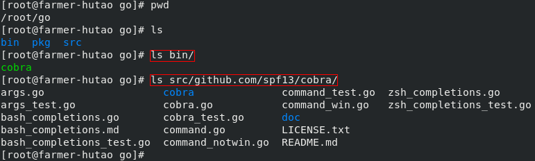
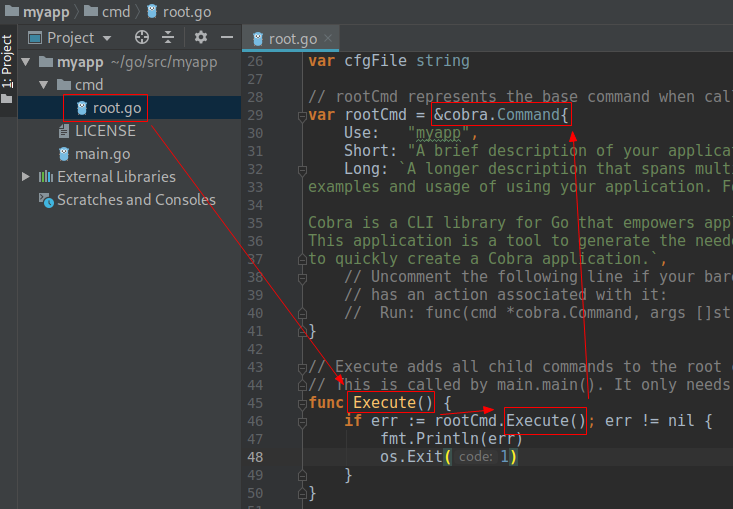
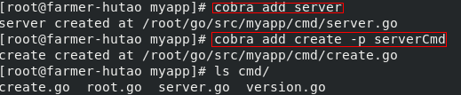
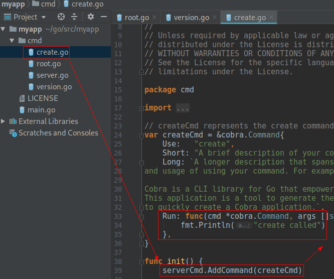

# 调度程序启动前逻辑

<!-- toc -->

## 概述

前面提到过scheduler程序可以分为三层，第一层是调度器启动前的逻辑，包括命令行参数解析、参数校验、调度器初始化等一系列逻辑。这个部分我不会太详细地介绍，因为这些代码位于调度框架之前，相对比较枯燥无趣，讲多了磨灭大伙对源码的兴趣～

## cobra和main

剧透一下先，如果你之前没有用过cobra，那么在第一次见到cobra之后，很可能以后你自己写的程序，开发的小工具会全部变成cobra风格。我最近半年写的命令行程序就全部是基于cobra+pflag的。cobra有多优雅呢，且听我慢慢道来～

### cobra是啥


从github上我们可以找到这个项目，截至今天已经有上万个star，一百多个contributors，可见来头不小！Cobra官方描述是：

> Cobra is both a library for creating powerful modern CLI applications as well as a program to generate applications and command files.

也就是这个意思：Cobra既是一个创建强大的现代化命令行程序的库，又是一个用于生成应用和命令行文件的程序。有很多流行的Go项目用了Cobra，其中当然包括我们最最熟知的k8s和docker，大致列出来有这些：

- Kubernetes
- Hugo
- rkt
- etcd
- Moby (former Docker)
- Docker (distribution)
- OpenShift
- Delve
- GopherJS
- CockroachDB
- Bleve
- ProjectAtomic (enterprise)
- Giant Swarm's gsctl
- Nanobox/Nanopack
- rclone
- nehm
- Pouch

如果你是云计算方向的攻城狮，上面半数项目应该都耳熟能详～

### 使用cobra

下面我们实践一下cobra，先下载这个项目编译一下：

```shell
# 如果你的网络很给力，那么下面这个命令就够了；
go get -u github.com/spf13/cobra/cobra
# 如果你的网络不给力，那就下载cobra的zip包，丢到GOPATH下对应目录，然后解决依赖，再build

```

于是我们得到了这样一个可执行文件及项目源码：



我们试一下这个命令：`cobra init ${project-name}`

```shell
[root@farmer-hutao src]# cobra init myapp
Your Cobra application is ready at
/root/go/src/myapp

Give it a try by going there and running `go run main.go`.
Add commands to it by running `cobra add [cmdname]`.

[root@farmer-hutao src]# ls myapp/
cmd  LICENSE  main.go
[root@farmer-hutao src]# pwd
/root/go/src
```

如上，本地可以看到一个main.go和一个cmd目录，这个cmd和k8s源码里的cmd是不是很像～

main.go里面的代码很精简，如下：


!FILENAME main.go
```go
package main

import "myapp/cmd"

func main() {
        cmd.Execute()
}
```

这里注意到调用了一个cmd的Execute()方法，我们继续看cmd是什么：



如上图，在`main.go`里面import了`myapp/cmd`，也就是这个`root.go`文件。所以Execute()函数就很好找了。在`Execute`里面调用了`rootCmd.Execute()`方法，这个`rootCmd`是`*cobra.Command`类型的。我们关注一下这个类型。

下面我们继续使用cobra命令给myapp添加一个子命令：


如上，我们的程序可以使用version子命令了！我们看一下源码发生了什么变化：


多了一个`version.go`，在这个源文件的init()函数里面调用了一个`rootCmd.AddCommand(versionCmd)`，这里可以猜到是根命令下添加一个子命令的意思，根命令表示的就是我们直接执行这个可执行文件，子命令就是version，放在一起的感觉就类似大家使用`kubectl version`的感觉。

另外注意到这里的Run属性是一个匿名函数，这个函数中输出了“version called”字样，也就是说我们执行version子命令的时候其实是调用到了这里的Run.

最后我们实践一下多级子命令：





套路也就这样，通过`serverCmd.AddCommand(createCmd)`调用后就能够把`*cobra.Command`类型的createCmd变成serverCmd的子命令了，这个时候我们玩起来就像`kubectl get pods`.

行，看到这里我们回头看一下scheduler的源码就能找到main的逻辑了。

## Scheduler的main

我们打开文件：`cmd/kube-scheduler/scheduler.go`可以找到scheduler的main()函数，很简短，去掉枝干后如下：

!FILENAME cmd/kube-scheduler/scheduler.go:34

```go
func main() {
	command := app.NewSchedulerCommand()
	if err := command.Execute(); err != nil {
		fmt.Fprintf(os.Stderr, "%v\n", err)
		os.Exit(1)
	}
}
```

看到这里猜都能猜到`kube-scheduler`这个二进制文件在运行的时候是调用了`command.Execute()`函数背后的那个Run，那个Run躲在`command := app.NewSchedulerCommand()`这行代码调用的`NewSchedulerCommand()`方法里，这个方法一定返回了一个`*cobra.Command`类型的对象。我们跟进去这个函数，看一下是不是这个样子：

!FILENAME cmd/kube-scheduler/app/server.go:70

```go
/ NewSchedulerCommand creates a *cobra.Command object with default parameters
func NewSchedulerCommand() *cobra.Command {
	cmd := &cobra.Command{
		Use: "kube-scheduler",
		Long: `The Kubernetes scheduler is a policy-rich, topology-aware,
workload-specific function that significantly impacts availability, performance,
and capacity. The scheduler needs to take into account individual and collective
resource requirements, quality of service requirements, hardware/software/policy
constraints, affinity and anti-affinity specifications, data locality, inter-workload
interference, deadlines, and so on. Workload-specific requirements will be exposed
through the API as necessary.`,
		Run: func(cmd *cobra.Command, args []string) {
			if err := runCommand(cmd, args, opts); err != nil {
				fmt.Fprintf(os.Stderr, "%v\n", err)
				os.Exit(1)
			}
		},
	}
	return cmd
}
```

如上，同样我先删掉了一些枝干代码，剩下的可以很清楚地看到，schduler启动时调用了`runCommand(cmd, args, opts)`，这个函数在哪里呢，继续跟一下：

!FILENAME cmd/kube-scheduler/app/server.go:117

```go
// runCommand runs the scheduler.
func runCommand(cmd *cobra.Command, args []string, opts *options.Options) error {
	c, err := opts.Config()
	stopCh := make(chan struct{})
	// Get the completed config
	cc := c.Complete()
	return Run(cc, stopCh)
}
```

如上，可以看到这里是处理配置问题后调用了一个Run()函数，Run()的作用是基于给定的配置启动scheduler，它只会在出错时或者channel stopCh被关闭时才退出，代码主要部分如下：

!FILENAME cmd/kube-scheduler/app/server.go:167

```go
// Run executes the scheduler based on the given configuration. It only return on error or when stopCh is closed.
func Run(cc schedulerserverconfig.CompletedConfig, stopCh <-chan struct{}) error {
	// Create the scheduler.
	sched, err := scheduler.New(cc.Client,
		cc.InformerFactory.Core().V1().Nodes(),
		stopCh,
		scheduler.WithName(cc.ComponentConfig.SchedulerName))
	
	// Prepare a reusable runCommand function.
	run := func(ctx context.Context) {
		sched.Run()
		<-ctx.Done()
	}

	ctx, cancel := context.WithCancel(context.TODO()) 
	defer cancel()

	go func() {
		select {
		case <-stopCh:
			cancel()
		case <-ctx.Done():
		}
	}()

	// Leader election is disabled, so runCommand inline until done.
	run(ctx)
	return fmt.Errorf("finished without leader elect")
}
```

可以看到这里最终是要跑`sched.Run()`这个方法来启动scheduler，`sched.Run()`方法已经在pkg下，具体位置是`pkg/scheduler/scheduler.go:276`，也就是scheduler框架真正运行的逻辑了。于是我们已经从main出发，找到了scheduler主框架的入口，具体的scheduler逻辑我们下一讲再来仔细分析。

最后我们来看一下sched的定义，在linux里我们经常会看到一些软件叫做什么什么d，d也就是daemon，守护进程的意思，也就是一直跑在后台的一个程序。这里的sched也就是“scheduler daemon”的意思。sched的其实是`*Scheduler`类型，定义在：

!FILENAME pkg/scheduler/scheduler.go:58

```go
// Scheduler watches for new unscheduled pods. It attempts to find
// nodes that they fit on and writes bindings back to the api server.
type Scheduler struct {
	config *factory.Config
}
```

如上，注释也很清晰，说Scheduler watch新创建的未被调度的pods，然后尝试寻找合适的node，回写一个绑定关系到api server.这里也可以体会到daemon的感觉，我们平时搭建的k8s集群中运行着一个daemon进程叫做kube-scheduler，这个一直跑着的进程做的就是上面注释里说的事情，在程序里面也就对应这样一个对象：Scheduler.

Scheduler结构体中的Config对象我们再简单看一下：

!FILENAME pkg/scheduler/factory/factory.go:96

```go
// Config is an implementation of the Scheduler's configured input data.
type Config struct {
	// It is expected that changes made via SchedulerCache will be observed
	// by NodeLister and Algorithm.
	SchedulerCache schedulerinternalcache.Cache
	// Ecache is used for optimistically invalid affected cache items after
	// successfully binding a pod
	Ecache     *equivalence.Cache
	NodeLister algorithm.NodeLister
	Algorithm  algorithm.ScheduleAlgorithm
	GetBinder  func(pod *v1.Pod) Binder
	// PodConditionUpdater is used only in case of scheduling errors. If we succeed
	// with scheduling, PodScheduled condition will be updated in apiserver in /bind
	// handler so that binding and setting PodCondition it is atomic.
	PodConditionUpdater PodConditionUpdater
	// PodPreemptor is used to evict pods and update pod annotations.
	PodPreemptor PodPreemptor

	// NextPod should be a function that blocks until the next pod
	// is available. We don't use a channel for this, because scheduling
	// a pod may take some amount of time and we don't want pods to get
	// stale while they sit in a channel.
	NextPod func() *v1.Pod

	// SchedulingQueue holds pods to be scheduled
	SchedulingQueue internalqueue.SchedulingQueue
}
```

如上，同样我只保留了一些好理解的字段，我们随便扫一下可以看到譬如：SchedulingQueue、NextPod、NodeLister这些很容易从字面上理解的字段，也就是Scheduler对象在工作（完成调度这件事）中需要用到的一些对象。

ok，下一讲我们开始聊Scheduler的工作过程！