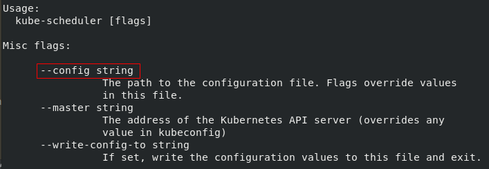

# 调度器初始化

<!-- toc -->

## 概述

今天我们要做一些琐碎的知识点分析，比如调度器启动的时候默认配置是怎么来的？默认生效了哪些调度算法？自定义的算法是如何注入的？诸如这些问题，我们顺带会看一下调度器相关的一些数据结构的含义。看完前面这些节的分析后再看完本篇文章你可能会有一种醍醐灌顶的感觉哦～

## 从 --config 开始

如果我们编译出来一个 **kube-scheduler** 二进制文件，运行`./kube-scheduler -h`后会看到很多的帮助信息，这些信息是分组的，比如第一组 Misc，差不多是“大杂烩”的意思，不好分类的几个 flag，其实也是最重要的几个 flag，如下：



很好理解，第一个红框框圈出来的`--config`用于指定配置文件，老版本的各种参数基本都不建议使用了，所以这个 config flag 指定的 config 文件中基本包含了所有可配置项，我们看一下代码中获取这个 flag 的相关代码：

!FILENAME cmd/kube-scheduler/app/options/options.go:143

```go
func (o *Options) Flags() (nfs apiserverflag.NamedFlagSets) {
   fs := nfs.FlagSet("misc")
    // 关注 --config
   fs.StringVar(&o.ConfigFile, "config", o.ConfigFile, "The path to the configuration file. Flags override values in this file.")
   fs.StringVar(&o.WriteConfigTo, "write-config-to", o.WriteConfigTo, "If set, write the configuration values to this file and exit.")
   fs.StringVar(&o.Master, "master", o.Master, "The address of the Kubernetes API server (overrides any value in kubeconfig)")

   o.SecureServing.AddFlags(nfs.FlagSet("secure serving"))
   o.CombinedInsecureServing.AddFlags(nfs.FlagSet("insecure serving"))
   o.Authentication.AddFlags(nfs.FlagSet("authentication"))
   o.Authorization.AddFlags(nfs.FlagSet("authorization"))
   o.Deprecated.AddFlags(nfs.FlagSet("deprecated"), &o.ComponentConfig)

   leaderelectionconfig.BindFlags(&o.ComponentConfig.LeaderElection.LeaderElectionConfiguration, nfs.FlagSet("leader election"))
   utilfeature.DefaultFeatureGate.AddFlag(nfs.FlagSet("feature gate"))

   return nfs
}
```

上述代码中有几个点可以关注到：

1. FlagSet 的含义，命令行输出的分组和这里的分组是对应的；
2. 除了认证授权、选举等“非关键”配置外，其他配置基本 Deprecated 了，也就意味着建议使用 config file；

上面代码中可以看到`o.ConfigFile`接收了**config**配置，我们看看Option类型是什么样子的~

### options.Option 对象

`Options`对象包含运行一个 **Scheduler** 所需要的所有参数

!FILENAME cmd/kube-scheduler/app/options/options.go:55

```go
type Options struct {
    // 和命令行帮助信息的分组是一致的
   ComponentConfig kubeschedulerconfig.KubeSchedulerConfiguration
   SecureServing           *apiserveroptions.SecureServingOptionsWithLoopback
   CombinedInsecureServing *CombinedInsecureServingOptions
   Authentication          *apiserveroptions.DelegatingAuthenticationOptions
   Authorization           *apiserveroptions.DelegatingAuthorizationOptions
   Deprecated              *DeprecatedOptions

   // config 文件的路径
   ConfigFile string

   // 如果指定了，会输出 config 的默认配置到这个文件
   WriteConfigTo string
   Master string
}
```

前面的 flag 相关代码中写到配置文件的内容给了`o.ConfigFile`，也就是`Options.ConfigFile`，那这个属性怎么使用呢？

我们来看下面这个 **ApplyTo()** 函数，这个函数要做的事情是把 options 配置 apply 给 scheduler app configuration(这个对象后面会讲到)：

!FILENAME cmd/kube-scheduler/app/options/options.go:162

```go
// 把 Options apply 给 Config
func (o *Options) ApplyTo(c *schedulerappconfig.Config) error {
    // --config 没有使用的情况
   if len(o.ConfigFile) == 0 {
      c.ComponentConfig = o.ComponentConfig
       // 使用 Deprecated 的配置
      if err := o.Deprecated.ApplyTo(&c.ComponentConfig); err != nil {
         return err
      }
      if err := o.CombinedInsecureServing.ApplyTo(c, &c.ComponentConfig); err != nil {
         return err
      }
   } else {
       // 加载 config 文件中的内容
      cfg, err := loadConfigFromFile(o.ConfigFile)
      if err != nil {
         return err
      }

      // 上面加载到的配置赋值给 Config中的 ComponentConfig
      c.ComponentConfig = *cfg

      if err := o.CombinedInsecureServing.ApplyToFromLoadedConfig(c, &c.ComponentConfig); err != nil {
         return err
      }
   }
   // ……
    
   return nil
}
```

这个函数中可以看到用 **--config** 和不用 **--config** 两种情况下 **options** 是如何应用到`schedulerappconfig.Config`中的。那么这里提到的 **Config** 对象又是什么呢？

### config.Config对象

**Config** 对象包含运行一个 **Scheduler** 所需要的所有 **context**

!FILENAME cmd/kube-scheduler/app/config/config.go:32

```go
type Config struct {
   // 调度器配置对象
   ComponentConfig kubeschedulerconfig.KubeSchedulerConfiguration

   LoopbackClientConfig *restclient.Config
   InsecureServing        *apiserver.DeprecatedInsecureServingInfo 
   InsecureMetricsServing *apiserver.DeprecatedInsecureServingInfo 
   Authentication         apiserver.AuthenticationInfo
   Authorization          apiserver.AuthorizationInfo
   SecureServing          *apiserver.SecureServingInfo
   Client          clientset.Interface
   InformerFactory informers.SharedInformerFactory
   PodInformer     coreinformers.PodInformer
   EventClient     v1core.EventsGetter
   Recorder        record.EventRecorder
   Broadcaster     record.EventBroadcaster
   LeaderElection *leaderelection.LeaderElectionConfig
}
```

所以前面的`c.ComponentConfig = o.ComponentConfig`这行代码也就是把 **Options** 中的 **ComponentConfig** 赋值给了 **Config** 中的 **ComponentConfig**；是哪里的逻辑让 **Options** 和 **Config** 对象产生了关联呢？(也就是说前面提到的 `ApplyTo()` 方法是再哪里被调用的？)

继续跟下去可以找到`Config()`函数，从这个函数的返回值`*schedulerappconfig.Config`可以看到它的目的，是需要得到一个 **schedulerappconfig.Config**，代码不长：

!FILENAME cmd/kube-scheduler/app/options/options.go:221

```go
func (o *Options) Config() (*schedulerappconfig.Config, error) {
   // ……

   c := &schedulerappconfig.Config{}
    // 前面我们看到的 ApplyTo() 函数
   if err := o.ApplyTo(c); err != nil {
      return nil, err
   }

   // Prepare kube clients.
   // ……

   // Prepare event clients.
   eventBroadcaster := record.NewBroadcaster()
   recorder := eventBroadcaster.NewRecorder(legacyscheme.Scheme, corev1.EventSource{Component: c.ComponentConfig.SchedulerName})

   // Set up leader election if enabled.
   // ……

   c.Client = client
   c.InformerFactory = informers.NewSharedInformerFactory(client, 0)
   c.PodInformer = factory.NewPodInformer(client, 0)
   c.EventClient = eventClient
   c.Recorder = recorder
   c.Broadcaster = eventBroadcaster
   c.LeaderElection = leaderElectionConfig

   return c, nil
}
```

那调用这个`Config()`函数的地方又在哪里呢？继续跟就到 **runCommand** 里面了～

### runCommand

**runCommand** 这个函数我们不陌生：

!FILENAME cmd/kube-scheduler/app/server.go:117

```go
func runCommand(cmd *cobra.Command, args []string, opts *options.Options) error {
   // ……
    
   // 这个地方完成了前面说到的配置文件和命令行参数等读取和应用工作
   c, err := opts.Config()
   if err != nil {
      fmt.Fprintf(os.Stderr, "%v\n", err)
      os.Exit(1)
   }

   stopCh := make(chan struct{})

   // Get the completed config
   cc := c.Complete()

   // To help debugging, immediately log version
   klog.Infof("Version: %+v", version.Get())

   // 这里有一堆逻辑
   algorithmprovider.ApplyFeatureGates()

   // Configz registration.
  
   // ……

   return Run(cc, stopCh)
}
```

runCommand 在最开始的时候我们有见到过，已经到 cobra 入口的 Run 中了：

!FILENAME cmd/kube-scheduler/app/server.go:85

```go
Run: func(cmd *cobra.Command, args []string) {
   if err := runCommand(cmd, args, opts); err != nil {
      fmt.Fprintf(os.Stderr, "%v\n", err)
      os.Exit(1)
   }
},
```

上面涉及到2个知识点：

- ApplyFeatureGates
- Run 中的逻辑

我们下面分别来看看～

## ApplyFeatureGates

这个函数跟进去可以看到如下几行简单的代码，这里很自然我们能够想到继续跟`defaults.ApplyFeatureGates()`，但是不能只看到这个函数哦，具体来看：


!FILENAME pkg/scheduler/algorithmprovider/plugins.go:17

```go
package algorithmprovider

import (
   "k8s.io/kubernetes/pkg/scheduler/algorithmprovider/defaults"
)

// ApplyFeatureGates applies algorithm by feature gates.
func ApplyFeatureGates() {
   defaults.ApplyFeatureGates()
}
```

到这里分2条路：

- import defaults 这个 package 的时候有一个`init()`函数调用的逻辑
- `defaults.ApplyFeatureGates()` 函数调用本身。

### 默认算法注册

!FILENAME pkg/scheduler/algorithmprovider/defaults/defaults.go:38

```go
func init() {
   // ……
   registerAlgorithmProvider(defaultPredicates(), defaultPriorities())
   // ……
}
```

`init()`函数中我们先关注 **registerAlgorithmProvider() **函数，这里从字面上可以得到不少信息，大胆猜一下：是不是注册了默认的预选算法和优选算法？

!FILENAME pkg/scheduler/algorithmprovider/defaults/defaults.go:222

```go
func registerAlgorithmProvider(predSet, priSet sets.String) {
   // 注册 algorithm provider. 默认使用 DefaultProvider
   factory.RegisterAlgorithmProvider(factory.DefaultProvider, predSet, priSet)
   factory.RegisterAlgorithmProvider(ClusterAutoscalerProvider, predSet,
      copyAndReplace(priSet, "LeastRequestedPriority", "MostRequestedPriority"))
}
```

看到这里可以关注到 **AlgorithmProvider** 这个概念，后面会讲到。

先看一下里面调用的注册函数是怎么实现的：

!FILENAME pkg/scheduler/factory/plugins.go:387

```go
func RegisterAlgorithmProvider(name string, predicateKeys, priorityKeys sets.String) string {
   schedulerFactoryMutex.Lock()
   defer schedulerFactoryMutex.Unlock()
   validateAlgorithmNameOrDie(name)
    // 很明显，关键逻辑在这里
   algorithmProviderMap[name] = AlgorithmProviderConfig{
      FitPredicateKeys:     predicateKeys,
      PriorityFunctionKeys: priorityKeys,
   }
   return name
}
```

首先，algorithmProviderMap 这个变量是一个包级变量，在86行做的定义：`algorithmProviderMap   = make(map[string]AlgorithmProviderConfig)`

这里的 key 有2种情况：

- "DefaultProvider"
- "ClusterAutoscalerProvider"

混合云场景用得到 ClusterAutoscalerProvider，大家感兴趣可以研究一下 ClusterAutoscaler 特性，这块我们先不说。默认的情况是生效的 DefaultProvider，这块逻辑后面还会提到。

然后这个 map 的 value 的类型是一个简单的 struct：

!FILENAME pkg/scheduler/factory/plugins.go:99

```go
type AlgorithmProviderConfig struct {
   FitPredicateKeys     sets.String
   PriorityFunctionKeys sets.String
}
```

接着看一下`defaultPredicates()`函数

!FILENAME pkg/scheduler/algorithmprovider/defaults/defaults.go:106

```go
func defaultPredicates() sets.String {
   return sets.NewString(
      // Fit is determined by volume zone requirements.
      factory.RegisterFitPredicateFactory(
         predicates.NoVolumeZoneConflictPred,
         func(args factory.PluginFactoryArgs) algorithm.FitPredicate {
            return predicates.NewVolumeZonePredicate(args.PVInfo, args.PVCInfo, args.StorageClassInfo)
         },
      ),
       
      // ……

      factory.RegisterFitPredicate(predicates.NoDiskConflictPred, predicates.NoDiskConflict),

      // ……
   )
}
```

这个函数里面就2中类型的玩法，简化一些可以理解成上面这个样子，我们一个个来看。

先认识一下 `sets.NewString()`函数要干嘛：

!FILENAME vendor/k8s.io/apimachinery/pkg/util/sets/string.go:27

```go
type String map[string]Empty

// NewString creates a String from a list of values.
func NewString(items ...string) String {
   ss := String{}
   ss.Insert(items...)
   return ss
}
// ……

// Insert adds items to the set.
func (s String) Insert(items ...string) {
	for _, item := range items {
		s[item] = Empty{}
	}
}
```

如上，很简单的类型封装。里面的Empty是：`type Empty struct{}`，所以本质上就是要用`map[string]struct{}`这个类型罢了。

因此上面`defaultPredicates()`函数中`sets.NewString()`内每一个参数本质上就是一个 **string** 类型了，我们来看这一个个 **string** 是怎么来的。

!FILENAME pkg/scheduler/factory/plugins.go:195

```go
func RegisterFitPredicateFactory(name string, predicateFactory FitPredicateFactory) string {
   schedulerFactoryMutex.Lock()
   defer schedulerFactoryMutex.Unlock()
   validateAlgorithmNameOrDie(name)
    // 唯一值的关注的逻辑
   fitPredicateMap[name] = predicateFactory
    // 返回 name
   return name
}
```

这个函数要返回一个 **string** 我们已经知道了，里面的逻辑也只有这一行需要我们关注：`fitPredicateMap[name] = predicateFactory`，这个 **map** 类型也是一个包级变量：`fitPredicateMap = make(map[string]FitPredicateFactory)`，所以前面讲的注册本质也就是在填充这个变量而已。理解`fitPredicateMap[name] = predicateFactory`中 **fitPredicateMap** 的 **key** 和 **value**，也就知道了这里的 **Register** 要做什么。

`defaultPredicates()`中的第二种注册方式 **RegisterFitPredicate** 区别不大，函数体也是调用的 **RegisterFitPredicateFactory()**：

!FILENAME pkg/scheduler/factory/plugins.go:106

```go
func RegisterFitPredicate(name string, predicate algorithm.FitPredicate) string {
   return RegisterFitPredicateFactory(name, func(PluginFactoryArgs) algorithm.FitPredicate { return predicate })
}
```

### 特性开关

!FILENAME pkg/scheduler/algorithmprovider/defaults/defaults.go:183

```go
func ApplyFeatureGates() {
   if utilfeature.DefaultFeatureGate.Enabled(features.TaintNodesByCondition) {
      
      factory.RemoveFitPredicate(predicates.CheckNodeConditionPred)
      factory.RemoveFitPredicate(predicates.CheckNodeMemoryPressurePred)
      factory.RemoveFitPredicate(predicates.CheckNodeDiskPressurePred)
      factory.RemoveFitPredicate(predicates.CheckNodePIDPressurePred)
      factory.RemovePredicateKeyFromAlgorithmProviderMap(predicates.CheckNodeConditionPred)
      factory.RemovePredicateKeyFromAlgorithmProviderMap(predicates.CheckNodeMemoryPressurePred)
      factory.RemovePredicateKeyFromAlgorithmProviderMap(predicates.CheckNodeDiskPressurePred)
      factory.RemovePredicateKeyFromAlgorithmProviderMap(predicates.CheckNodePIDPressurePred)
     
      factory.RegisterMandatoryFitPredicate(predicates.PodToleratesNodeTaintsPred, predicates.PodToleratesNodeTaints)
      factory.RegisterMandatoryFitPredicate(predicates.CheckNodeUnschedulablePred, predicates.CheckNodeUnschedulablePredicate)
      factory.InsertPredicateKeyToAlgorithmProviderMap(predicates.PodToleratesNodeTaintsPred)
      factory.InsertPredicateKeyToAlgorithmProviderMap(predicates.CheckNodeUnschedulablePred)
   }

   if utilfeature.DefaultFeatureGate.Enabled(features.ResourceLimitsPriorityFunction) {
      factory.RegisterPriorityFunction2("ResourceLimitsPriority", priorities.ResourceLimitsPriorityMap, nil, 1)
      factory.InsertPriorityKeyToAlgorithmProviderMap(factory.RegisterPriorityFunction2("ResourceLimitsPriority", priorities.ResourceLimitsPriorityMap, nil, 1))
   }
}
```

这个函数看着几十行，实际上只在重复一件事情，增加或删除一些预选和优选算法。我们看一下这里的一些逻辑：

`utilfeature.DefaultFeatureGate.Enabled()` 函数要做的事情是判断一个 feature 是否开启；函数参数本质只是一个字符串：

!FILENAME pkg/features/kube_features.go:25

```go
const (
   AppArmor utilfeature.Feature = "AppArmor"
   DynamicKubeletConfig utilfeature.Feature = "DynamicKubeletConfig"
   // ……
)
```

这里定义了很多的 feature，然后定义了哪些 feature 是开启的，处在 alpha 还是 beta 或者 GA 等：

!FILENAME pkg/features/kube_features.go:405

```go
var defaultKubernetesFeatureGates = map[utilfeature.Feature]utilfeature.FeatureSpec{
   AppArmor:             {Default: true, PreRelease: utilfeature.Beta},
   DynamicKubeletConfig: {Default: true, PreRelease: utilfeature.Beta},
   ExperimentalHostUserNamespaceDefaultingGate: {Default: false, PreRelease: utilfeature.Beta},
   ExperimentalCriticalPodAnnotation:           {Default: false, PreRelease: utilfeature.Alpha},
   DevicePlugins:                               {Default: true, PreRelease: utilfeature.Beta},
   TaintBasedEvictions:                         {Default: true, PreRelease: utilfeature.Beta},
   RotateKubeletServerCertificate:              {Default: true, PreRelease: utilfeature.Beta},
    // ……
}
```

所以回到前面`ApplyFeatureGates()`的逻辑，`utilfeature.DefaultFeatureGate.Enabled(features.TaintNodesByCondition)`要判断的是 **TaintNodesByCondition** 这个特性是否开启了，如果开启了就把 predicates 中 **"CheckNodeCondition", "CheckNodeMemoryPressure", "CheckNodePIDPressurePred", "CheckNodeDiskPressure"** 这几个算法去掉，把 **"PodToleratesNodeTaints", "CheckNodeUnschedulable"** 加上。接着对于特性 **"ResourceLimitsPriorityFunction"** 的处理也是同一个逻辑。

## Scheduler 的创建

我们换一条线，从 Scheduler 对象的创建再来看另外几个知识点。

前面分析到`runCommand()`函数的时候我们说到了需要关注最后一行`return Run(cc, stopCh)`的逻辑，在`Run()`函数中主要的逻辑就是创建 Scheduler 和启动 Scheduler；现在我们来看创建逻辑：

!FILENAME cmd/kube-scheduler/app/server.go:174

```go
sched, err := scheduler.New(cc.Client,
   cc.InformerFactory.Core().V1().Nodes(),
   cc.PodInformer,
   cc.InformerFactory.Core().V1().PersistentVolumes(),
   cc.InformerFactory.Core().V1().PersistentVolumeClaims(),
   cc.InformerFactory.Core().V1().ReplicationControllers(),
   cc.InformerFactory.Apps().V1().ReplicaSets(),
   cc.InformerFactory.Apps().V1().StatefulSets(),
   cc.InformerFactory.Core().V1().Services(),
   cc.InformerFactory.Policy().V1beta1().PodDisruptionBudgets(),
   storageClassInformer,
   cc.Recorder,
   cc.ComponentConfig.AlgorithmSource,
   stopCh,
   scheduler.WithName(cc.ComponentConfig.SchedulerName),
   scheduler.WithHardPodAffinitySymmetricWeight(cc.ComponentConfig.HardPodAffinitySymmetricWeight),
   scheduler.WithEquivalenceClassCacheEnabled(cc.ComponentConfig.EnableContentionProfiling),
   scheduler.WithPreemptionDisabled(cc.ComponentConfig.DisablePreemption),
   scheduler.WithPercentageOfNodesToScore(cc.ComponentConfig.PercentageOfNodesToScore),
   scheduler.WithBindTimeoutSeconds(*cc.ComponentConfig.BindTimeoutSeconds))
```

这里调用了一个`New()`函数，传了很多参数进去。`New()`函数的定义如下：

!FILENAME pkg/scheduler/scheduler.go:131

```go
func New(client clientset.Interface,
   nodeInformer coreinformers.NodeInformer,
   podInformer coreinformers.PodInformer,
   pvInformer coreinformers.PersistentVolumeInformer,
   pvcInformer coreinformers.PersistentVolumeClaimInformer,
   replicationControllerInformer coreinformers.ReplicationControllerInformer,
   replicaSetInformer appsinformers.ReplicaSetInformer,
   statefulSetInformer appsinformers.StatefulSetInformer,
   serviceInformer coreinformers.ServiceInformer,
   pdbInformer policyinformers.PodDisruptionBudgetInformer,
   storageClassInformer storageinformers.StorageClassInformer,
   recorder record.EventRecorder,
   schedulerAlgorithmSource kubeschedulerconfig.SchedulerAlgorithmSource,
   stopCh <-chan struct{},
   opts ...func(o *schedulerOptions)) (*Scheduler, error) 
```

这里涉及到的东西有点小多，我们一点点看：

`options := defaultSchedulerOptions` 这行代码的 **defaultSchedulerOptions** 是一个 schedulerOptions 对象：

!FILENAME pkg/scheduler/scheduler.go:121

```go
// LINE 67
type schedulerOptions struct {
	schedulerName                  string
	hardPodAffinitySymmetricWeight int32
	enableEquivalenceClassCache    bool
	disablePreemption              bool
	percentageOfNodesToScore       int32
	bindTimeoutSeconds             int64
}

// ……

// LINE 121
var defaultSchedulerOptions = schedulerOptions{
    // "default-scheduler"
   schedulerName:                  v1.DefaultSchedulerName, 
    // 1
   hardPodAffinitySymmetricWeight: v1.DefaultHardPodAffinitySymmetricWeight,
   enableEquivalenceClassCache:    false,
   disablePreemption:              false,
    // 50
   percentageOfNodesToScore:       schedulerapi.DefaultPercentageOfNodesToScore,
    // 100
   bindTimeoutSeconds:             BindTimeoutSeconds,
}
```

回到`New()`函数的逻辑：

!FILENAME pkg/scheduler/scheduler.go:148

```go
for _, opt := range opts {
   opt(&options)
}
```

这里的 opts 定义在参数里：`opts ...func(o *schedulerOptions)`，我们看一个实参来理解一下：`scheduler.WithName(cc.ComponentConfig.SchedulerName)`：

!FILENAME pkg/scheduler/scheduler.go:80

```go
// 这个函数能够把给定的 schedulerName 赋值给 schedulerOptions.schedulerName
func WithName(schedulerName string) Option {
   return func(o *schedulerOptions) {
      o.schedulerName = schedulerName
   }
}
```

这种方式设置一个对象的属性还是挺有意思的。

### 调度算法源

我们继续往后面看`New()`函数的其他逻辑：

`source := schedulerAlgorithmSource` 这行代码里的 **schedulerAlgorithmSource** 代表了什么？

形参中有这个变量的定义：`schedulerAlgorithmSource kubeschedulerconfig.SchedulerAlgorithmSource`，跟进去可以看到：

!FILENAME pkg/scheduler/apis/config/types.go:97

```go
// 表示调度算法源，两个属性是互相排斥的，也就是二选一的意思
type SchedulerAlgorithmSource struct {
   // Policy is a policy based algorithm source.
   Policy *SchedulerPolicySource
   // Provider is the name of a scheduling algorithm provider to use.
   Provider *string
}
```

这两个属性肯定得理解一下了，目测挺重要的样子：

**Policy**

!FILENAME pkg/scheduler/apis/config/types.go:106

```go
type SchedulerPolicySource struct {
   // 文件方式配置生效的调度算法
   File *SchedulerPolicyFileSource
   // ConfigMap 方式配置生效的调度算法
   ConfigMap *SchedulerPolicyConfigMapSource
}
// 下面分别是2个属性的结构定义：
// ……
type SchedulerPolicyFileSource struct {
	// Path is the location of a serialized policy.
	Path string
}

// ……
type SchedulerPolicyConfigMapSource struct {
	// Namespace is the namespace of the policy config map.
	Namespace string
	// Name is the name of hte policy config map.
	Name string
}
```

大家还记得我们在讲调度器设计的时候提到的 Policy 文件不？大概长这个样子：

```yaml
{
"kind" : "Policy",
"apiVersion" : "v1",
"predicates" : [
    {"name" : "PodFitsHostPorts"},
    {"name" : "HostName"}
    ],
"priorities" : [
    {"name" : "LeastRequestedPriority", "weight" : 1},
    {"name" : "EqualPriority", "weight" : 1}
    ],
"hardPodAffinitySymmetricWeight" : 10,
"alwaysCheckAllPredicates" : false
}
```

所以啊，这个 Policy原来是通过代码里的 **SchedulerPolicySource** 去配置的～

### policy / provider 如何生效

前面讲到调度算法从何而来(源头)，现在我们看一下这些算法配置如何生效的：

!FILENAME pkg/scheduler/scheduler.go:173

```go
source := schedulerAlgorithmSource
switch {
    // 如果 Provider 配置了，就不用 policy 了
case source.Provider != nil:
   // 根据给定的 Provider 创建 scheduler config
   sc, err := configurator.CreateFromProvider(*source.Provider)
   if err != nil {
      return nil, fmt.Errorf("couldn't create scheduler using provider %q: %v", *source.Provider, err)
   }
   config = sc
    // 如果 Policy 提供了，就没有上面的 provider 的事情了
case source.Policy != nil:
   // 根据给定的 Policy 创建 scheduler config
   policy := &schedulerapi.Policy{}
   switch {
       // 是 File 的情况
   case source.Policy.File != nil:
      if err := initPolicyFromFile(source.Policy.File.Path, policy); err != nil {
         return nil, err
      }
       // 是 ConfigMap 的情况
   case source.Policy.ConfigMap != nil:
      if err := initPolicyFromConfigMap(client, source.Policy.ConfigMap, policy); err != nil {
         return nil, err
      }
   }
   sc, err := configurator.CreateFromConfig(*policy)
   if err != nil {
      return nil, fmt.Errorf("couldn't create scheduler from policy: %v", err)
   }
   config = sc
default:
   return nil, fmt.Errorf("unsupported algorithm source: %v", source)
}
```

上面代码涉及到的2个类型我们再来关注一下：

- schedulerapi.Policy
- factory.Config

这个 **Policy** 就是具体用于存放我们配置的 policy 的载体，对照着这个结构我们可以判断自己在配置 policy 的时候应该按照什么格式：

!FILENAME pkg/scheduler/api/types.go:47

```go
type Policy struct {
   metav1.TypeMeta
   Predicates []PredicatePolicy
   Priorities []PriorityPolicy
   ExtenderConfigs []ExtenderConfig
   HardPodAffinitySymmetricWeight int32
   AlwaysCheckAllPredicates bool
}
```

这个结构内部封装的一层层结构我就不继续贴了，大家感兴趣可以点开看一下，跟到底的落点都是基础类型的，string啊，int啊，bool啊这些～

关于 `factory.Config` 可能大家有印象，这个结构就是 **Scheduler** 对象的唯一属性：

!FILENAME pkg/scheduler/scheduler.go:58

```go
type Scheduler struct {
   config *factory.Config
}
```

Config 结构体的属性不外乎 Scheduler 在落实调度、抢占等动作时所需要的一系列方法(或对象)；在`New()`函数的最后有一行`sched := NewFromConfig(config)`，实现是简单地实例化 Scheduler，然后将 config 赋值给 Scheduler 的 config 属性，然后返回 Scheduler 对象的地址。

## 默认生效的算法

我们最后还是单独拎出来强调一下生效了哪些算法的具体逻辑吧，前面有提到一些了，我相信肯定有人很关注这个知识点。

前面提到 Scheduler 创建的时候使用的 `New()`函数，函数中 switch 判断 **schedulerAlgorithmSource** 是 Provider 还是 Policy，然后做了具体的初始化逻辑，我们具体看其中一个初始化， 串一下这些点：

`sc, err := configurator.CreateFromProvider(*source.Provider)`

如果我们配置的是 Provider，这时候代码逻辑调用的是这样一行，这个函数的实现如下：

!FILENAME pkg/scheduler/factory/factory.go:1156

```go
func (c *configFactory) CreateFromProvider(providerName string) (*Config, error) {
    // 比如说我们配置的 name 是 DefaultProvider，这个函数要获取一个 AlgorithmProviderConfig 类型的对象
   provider, err := GetAlgorithmProvider(providerName)
   if err != nil {
      return nil, err
   }
    // 下面详细看
   return c.CreateFromKeys(provider.FitPredicateKeys, provider.PriorityFunctionKeys, []algorithm.SchedulerExtender{})
}
```

这个函数里有2个点需要关注，第一个是`GetAlgorithmProvider()`函数返回了什么：

!FILENAME pkg/scheduler/factory/plugins.go:99

```go
type AlgorithmProviderConfig struct {
   FitPredicateKeys     sets.String
   PriorityFunctionKeys sets.String
}
```

看到这个返回值类型，心里就明朗了。

我们继续看比较重要的`CreateFromKeys()`方法调用的具体逻辑，这个函数的实参中 **provider.FitPredicateKeys, provider.PriorityFunctionKeys** 很明显和具体的 provider 相关，不同 provider 定义的预置算法不同。继续来看函数实现：

!FILENAME pkg/scheduler/factory/factory.go:1255

```go
func (c *configFactory) CreateFromKeys(predicateKeys, priorityKeys sets.String, extenders []algorithm.SchedulerExtender) (*Config, error) {
   
    // ……
    
    // 根据 predicateKeys 得到 predicateFuncs
    predicateFuncs, err := c.GetPredicates(predicateKeys)
    // 根据 priorityKeys 得到 priorityConfigs
	priorityConfigs, err := c.GetPriorityFunctionConfigs(priorityKeys)
    
    // ……
    
    // 创建一个 genericScheduler，这个对象我们很熟悉。algo 也就是 Algorithm 的简写；
   algo := core.NewGenericScheduler(
      c.schedulerCache,
      c.equivalencePodCache,
      c.podQueue,
      predicateFuncs, // 和 predicateKeys 对应
      predicateMetaProducer,
      priorityConfigs, // 和 priorityKeys 对应
      priorityMetaProducer,
      // ……
   )

   podBackoff := util.CreateDefaultPodBackoff()
   return &Config{
      // ……
      Algorithm:           algo, // 很清晰了
      // ……
   }, nil
}
```

上面的`NewGenericScheduler()`函数接收了这些参数之后丢给了 **genericScheduler** 对象，这个对象中 predicates 属性对应参数 predicateFuncs，prioritizers 属性对应参数 priorityConfigs；

从这里的代码可以看出来我们配置的算法源可以影响到 Scheduler 的初始化，最终体现在改变了 Scheduler 对象的 config 属性的 Algorithm 属性的 prioritizers 和 prioritizers 上。我们最后回顾一下这2个属性的类型，就和以前的预选、优选过程分析的时候关注的点对上了：

- predicates --> map[string]algorithm.FitPredicate
- prioritizers --> []algorithm.PriorityConfig

是不是很熟悉呢？

行，今天就讲到这里～