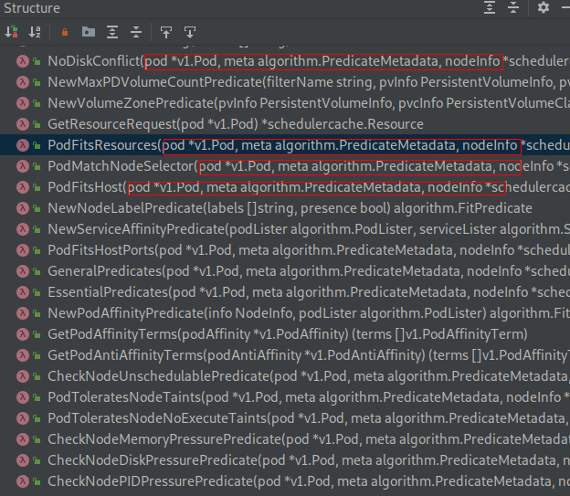

# 预选过程

<!-- toc -->

## 预选流程

predicate过程从`pkg/scheduler/core/generic_scheduler.go:389 findNodesThatFit()`方法就算正式开始了，这个方法根据给定的**predicate functions**过滤所有的nodes来寻找一堆可以跑pod的node集。老规矩，我们来看主干代码：

!FILENAME pkg/scheduler/core/generic_scheduler.go:389

```go
func (g *genericScheduler) findNodesThatFit(pod *v1.Pod, nodes []*v1.Node) ([]*v1.Node, FailedPredicateMap, error) {
	checkNode := func(i int) {
		fits, failedPredicates, err := podFitsOnNode(
			//……
		)
		if fits {
			length := atomic.AddInt32(&filteredLen, 1)
			filtered[length-1] = g.cachedNodeInfoMap[nodeName].Node()
		} 
	}
	workqueue.ParallelizeUntil(ctx, 16, int(allNodes), checkNode)

	if len(filtered) > 0 && len(g.extenders) != 0 {
		for _, extender := range g.extenders {
			// Logic of extenders 
		}
	}
	return filtered, failedPredicateMap, nil
}
```

如上，删的有点多，大家也可以看一下原函数然后对比一下，看看我为什么只保留这一点。从上面代码中我们可以发现，最重要的是一个子函数调用过程`fits, failedPredicates, err := podFitsOnNode()`，这个函数的参数我没有贴出来，下面会详细讲；下半部分是一个extender过程，extender不影响对predicate过程的理解，我们后面专门当作一个主题讲。所以这里的关注点是`podFitsOnNode()`函数。


## predicate的并发

进入`podFitsOnNode()`函数逻辑之前，我们先看一下调用到`podFitsOnNode()`函数的匿名函数变量**checkNode**是怎么被调用的：

!FILENAME pkg/scheduler/core/generic_scheduler.go:458

```go
workqueue.ParallelizeUntil(ctx, 16, int(allNodes), checkNode)
```

`ParallelizeUntil()`函数是用于并行执行N个独立的工作过程的，这个逻辑写的挺有意思，我们看一下完整的代码(这段的分析思路写到注释里哦)：

!FILENAME vendor/k8s.io/client-go/util/workqueue/parallelizer.go:38

```go
func ParallelizeUntil(ctx context.Context, workers, pieces int, doWorkPiece DoWorkPieceFunc) {
    // 从形参列表看，需要关注的有workers和pieces两个数字类型的参数，doworkPiece这个函数类型的参数
    // DoWorkPieceFunc类型也就是func(piece int)类型
    // 注意到上面调用的时候workers的实参是16，pieces是allNodes，也就是node数量
	var stop <-chan struct{}
	if ctx != nil {
		stop = ctx.Done()
	}
	// 这里定义toProcess的容量和pieces相等，也就是和node数量相等
	toProcess := make(chan int, pieces)
	for i := 0; i < pieces; i++ {
        // 假设有100个node，那么这里就写了100个数到toProcess里
		toProcess <- i
	}
    // 关闭了一个有缓存的channel
	close(toProcess)
	// 如果pieces数量比较少，也就是说假设node只有10个，那么workers就赋值为10个
    // 到这里差不多可以猜到worker是并发工作数，当node大于16时并发是16，当node小于16时并法数就是node数
	if pieces < workers {
		workers = pieces
	}

	wg := sync.WaitGroup{}
	wg.Add(workers)
    // 要批量开goroutine了
	for i := 0; i < workers; i++ {
        // 如果100个node，这里时16；如果是10个node，这里是10
		go func() {
			defer utilruntime.HandleCrash()
			defer wg.Done()
			for piece := range toProcess {
                // 从toProcess中拿一个数，举个例子，假如现在并发是10，那么toProcess里面存的数据其实
                // 也是10个，也就是1个goroutine拿到1个数，开始了一个下面的default逻辑；
                // 假设并发数是16，node数是100，这时候toProcess里面也就是100个数，
                // 这时候就是16个“消费者”在消耗100个数。当然每拿到一个数需要执行到一次下面的default
				select {
				case <-stop:
					return
				default:
                    // 第piece个节点被doWorkPiece了；
                    // 对应调用过程也就是checkNode函数传入了一个整型参数piece
					doWorkPiece(piece)
				}
			}
		}()
	}
	wg.Wait()
}
```

回想一下前面的`checkNode := func(i int){……}`，上面的`doWorkPiece(piece)`也就是调用到了这里的这个匿名函数`func(i int){……}`；到这里就清楚如何实现并发执行多个node的predicate过程了。

## 一个node的predicate

checkNode的主要逻辑就是上面介绍的并发加上下面这个`podFitsOnNode()`函数逻辑：

!FILENAME pkg/scheduler/core/generic_scheduler.go:425

```go
fits, failedPredicates, err := podFitsOnNode(
				pod,
				meta,
				g.cachedNodeInfoMap[nodeName],
				g.predicates,
				nodeCache,
				g.schedulingQueue,
				g.alwaysCheckAllPredicates,
				equivClass,
			)
```

我们从`podFitsOnNode()`的函数定义入手：

!FILENAME pkg/scheduler/core/generic_scheduler.go:537

```go
func podFitsOnNode(
	pod *v1.Pod,
	meta algorithm.PredicateMetadata,
	info *schedulercache.NodeInfo,
	predicateFuncs map[string]algorithm.FitPredicate,
	nodeCache *equivalence.NodeCache,
	queue internalqueue.SchedulingQueue,
	alwaysCheckAllPredicates bool,
	equivClass *equivalence.Class,
) (bool, []algorithm.PredicateFailureReason, error) 
```

关于这个函数的逻辑，注释里的描述翻译过来大概是这个意思：
> podFitsOnNode()函数检查一个通过NodeInfo形式给定的node是否满足指定的predicate functions. 对于给定的一个Pod，podFitsOnNode()函数会检查是否有某个“等价的pod”存在，然后重用那个等价pod缓存的predicate结果。 
> 这个函数的调用入口有2处: Schedule and Preempt.
>
> 1. 当从Schedule进入时：这个函数想要测试node上所有已经存在的pod外加被指定将要调度到这个node上的其他所有高优先级（优先级不比自己低，也就是>=）的pod后，当前pod是否可以被调度到这个node上。
> 2. 当从Preempt进入时：后面讲preempt时再详细分析。

podFitsOnNode()函数的参数有点多，每个跟进去就是一堆知识点。这里建议大家从字面先过一边，然后跟进去看一下类型定义，类型的注释等，了解一下功能，先不深究。整体看完一边调度器代码后回过头深入细节。

我们一起看一下其中这个参数：`predicateFuncs map[string]algorithm.FitPredicate`；这里的**predicateFuncs**是一个map，表示所有的predicate函数。这个map的key是个字符串，也就是某种形式的name了；value类型跟进去看一下：

!FILENAME pkg/scheduler/algorithm/types.go:36

```go
// FitPredicate is a function that indicates if a pod fits into an existing node.
// The failure information is given by the error.
type FitPredicate func(pod *v1.Pod, meta PredicateMetadata, nodeInfo *schedulercache.NodeInfo) (bool, []PredicateFailureReason, error)
```

FitPredicate是一个函数类型，3个参数，pod和node都很好理解，meta跟进去简单看一下可以发现定义的是一些和predicate相关的一些元数据，这些数据是根据pod和node信息获取到的，类似pod的端口有哪些，pod亲和的pod列表等。返回值是一个表示是否fit的bool值，predicate失败的原因列表，一个错误类型。

也就是说，FitPredicate这个函数类型也就是前面一直说的predicate functions的真面目了。下面看podFitsOnNode()函数的具体逻辑吧：

!FILENAME pkg/scheduler/core/generic_scheduler.go:537

```go
func podFitsOnNode(
	pod *v1.Pod,
	meta algorithm.PredicateMetadata,
	info *schedulercache.NodeInfo,
	predicateFuncs map[string]algorithm.FitPredicate,
	nodeCache *equivalence.NodeCache,
	queue internalqueue.SchedulingQueue,
	alwaysCheckAllPredicates bool,
	equivClass *equivalence.Class,
) (bool, []algorithm.PredicateFailureReason, error) {
	podsAdded := false
	for i := 0; i < 2; i++ {
		metaToUse := meta
		nodeInfoToUse := info
		if i == 0 {
			podsAdded, metaToUse, nodeInfoToUse = addNominatedPods(pod, meta, info, queue)
		} else if !podsAdded || len(failedPredicates) != 0 {
			break
		}
		eCacheAvailable = equivClass != nil && nodeCache != nil && !podsAdded
		// 这里省略一个for循环，下面会单独讲
	}

	return len(failedPredicates) == 0, failedPredicates, nil
}
```

这里的逻辑是从一个for循环开始的，关于这个2次循环的含义代码里有很长的一段注释，我们先看一下注释里怎么说的（这里可以多看几遍体会一下）：


> - 出于某些原因考虑我们需要运行两次predicate. 如果node上有更高或者相同优先级的“指定pods”（这里的“指定pods”指的是通过schedule计算后指定要跑在一个node上但是还未真正运行到那个node上的pods），我们将这些pods加入到meta和nodeInfo后执行一次计算过程。
> - 如果这个过程所有的predicates都成功了，我们再假设这些“指定pods”不会跑到node上再运行一次。第二次计算是必须的，因为有一些predicates比如pod亲和性，也许在“指定pods”没有成功跑到node的情况下会不满足。
> - 如果没有“指定pods”或者第一次计算过程失败了，那么第二次计算不会进行。
> - 我们在第一次调度的时候只考虑相等或者更高优先级的pods，因为这些pod是当前pod必须“臣服”的，也就是说不能够从这些pod中抢到资源，这些pod不会被当前pod“抢占”；这样当前pod也就能够安心从低优先级的pod手里抢资源了。
> - 新pod在上述2种情况下都可调度基于一个保守的假设：资源和pod反亲和性等的predicate在“指定pods”被处理为Running时更容易失败；pod亲和性在“指定pods”被处理为Not Running时更加容易失败。
> -  我们不能假设“指定pods”是Running的因为它们当前还没有运行，而且事实上，它们确实有可能最终又被调度到其他node上了。

看了这个注释后，上面代码里的前几行就很好理解了，在第一次进入循环体和第二次进入时做了不同的处理，具体怎么做的处理我们暂时不关注。下面看省略的这个for循环做了啥：

!FILENAME pkg/scheduler/core/generic_scheduler.go:583

```go
// predicates.Ordering()得到的是一个[]string，predicate名字集合
for predicateID, predicateKey := range predicates.Ordering() {
	var (
		fit     bool
		reasons []algorithm.PredicateFailureReason
		err     error
	)
	// 如果predicateFuncs有这个key，则调用这个predicate；也就是说predicateFuncs如果定义了一堆乱七八遭的名字，会被忽略调，因为predicateKey是内置的。
	if predicate, exist := predicateFuncs[predicateKey]; exist {
        // 降低难度，先不看缓存情况。
		if eCacheAvailable {
			fit, reasons, err = nodeCache.RunPredicate(predicate, predicateKey, predicateID, pod, metaToUse, nodeInfoToUse, equivClass)
		} else {
            // 真正调用predicate函数了！！！！！！！！！
			fit, reasons, err = predicate(pod, metaToUse, nodeInfoToUse)
		}
		if err != nil {
			return false, []algorithm.PredicateFailureReason{}, err
		}
		if !fit {
			// ……
		}
	}
}
```

如上，我们看一下2个地方：

1. predicates.Ordering()
2. fit, reasons, err = predicate(pod, metaToUse, nodeInfoToUse)

分两个小节吧～

### predicates的顺序

!FILENAME pkg/scheduler/algorithm/predicates/predicates.go:130

```go
var (
   predicatesOrdering = []string{
       CheckNodeConditionPred, 
       CheckNodeUnschedulablePred,
       GeneralPred, 
       HostNamePred, 
       PodFitsHostPortsPred,
       MatchNodeSelectorPred, 
       PodFitsResourcesPred, 
       NoDiskConflictPred,
       PodToleratesNodeTaintsPred, 
       PodToleratesNodeNoExecuteTaintsPred, 
       CheckNodeLabelPresencePred,
       CheckServiceAffinityPred, 
       MaxEBSVolumeCountPred, 
       MaxGCEPDVolumeCountPred, 
       MaxCSIVolumeCountPred,
       MaxAzureDiskVolumeCountPred, 
       CheckVolumeBindingPred, 
       NoVolumeZoneConflictPred,
       CheckNodeMemoryPressurePred, 
       CheckNodePIDPressurePred, 
       CheckNodeDiskPressurePred, 
       MatchInterPodAffinityPred}
)
```

如上，这里定义了一个次序，前面的for循环遍历的是这个[]string，这样也就实现了不管`predicateFuncs`里定义了怎样的顺序，影响不了predicate的实际调用顺序。官网对于这个顺序有这样一个[表格](https://github.com/kubernetes/community/blob/master/contributors/design-proposals/scheduling/predicates-ordering.md)解释：

|Position                  | Predicate                        | comments (note, justification...)              |
| ----------------- | ---------------------------- | ------------------|
| 1 | `CheckNodeConditionPredicate`  | we really don’t want to check predicates against unschedulable nodes. |
| 2           | `PodFitsHost`            | we check the pod.spec.nodeName. |
| 3           | `PodFitsHostPorts` | we check ports asked on the spec. |
| 4 | `PodMatchNodeSelector`            | check node label after narrowing search. |
| 5           | `PodFitsResources `            | this one comes here since it’s not restrictive enough as we do not try to match values but ranges. |
| 6           | `NoDiskConflict` | Following the resource predicate, we check disk |
| 7 | `PodToleratesNodeTaints`           | check toleration here, as node might have toleration |
| 8          | `PodToleratesNodeNoExecuteTaints`            | check toleration here, as node might have toleration |
| 9           | `CheckNodeLabelPresence ` | labels are easy to check, so this one goes before |
| 10 | `checkServiceAffinity `            | - |
| 11           | `MaxPDVolumeCountPredicate `            | - |
| 12           | `VolumeNodePredicate ` | - |
| 13 | `VolumeZonePredicate `            | - |
| 14           | `CheckNodeMemoryPressurePredicate`            | doesn’t happen often |
| 15           | `CheckNodeDiskPressurePredicate` | doesn’t happen often |
| 16 | `InterPodAffinityMatches`            | Most expensive predicate to compute |

这个表格大家对着字面意思体会一下吧，基本还是可以联想到意义的。

当然这个顺序是可以被配置文件覆盖的，用户可以使用类似这样的配置：

```json
{
"kind" : "Policy",
"apiVersion" : "v1",
"predicates" : [
	{"name" : "PodFitsHostPorts", "order": 2},
	{"name" : "PodFitsResources", "order": 3},
	{"name" : "NoDiskConflict", "order": 5},
	{"name" : "PodToleratesNodeTaints", "order": 4},
	{"name" : "MatchNodeSelector", "order": 6},
	{"name" : "PodFitsHost", "order": 1}
	],
"priorities" : [
	{"name" : "LeastRequestedPriority", "weight" : 1},
	{"name" : "BalancedResourceAllocation", "weight" : 1},
	{"name" : "ServiceSpreadingPriority", "weight" : 1},
	{"name" : "EqualPriority", "weight" : 1}
	],
"hardPodAffinitySymmetricWeight" : 10
}
```

整体过完源码后我们再实际尝试一下这些特性，这一边先知道有这回事吧，ok，继续～

### 单个predicate执行过程

```go
fit, reasons, err = predicate(pod, metaToUse, nodeInfoToUse)
```

这行代码其实没有啥复杂逻辑，不过我们还是重复讲一下，清晰理解这一行很有必要。这里的`predicate()`来自前几行的if语句`predicate, exist := predicateFuncs[predicateKey]`，往前跟也就是**FitPredicate**类型，我们前面提过，类型定义在`pkg/scheduler/algorithm/types.go:36`，这个类型表示的是一个具体的predicate函数，这里使用`predicate()`也就是一个函数调用的语法，很和谐了。

### 具体的predicate函数

一直在讲predicate，那么predicate函数到底长什么样子呢，我们从具体的实现函数找一个看一下。开始讲design的时候提到过predicate的实现在`pkg/scheduler/algorithm/predicates/predicates.go`文件中，先看一眼Structure吧：



这个文件中predicate函数有点多，这样看眼花，我们具体点开一个观察一下：

!FILENAME pkg/scheduler/algorithm/predicates/predicates.go:277

```go
func NoDiskConflict(pod *v1.Pod, meta algorithm.PredicateMetadata, nodeInfo *schedulercache.NodeInfo) (bool, []algorithm.PredicateFailureReason, error) {
	for _, v := range pod.Spec.Volumes {
		for _, ev := range nodeInfo.Pods() {
			if isVolumeConflict(v, ev) {
				return false, []algorithm.PredicateFailureReason{ErrDiskConflict}, nil
			}
		}
	}
	return true, nil, nil
}
```

我们知道predicate函数的特点，这样就很好在这个一千六百多行go文件中寻找predicate函数了。像上面这个`NoDiskConflict()`函数，参数是pod、meta和nodeinfo，很明显是**FitPredicate**类型的，标准的predicate函数。

这个函数的实现也特别简单，遍历pod的Volumes，然后对于pod的每一个Volume，遍历node上的每个pod，看是否和当前podVolume冲突。如果不fit就返回false加原因；如果fit就返回true，很清晰。

