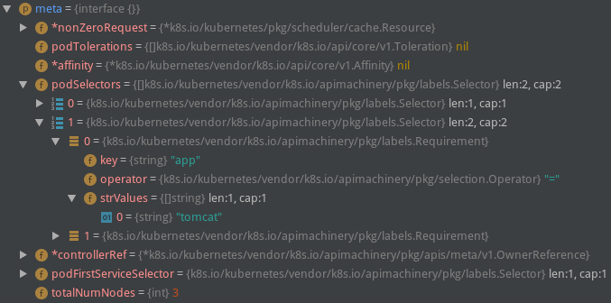
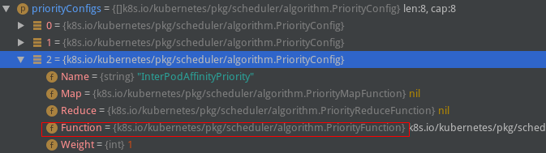

# 优选过程

<!-- toc -->

## 走近priority过程

!FILENAME pkg/scheduler/core/generic_scheduler.go:186

```
priorityList, err := PrioritizeNodes(pod, g.cachedNodeInfoMap, metaPrioritiesInterface, g.prioritizers, filteredNodes, g.extenders)
```

今天的分析从这行代码开始。

`PrioritizeNodes`要做的事情是给已经通过predicate的nodes赋上一个分值，从而抉出一个最优node用于运行当前pod. 第一次看priority可能会一脸蒙，和predicate中的逻辑不太一样；大伙得耐下性子多思考，实在有障碍也可以先不求甚解，整体过完后再二刷代码，再不行三刷，总会大彻大悟的！

从注释中可以找到关于**PrioritizeNodes**的原理(`pkg/scheduler/core/generic_scheduler.go:624`)：

> - PrioritizeNodes通过并发调用一个个priority函数来给node排优先级。每一个priority函数会给一个1-10之间的分值，0最低10最高。
> - 每一个priority函数可以有自己的权重，单个函数返回的分值*权重后得到一个加权分值，最终所有的加权分值加在一起就是这个node的最终分值。

然后我们先函数签名入手：

!FILENAME pkg/scheduler/core/generic_scheduler.go:624

```go
func PrioritizeNodes(
	pod *v1.Pod,
	nodeNameToInfo map[string]*schedulercache.NodeInfo,
	meta interface{},
	priorityConfigs []algorithm.PriorityConfig,
	nodes []*v1.Node,
	extenders []algorithm.SchedulerExtender,
) (schedulerapi.HostPriorityList, error) 
```

形参定义和返回值：

- `pod *v1.Pod*` // pod就不用说了；
- `*nodeNameToInfo map[string]*schedulercache.NodeInfo` // 这个也不需要讲，字面意思代表一切；
- `meta interface{}` // 和predicate里的meta不太一样，下面会贴个debug的图先，具体后面再看；
- `priorityConfigs []algorithm.PriorityConfig` // 包含优选算法各种信息，比较重要；
- `nodes []*v1.Node` // node集合，不需要解释了；
- `extenders []algorithm.SchedulerExtender` // extender逻辑放到后面单独讲。

meta实参长这个样子：



返回值只需要看一下`schedulerapi.HostPriorityList`类型的含义了，这个类型之前也提过，后面频繁涉及到操作这个结构，所以这里再贴一次，大伙得烂熟于心才行！

!FILENAME pkg/scheduler/api/types.go:305

```go
type HostPriority struct {
	Host string
	Score int
}
type HostPriorityList []HostPriority
```

着重分析一下这2个type，虽然很简单，还是有必要啰嗦一下，必须记在心里。**HostPriority**这个struct的属性是*Host*和*Score*，一个是string一个是int，所以很明显**HostPriority**所能够保存的信息是一个节点的名字和分值，再仔细一点说就是这个结构保存的是一个node在一个priority算法计算后所得到的结果；然后看**HostPriorityList**类型，这个类型是上一个类型的“集合”，集合表达的是一个node多个算法还是多个node一个算法呢？稍微思考一下可以知道**HostPriorityList**中存的是多个Host和Score的组合，所以**HostPriorityList**这个结构是要保存一个算法作用于所有node之后，得到的所有node的Score信息的。（这里我们先理解成一个算法的结果，作为函数返回值这里肯定是要保留所有算法作用后的最终node的Score，所以函数后半部分肯定有combine分值的步骤。）

## PrioritizeNodes整体流程

前面说到`PrioritizeNodes()`函数也就是node优选的具体逻辑，这个函数略长，我们分段讲解。

### Results

PrioritizeNodes()函数开头的逻辑很简单，我们先从第一行看到results定义的这一行。

!FILENAME pkg/scheduler/core/generic_scheduler.go:634

```go
if len(priorityConfigs) == 0 && len(extenders) == 0 {
    // 这个if很明显是处理特殊场景的，就是优选算法一个都没有配置（extenders同样没有配置）的时候怎么做；
    // 这个result是要当作返回值的，HostPriorityList类型前面唠叨了很多了，大家得心里有数；
   result := make(schedulerapi.HostPriorityList, 0, len(nodes))
   for i := range nodes {
       // 这一行代码是唯一的“逻辑了”，下面直到for结束都是简单代码；所以我们看一下EqualPriorityMap
       // 函数的作用就行了。这里我不贴代码，这个函数很短，作用就是设置每个node的Score相同（都为1）
       // hostPriority的类型也就是schedulerapi.HostPriority类型，再次强调这个类型是要烂熟于心的；
      hostPriority, err := EqualPriorityMap(pod, meta, nodeNameToInfo[nodes[i].Name])
      if err != nil {
         return nil, err
      }
       // 最终的result也就是设置了每个node的Score为1的schedulerapi.HostPriorityList类型数据；
      result = append(result, hostPriority)
   }
   return result, nil
}
// 这里只是简单定义3个变量，一把锁，一个并发等待相关的wg，一个错误集合errs；
var (
   mu   = sync.Mutex{}
   wg   = sync.WaitGroup{}
   errs []error
)
// 这里定义了一个appendError小函数，逻辑很简单，并发场景下将错误信息收集到errs中；
appendError := func(err error) {
   mu.Lock()
   defer mu.Unlock()
   errs = append(errs, err)
}
// 最后一个变量results也不难理解，类型是[]schedulerapi.HostPriorityList，这里需要注意这个类型
// 的作用，它保存的是所有算法作用所有node之后得到的结果集，相当于一个二维数组，每个格子是1个算法
// 作用于1个节点的结果，一行也就是1个算法作用于所有节点的结果；一行展成一个二维就是所有算法作用于所有节点；
results := make([]schedulerapi.HostPriorityList, len(priorityConfigs), len(priorityConfigs))
```

到这里要求大家心中能够想象上面提到的results是什么样的，可以借助纸笔画一画。下面的代码会往这个二维结构里面存储数据。

### Old Priority Function

我们既然讲到“老式”，后面肯定有对应的“新式”。虽然这种函数已经DEPRECATED了，不过对于我们学习掌握优选流程还是很有帮助的。默认的优选算法里其实也只有1个是这在old形式的了：



贴这块代码之前我们先关注一下多次出现的`priorityConfigs`这个变量的类型：

函数形参中有写到：`priorityConfigs []algorithm.PriorityConfig`，所以我们直接看**PriorityConfig**是什么类型：

!FILENAME pkg/scheduler/algorithm/types.go:62

```go
// PriorityConfig is a config used for a priority function.
type PriorityConfig struct {
   Name   string
   Map    PriorityMapFunction
   Reduce PriorityReduceFunction
   // TODO: Remove it after migrating all functions to
   // Map-Reduce pattern.
   Function PriorityFunction
   Weight   int
}
```

**PriorityConfig**中有一个Name，一个Weight，很好猜到意思，名字和权重嘛。剩下的Map、Reduce和Function目测代表的就是优选函数的新旧两种表达方式了。我们先看旧的Function属性的类型PriorityFunction是什么：

!FILENAME pkg/scheduler/algorithm/types.go:59

```go
type PriorityFunction func(pod *v1.Pod, nodeNameToInfo map[string]*schedulercache.NodeInfo, nodes []*v1.Node) (schedulerapi.HostPriorityList, error)
```

很明显这个类型代表了一个priority函数，入参是pod、nodeNameToInfo和nodes，返回值是HostPriorityList，也就是我们前面提到的1个priority函数作用于每个node后得到了Score信息，存结果的结构就是这个HostPriorityList；看起来很和谐～

然后讲回**PrioritizeNodes**过程：

!FILENAME pkg/scheduler/core/generic_scheduler.go:661

```go
for i := range priorityConfigs {
    // 如果第i个优选配置(priorityConfig)定义了老函数，则调用之；
	if priorityConfigs[i].Function != nil {
		wg.Add(1)
        // 注意这里的参数index，这里传入的实参是上面的i；
		go func(index int) {
			defer wg.Done()
			var err error
            // 所以这里的results[index]就好理解了；后面priorityConfigs[index]的索引也是index，
            // 这里表达的是第N个优选配置里有Function，那么这个Function的计算结果保存在
            // results的第N个格子里；
			results[index], err = priorityConfigs[index].Function(pod, nodeNameToInfo, nodes)
			if err != nil {
				appendError(err)
			}
		}(i)
	} else {
        // 如果没有定义Function，其实也就是使用了Map-Reduce方式的，这里先存个空的结构占位；
		results[i] = make(schedulerapi.HostPriorityList, len(nodes))
	}
}
```

上面这段代码逻辑还算好理解，唯一有点小绕的还是前面强调的HostPriorityList相关类型的操作上。

### Map-Reduce

关于map-reduce思想我就不在这里赘述了，大数据行业很流行的一个词汇，百度一下（如果你能够google，自然更好咯）可以找到一大堆介绍的文章。

简单说map-reduce就是：Map是映射，Reduce是归约；map是统计一本书中的一页出现了多少次k8s这个词，reduce是将这些map结果汇总在一起得到最终结果。（map一般都是将一个算法作用于一堆数据集的每一个元素，得到一个结果集，reduce有各种形式，可以是累加这些结果，或者是对这个结果集做其他复杂的f(x)操作。

看看在Scheduler里面是怎么用Map-Reduce的吧：

```go
// 这个并发逻辑之前介绍过了，我们直接看ParallelizeUntil的最后一个参数就行，这里直接写了一个匿名函数；
workqueue.ParallelizeUntil(context.TODO(), 16, len(nodes), func(index int) {
    // 这里的index是[0，len(nodes)-1]，相当于遍历所有的nodes；
   nodeInfo := nodeNameToInfo[nodes[index].Name]
    // 这个for循环遍历的是所有的优选配置，如果有老Fun就跳过，新逻辑就继续；
   for i := range priorityConfigs {
      if priorityConfigs[i].Function != nil {
          // 因为前面old已经运行过了
         continue
      }

      var err error
       // 这里的i和前面老Fun的互补，老Fun中没有赋值的results中的元素就在这里赋值了；
       // 注意到这里调用了一个Map函数就直接赋值给了results[i][index]，这里的index是第一行这个
       // 匿名函数的形参，通过ParallelizeUntil这个并发实现所有node对应一个优选算法的分值计算；
      results[i][index], err = priorityConfigs[i].Map(pod, meta, nodeInfo)
      if err != nil {
         appendError(err)
         results[i][index].Host = nodes[index].Name
      }
   }
})

for i := range priorityConfigs {
    // 没有定义Reduce函数就不处理；
   if priorityConfigs[i].Reduce == nil {
      continue
   }
   wg.Add(1)
   go func(index int) {
      defer wg.Done()
       // 调用Reduce函数
      if err := priorityConfigs[index].Reduce(pod, meta, nodeNameToInfo, results[index]); err != nil {
         appendError(err)
      }
      if klog.V(10) {
         for _, hostPriority := range results[index] {
            klog.Infof("%v -> %v: %v, Score: (%d)", util.GetPodFullName(pod), hostPriority.Host, priorityConfigs[index].Name, hostPriority.Score)
         }
      }
   }(i)
}
// Wait for all computations to be finished.
wg.Wait()
if len(errs) != 0 {
   return schedulerapi.HostPriorityList{}, errors.NewAggregate(errs)
}
```

看到这里我们可以发现老Fun和Map的区别不大，都是优选函数的执行过程。那为什么会存在两种形式呢？我们看完**PrioritizeNodes**整体流程后通过具体的Fun和Map-Reduce实现来看二者的区别。

### Combine Scores

这块的代码很简单，我们先抛开extender的逻辑，剩下的代码如下：

```go
// Summarize all scores.
// 这个result和前面的results类似，result用于存储每个node的Score，到这里已经没有必要区分算法了；
result := make(schedulerapi.HostPriorityList, 0, len(nodes))
// 循环执行len(nodes)次
for i := range nodes {
    // 先在result中塞满所有node的Name，Score初始化为0；
   result = append(result, schedulerapi.HostPriority{Host: nodes[i].Name, Score: 0})
    // 执行了多少个priorityConfig就有多少个Score，所以这里遍历len(priorityConfigs)次；
   for j := range priorityConfigs {
       // 每个算法对应第i个node的结果分值加权后累加；
      result[i].Score += results[j][i].Score * priorityConfigs[j].Weight
   }
}

return result, nil
```

这块逻辑很清晰，要将前面得到的二维结果results压缩成一维的加权分值集合result，最终返回这个result.

从这里我们还可以得到一个结论，不管是Fun还是Map-Reduce，处理的结果都是填充results这个二维结构，所以Map-Reduce也没有什么神秘的，下面通过具体的算法来看二者有何异同。

## Fun和Map-Reduce实例分析

### InterPodAffinityPriority(Function)

这个算法做的是Pod间亲和性优选，也就是亲和pod越多的节点分值越高，反亲和pod越多分值越低。

我们撇开具体的亲和性计算规则，从优选函数的形式上看一下这段代码的逻辑：

!FILENAME pkg/scheduler/algorithm/priorities/interpod_affinity.go:119

```go
func (ipa *InterPodAffinity) CalculateInterPodAffinityPriority(pod *v1.Pod, nodeNameToInfo map[string]*schedulercache.NodeInfo, nodes []*v1.Node) (schedulerapi.HostPriorityList, error) {
	affinity := pod.Spec.Affinity
    // 是否有亲和性约束；
	hasAffinityConstraints := affinity != nil && affinity.PodAffinity != nil
    // 是否有反亲和性约束；
	hasAntiAffinityConstraints := affinity != nil && affinity.PodAntiAffinity != nil
	
    // 这里有一段根据亲和性和反亲和性来计算一个node上匹配的pod数量的逻辑，我们先跳过这些逻辑，从优选算法实现的角度看这个算法的架子；
    
    // 当遍历完所有的node之后，可以得到1个最高分和1个最低分，分别记为maxCount和minCount；
    for _, node := range nodes {
		if pm.counts[node.Name] > maxCount {
			maxCount = pm.counts[node.Name]
		}
		if pm.counts[node.Name] < minCount {
			minCount = pm.counts[node.Name]
		}
	}
	// 这个result类型和前面看到的一样，都是存储单个算法的计算结果的；
	result := make(schedulerapi.HostPriorityList, 0, len(nodes))
	for _, node := range nodes {
		fScore := float64(0)
        // 如果分差大于0，也就是说不是所有的node都一样的情况，需要对分值做一个处理；
		if (maxCount - minCount) > 0 {
            // MaxPriority定义的是优选最高分10，第二个因数是当前node的count-最小count，
            // 然后除以(maxCount - minCount)；举个例子，当前node的计算结果是5，最大count是20，最小
            // count是-3，那么这里就是10*[5-(-3)/20-(-3)]
            // 这个计算的结果显然会在[0-10]之间；
			fScore = float64(schedulerapi.MaxPriority) * ((pm.counts[node.Name] - minCount) / (maxCount - minCount))
		}
        // 如果分差不大于0，这时候int(fScore)也就是0，对于各个node的结果都是0；
		result = append(result, schedulerapi.HostPriority{Host: node.Name, Score: int(fScore)})
	}
	return result, nil
}
```

如上，我们可以发现最终这个函数计算出了每个node的分值，这个分值在[0-10]之间。所以说到底Function做的事情就是根据一定的规则给每个node赋一个分值，这个分值要求在[0-10]之间，然后把这个`HostPriorityList`返回就行。

### CalculateNodeAffinityPriorityMap(Map)

这个算法和上一个类似，上一个是Pod的Affinity，这个是Node的Affinity；我们来看代码：

!FILENAME pkg/scheduler/algorithm/priorities/node_affinity.go:34

```go
func CalculateNodeAffinityPriorityMap(pod *v1.Pod, meta interface{}, nodeInfo *schedulercache.NodeInfo) (schedulerapi.HostPriority, error) {
	node := nodeInfo.Node()
	if node == nil {
		return schedulerapi.HostPriority{}, fmt.Errorf("node not found")
	}

	// default is the podspec.
	affinity := pod.Spec.Affinity
	if priorityMeta, ok := meta.(*priorityMetadata); ok {
		// We were able to parse metadata, use affinity from there.
		affinity = priorityMeta.affinity
	}

	var count int32
	if affinity != nil && affinity.NodeAffinity != nil && affinity.NodeAffinity.PreferredDuringSchedulingIgnoredDuringExecution != nil {
		// Match PreferredDuringSchedulingIgnoredDuringExecution term by term.
		for i := range affinity.NodeAffinity.PreferredDuringSchedulingIgnoredDuringExecution {
			preferredSchedulingTerm := &affinity.NodeAffinity.PreferredDuringSchedulingIgnoredDuringExecution[i]
			if preferredSchedulingTerm.Weight == 0 {
				continue
			}

			nodeSelector, err := v1helper.NodeSelectorRequirementsAsSelector(preferredSchedulingTerm.Preference.MatchExpressions)
			if err != nil {
				return schedulerapi.HostPriority{}, err
			}
			if nodeSelector.Matches(labels.Set(node.Labels)) {
				count += preferredSchedulingTerm.Weight
			}
		}
	}

	return schedulerapi.HostPriority{
		Host:  node.Name,
		Score: int(count),
	}, nil
}
```

撇开具体的亲和性计算细节，我们可以发现这个的count没有特定的规则，可能会加到10以上；另外这里的返回值是`HostPriority`类型，前面的Function返回了`HostPriorityList`类型。


**map函数**

!FILENAME pkg/scheduler/algorithm/priorities/selector_spreading.go:221

```go
func (s *ServiceAntiAffinity) CalculateAntiAffinityPriorityMap(pod *v1.Pod, meta interface{}, nodeInfo *schedulercache.NodeInfo) (schedulerapi.HostPriority, error) {
	var firstServiceSelector labels.Selector

	node := nodeInfo.Node()
	if node == nil {
		return schedulerapi.HostPriority{}, fmt.Errorf("node not found")
	}
	priorityMeta, ok := meta.(*priorityMetadata)
	if ok {
		firstServiceSelector = priorityMeta.podFirstServiceSelector
	} else {
		firstServiceSelector = getFirstServiceSelector(pod, s.serviceLister)
	}
    // 查找给定node在给定namespace下符合selector的pod，返回值是[]*v1.Pod
	matchedPodsOfNode := filteredPod(pod.Namespace, firstServiceSelector, nodeInfo)

	return schedulerapi.HostPriority{
		Host:  node.Name,
        // 返回值中Score设置成上面找到的pod的数量
		Score: int(len(matchedPodsOfNode)),
	}, nil
}
```

这个函数比较短，可以看到在指定node上查询到匹配selector的pod越多，分值就越高。假设找到了20个，那么这里的分值就是20；假设找到的是2，那这里的分值就是2.

### CalculateNodeAffinityPriorityReduce(Reduce)

和上面这个Map对应的Reduce函数其实没有单独实现，通过`NormalizeReduce`函数做了一个通用的Reduce处理：

!FILENAME pkg/scheduler/algorithm/priorities/node_affinity.go:77

```go
var CalculateNodeAffinityPriorityReduce = NormalizeReduce(schedulerapi.MaxPriority, false)
```

!FILENAME pkg/scheduler/algorithm/priorities/reduce.go:29

```go
func NormalizeReduce(maxPriority int, reverse bool) algorithm.PriorityReduceFunction {
	return func(
		_ *v1.Pod,
		_ interface{},
		_ map[string]*schedulercache.NodeInfo,
        // 注意到这个result是HostPriorityList，对应1个算法N个node的结果集
		result schedulerapi.HostPriorityList) error {

		var maxCount int
        // 遍历result将最高的Score赋值给maxCount；
		for i := range result {
			if result[i].Score > maxCount {
				maxCount = result[i].Score
			}
		}

		if maxCount == 0 {
			if reverse {
				for i := range result {
					result[i].Score = maxPriority
				}
			}
			return nil
		}

		for i := range result {
			score := result[i].Score
            // 举个例子：10*(5/20)
			score = maxPriority * score / maxCount
			if reverse {
                // 如果score是3，得到7；如果score是4，得到6，结果反转；
				score = maxPriority - score
			}

			result[i].Score = score
		}
		return nil
	}
}
```

### 小结

- Function：一个算法一次性计算出所有node的Score，这个Score的范围是规定的[0-10]；
- Map-Reduce：一个Map算法计算1个node的Score，这个Score可以灵活处理，可能是20，可能是-3；Map过程并发进行；最终得到的结果result通过Reduce归约，将这个算法对应的所有node的分值归约为[0-10]；

本节有几张图是goland debug的截图，我们目前还没有提到如何debug；不过本节内容的阅读基本是不影响的。下一节源码分析内容发出来前我会在“环境准备”这一章中增加如何开始debug的内容，大家可以选择开始debug的时机。