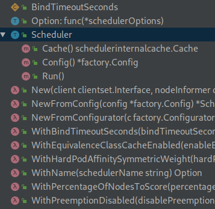
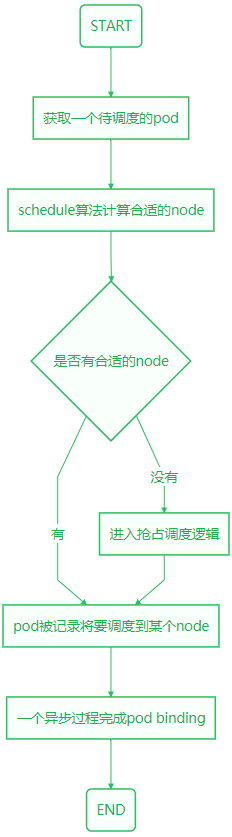

# 调度器框架

<!-- toc -->

## 写在前面

今天我们从`pkg/scheduler/scheduler.go`出发，分析Scheduler的整体框架。前面讲Scheduler设计的时候有提到过源码的3层结构，`pkg/scheduler/scheduler.go`也就是中间这一层，负责Scheduler除了具体node过滤算法外的工作逻辑～

这一层我们先尽可能找主线，顺着主线走通一遍，就像走一个迷宫，一条通路走出去后心里就有地了，但是迷宫中的很多角落是未曾涉足的。我们尽快走通主流程后，再就一些主要知识点专题攻破，比如k8s里面的List-Watch，Informer等好玩的东西。

## 调度器启动运行

从goland的Structure中可以看到这个源文件(*pkg/scheduler/scheduler.go*)主要有这些对象：



大概浏览一下可以很快找到我们的第一个关注点应该是Scheduler这个struct和Scheduler的Run()方法：

!FILENAME pkg/scheduler/scheduler.go:58

```go
// Scheduler watches for new unscheduled pods. It attempts to find
// nodes that they fit on and writes bindings back to the api server.
type Scheduler struct {
	config *factory.Config
}
```

这个struct在上一讲有跟到过，代码注释说的是：

> Scheduler watch新创建的未被调度的pods，然后尝试寻找合适的node，回写一个绑定关系到api server.

这个注释有个小问题就是用了复数形式，其实最后过滤出来的只有一个node；当然这种小问题知道就好，提到github上人家会觉得你在刷commit.接着往下看，Scheduler绑定了一个Run()方法，如下：

!FILENAME pkg/scheduler/scheduler.go:276

```go
// Run begins watching and scheduling. It waits for cache to be synced, then starts a goroutine and returns immediately.
func (sched *Scheduler) Run() {
	if !sched.config.WaitForCacheSync() {
		return
	}
	go wait.Until(sched.scheduleOne, 0, sched.config.StopEverything)
}
```

注释说这个函数开始watching and scheduling，也就是调度器主要逻辑了！注释后半段说到Run()方法起了一个goroutine后马上返回了，这个怎么理解呢？我们先看一下调用Run的地方：

!FILENAME cmd/kube-scheduler/app/server.go:240

```go
	// Prepare a reusable runCommand function.
	run := func(ctx context.Context) {
		sched.Run()
		<-ctx.Done()
	}
```

可以发现调用了`sched.Run()`之后就在等待`ctx.Done()`了，所以Run中启动的goroutine自己不退出就ok.

`wait.Until`这个函数做的事情是：每隔n时间调用f一次，除非channel c被关闭。这里的n就是0，也就是一直调用，前一次调用返回下一次调用就开始了。这里的f当然就是`sched.scheduleOne`，c就是`sched.config.StopEverything`.

## 一个pod的调度流程

于是我们的关注点就转到了`sched.scheduleOne`这个方法上，看一下：

> scheduleOne does the entire scheduling workflow for a single pod.  It is serialized on the scheduling algorithm's host fitting.

注释里说scheduleOne实现1个pod的完整调度工作流，这个过程是顺序执行的，也就是非并发的。结合前面的`wait.Until`逻辑，也就是说前一个pod的**scheduleOne**一完成，一个return，下一个pod的**scheduleOne**立马接着执行！

这里的串行逻辑也好理解，如果是同时调度N个pod，计算的时候觉得一个node很空闲，实际调度过去启动的时候发现别人的一群pod先起来了，端口啊，内存啊，全给你抢走了！所以这里的调度算法执行过程用串行逻辑很好理解。注意哦，调度过程跑完不是说要等pod起来，最后一步是写一个binding到apiserver，所以不会太慢。下面我们看一下scheduleOne的主要逻辑：

!FILENAME pkg/scheduler/scheduler.go:513

```go
func (sched *Scheduler) scheduleOne() {
	pod := sched.config.NextPod()
	suggestedHost, err := sched.schedule(pod)
    if err != nil {
		if fitError, ok := err.(*core.FitError); ok {
			preemptionStartTime := time.Now()
			sched.preempt(pod, fitError)
		}
		return
	}
	assumedPod := pod.DeepCopy()
	allBound, err := sched.assumeVolumes(assumedPod, suggestedHost)
	err = sched.assume(assumedPod, suggestedHost)
	go func() {
		err := sched.bind(assumedPod, &v1.Binding{
			ObjectMeta: metav1.ObjectMeta{Namespace: assumedPod.Namespace, Name: assumedPod.Name, UID: assumedPod.UID},
			Target: v1.ObjectReference{
				Kind: "Node",
				Name: suggestedHost,
			},
		})
	}()
}
```

上面几行代码只保留了主干，对于我们理解scheduleOne的过程足够了，这里来个流程图吧：



不考虑scheduleOne的所有细节和各种异常情况，基本是上图的流程了，主流程的核心步骤当然是`suggestedHost, err := sched.schedule(pod)`这一行，这里完成了不需要抢占的场景下node的计算，我们耳熟能详的预选过程，优选过程等就是在这里面。

## 潜入第三层前的一点逻辑

ok，这时候重点就转移到了`suggestedHost, err := sched.schedule(pod)`这个过程，强调一下这个过程是“同步”执行的。

!FILENAME pkg/scheduler/scheduler.go:290

```go
// schedule implements the scheduling algorithm and returns the suggested host.
func (sched *Scheduler) schedule(pod *v1.Pod) (string, error) {
	host, err := sched.config.Algorithm.Schedule(pod, sched.config.NodeLister)
	if err != nil {
		pod = pod.DeepCopy()
		sched.config.Error(pod, err)
		sched.config.Recorder.Eventf(pod, v1.EventTypeWarning, "FailedScheduling", "%v", err)
		sched.config.PodConditionUpdater.Update(pod, &v1.PodCondition{
			Type:          v1.PodScheduled,
			Status:        v1.ConditionFalse,
			LastProbeTime: metav1.Now(),
			Reason:        v1.PodReasonUnschedulable,
			Message:       err.Error(),
		})
		return "", err
	}
	return host, err
}
```

schedule方法很简短，我们关注一下第一行，调用`sched.config.Algorithm.Schedule()`方法，入参是pod和nodes，返回一个host，继续看一下这个Schedule方法：

!FILENAME pkg/scheduler/algorithm/scheduler_interface.go:78

```go
type ScheduleAlgorithm interface {
	Schedule(*v1.Pod, NodeLister) (selectedMachine string, err error)
	Preempt(*v1.Pod, NodeLister, error) (selectedNode *v1.Node, preemptedPods []*v1.Pod, cleanupNominatedPods []*v1.Pod, err error)
	Predicates() map[string]FitPredicate
	Prioritizers() []PriorityConfig
}
```

发现是个接口，这个接口有4个方法，实现`ScheduleAlgorithm`接口的对象意味着知道如何调度pods到nodes上。默认的实现是`pkg/scheduler/core/generic_scheduler.go:98 genericScheduler`这个struct.我们先继续看一下`ScheduleAlgorithm`接口定义的4个方法：

- Schedule() //给定pod和nodes，计算出一个适合跑pod的node并返回；
- Preempt() //抢占
- Predicates() //预选
- Prioritizers() //优选

前面流程里讲到的`sched.config.Algorithm.Schedule()`也就是`genericScheduler.Schedule()`方法了，这个方法位于：`pkg/scheduler/core/generic_scheduler.go:139`一句话概括这个方法就是：尝试将指定的pod调度到给定的node列表中的一个，如果成功就返回这个node的名字。最后看一眼签名：

```go
func (g *genericScheduler) Schedule(pod *v1.Pod, nodeLister algorithm.NodeLister) (string, error)
```

从如参和返回值其实可以猜到很多东西，行，今天就到这里，具体的逻辑下回我们再分析～
