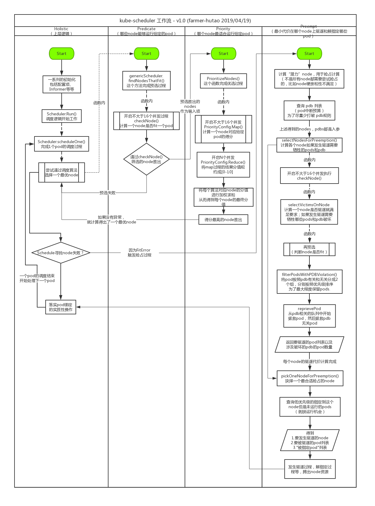

# Scheduler 总结

**In Edit**

## kube-scheduler 是什么

> The Kubernetes scheduler runs as a process alongside the other master components such as the API server. Its interface to the API server is to watch for Pods with an empty PodSpec.NodeName, and for each Pod, it posts a binding indicating where the Pod should be scheduled.

一句话介绍 kube-scheduler 的话，就是一个独立运行的程序，负责和 API Server 交互，获取 PodSpec.NodeName 属性为空的 Pods 列表，然后一个个计算最适合 Pod 运行的 Node，最后将 Pod 绑定到对应的 Node 上。

## Scheduler 工作流程

宏观上看，kube-scheduler 的工作流类似下图：

```yaml
对于一个给定的pod
+---------------------------------------------+
|             可用于调度的nodes如下：           |
|  +--------+     +--------+     +--------+   |
|  | node 1 |     | node 2 |     | node 3 |   |
|  +--------+     +--------+     +--------+   |
+----------------------+----------------------+
                       |
                       v
+----------------------+----------------------+
初步过滤: node 3 资源不足
+----------------------+----------------------+
                       |
                       v
+----------------------+----------------------+
|                 剩下的nodes:                 |
|     +--------+               +--------+     |
|     | node 1 |               | node 2 |     |
|     +--------+               +--------+     |
+----------------------+----------------------+
                       |
                       v
+----------------------+----------------------+
优先级算法计算结果:    node 1: 分数=2
                     node 2: 分数=5
+----------------------+----------------------+
                       |
                       v
            选择分值最高的节点 = node 2
```

上述流程图涉及到两个关键步骤：Predicate 和 Priority.

- Predicate：对应大家平时说的预选过程。在 predicate 过程中 scheduler 需要过滤掉无法满足 pod 正常运行需求的 node，比如不满足 pod 的“硬亲和性”需求。在 predicate 过程过滤后剩下的 node 理论上都可以成功让 pod 运行起来。
- Priority：对于大家平时说的优选过程。Pod 运行毕竟只需要1个 node，所以在预选结束后剩下的 node 要经过第二次计算从而得出最合适跑给定 pod 的 node.

## 代码层级工作流程



## Scheduler 拓展性

//TODO

## Scheduler 高级调度

- NodeSelector - 最简单的用法
- NodeAffinity - node 亲和与反亲和
- PodAffinity - pod 亲和与反亲和
- Taint / Toleration - 污点和容忍