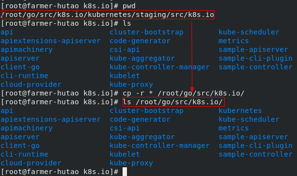
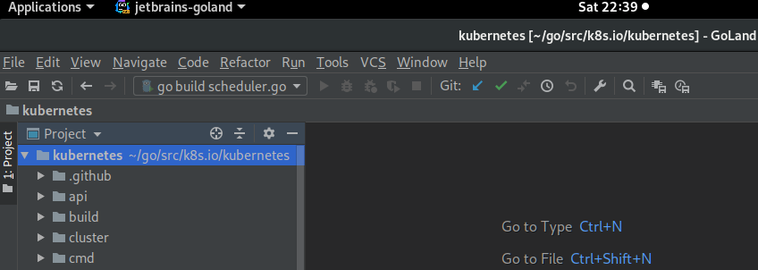

# 源码准备

<!-- toc -->

## 1、环境准备

操作系统：我们使用Linux作为k8s源码分析和调试环境，fedora、centos、ubuntu都行，我这里使用fedora；

golang相关：

- GOROOT=/usr/local/lib/golang
- GOPATH=/root/go
- go version go1.10.3 linux/amd64

## 2、源码下载

```sh
mkdir -p /root/go/src/k8s.io
cd /root/go/src/k8s.io/
git clone https://github.com/kubernetes/kubernetes.git
```

下载后本地目录：


## 3、源码编译

我们先看一下几个主要的目录：

| 目录名  | 用途                         |
| ------- | ---------------------------- |
| cmd     | 每个组件代码入口（main函数） |
| pkg     | 各个组件的具体功能实现       |
| staging | 已经分库的项目               |

staging里面存放了一些kubernetes相关的子项目，需要放到`${GOPATH}/src/k8s.io/`，我们先把这些文件挪动一下：



考虑到国内网络环境等因素，我们不使用容器化方式构建。完成如上目录移动之后，kubernetes的依赖分别丢到了`${GOPATH}/src/k8s.io/`和`${GOPATH}/src/k8s.io/kubernetes/vendor/`，我们尝试在kubernetes项目cmd目录下构建一个组件（执行路径：`/root/go/src/k8s.io/kubernetes/cmd/kube-scheduler`）：


## 4、IDE

我们使用Goland看代码：



最后，别忘了在正式研读源码前切换到`release-1.13`分支～